<a name="HOLTitle"></a>
# Azure Batch Service with Batch Shipyard

---	

<a name="Overview"></a>
## Overview

[**Azure Batch**](https://azure.microsoft.com/en-us/services/batch/) is a service that enables you to run batch processes on high-performance compute (HPC) clusters composed of Azure virtual machines (VMs). Batch processes are ideal for handling compute-intensive tasks such as rendering videos and performing financial risk analysis that can run unattended. Azure Batch uses [VM scale sets](https://docs.microsoft.com/en-us/azure/virtual-machine-scale-sets/virtual-machine-scale-sets-overview) to scale up and down as needed to ensure that adequate compute resources are available to handle the workload, while preventing you from paying for resources that you don't need.

Azure Batch services are oriented around three major components: **storage**, **pools**, and **jobs**. **Storage** is implemented through Azure Storage, and is where data input and output are stored. **Pools** are composed of compute nodes. Each pool has one or more VMs, and each VM has one or more CPUs. **Jobs** contain the applications and scripts that process the information from storage. The output from jobs are written back to storage. Jobs themselves are composed of one or more **tasks**. Tasks can be run one at a time or in parallel.

**[Batch Shipyard](https://github.com/Azure/batch-shipyard)** is an open-source toolkit that allows Dockerized workloads to be deployed to Azure Batch compute pools. The interaction between Azure Batch and Batch Shipyard is as follows:

1. Batch Shipyard creates a pool
1. Azure Storage is loaded with input data
1. Batch Shipyard creates and starts a job, which is composed of tasks
1. Tasks read data from storage, process it, and write the results back to storage
1. The results are downloaded and viewed locally


_Azure Batch Shipyard workflow_

In this lab, you will use Azure Batch and Batch Shipyard to process a text file containing the manuscript for the novel "A Tale of Two Cities" and generate a sound file using a text-to-speech engine.

Estimated time to complete this lab: **60** minutes.

### Objectives:

In this hands-on lab, you will learn how to:

- Create an Azure Batch account
- Configure Batch Shipyard to use the Batch account
- Create a pool and run a job on that pool
- View the results of the job
- Use Azure Portal to remove the Batch account

### Prerequisites:

* An active Microsoft Azure subscription, or [sign up for a free trial](https://azure.microsoft.com/en-us/free/)

## Exercises

This hands-on lab includes the following exercises:

- [Exercise 1: Create a Batch account](#Exercise1)
- [Exercise 2: Set up Batch Shipyard (Windows)](#Exercise2)
- [Exercise 3: Set up Batch Shipyard (macOS)](#Exercise3)
- [Exercise 4: Set up Batch Shipyard (Ubuntu Linux)](#Exercise4)
- [Exercise 5: Configure Batch Shipyard](#Exercise5)
- [Exercise 6: Create a pool](#Exercise6)
- [Exercise 7: Prepare a job](#Exercise7)
- [Exercise 8: Run the job](#Exercise8)
- [Exercise 9: View the results](#Exercise9)
- [Exercise 10: Remove the Batch service](#Exercise10)

Estimated time to complete this lab: **60** minutes.

<a id="Exercise1"/></a>
## Exercise 1: Create a Batch account

Azure Batch accounts are simple to setup through the Azure Portal.

1. Open the [Azure Portal](https://portal.azure.com) in your browser. If you are asked to log in, do so using your Microsoft account.

1. Click **+ New**, followed by **Compute** and **Batch Service**.

	

	_Creating a Batch service_

1. In the "New Batch account" blade, give the account a unique name such as "batchservicelab" and make sure a green check mark appears next to it. (You can only use numbers and lowercase letters since the name becomes part of a DNS name.) Select **Create new** under **Resource group** and name the resource group "batch-service-lab". Select the **Location** nearest you, and then click **Select a storage account**.

	

	_Entering Batch service parameters_

1. Click **Create new** to create a new storage account for the Batch service.

	

	_Creating a new storage account_

1. Enter a unique name for the storage account and make sure a green check mark appears next to it. Then set **Replication** to **Locally-redundant Storage (LRS)** and click **OK** at the bottom of the blade.

	> Storage account names can be 3 to 24 characters in length and can only contain numbers and lowercase letters. In addition, the name you enter must be unique within Azure; if someone else has chosen the same name, you'll be notified that the name isn't available with a red exclamation mark in the **Name** field.

	

	_Creating a new storage account_

1. Click the **Create** button at the bottom of the "New Batch account" blade to start the deployment

	

	_Creating a Batch account_

1. Click **Resource groups** in the ribbon on the left side of the portal, and then click the resource group created for the Batch account.
 
    

    _Opening the resource group_

1. Wait until "Deploying" changes to "Succeeded," indicating that the Batch account has been deployed.

	> Refresh the page in the browser every now and then to update the deployment status. Clicking the **Refresh** button in the resource-group blade refreshes the list of resources in the resource group, but does not reliably update the deployment status.

    

    _Viewing the deployment status_

After the deployment finishes, proceed to [Exercise 2](#Exercise2) if you are running Windows, [Exercise 3](#Exercise3) if you are running macOS, or [Exercise 4](#Exercise4) if you are running Linux.

<a id="Exercise2"/></a>
## Exercise 2: Set up Batch Shipyard (Windows)

**Note: If setup fails at any point in this exercise, try using a Windows 10 virtual machine on Azure rather than your local PC.** Instructions for creating a Windows 10 VM can be found [here](https://github.com/MSRConnections/Azure-training-course/blob/master/Content/Batch/Windows%20VM.html).

Azure Batch Shipyard is built on Python. Windows does not have a built-in Python client, so you need to install one if it isn't installed already. In this exercise, you will download and install Python, and then use PiPy, the Python package manager, to install the dependencies for Batch Shipyard.

1. Visit https://www.python.org/downloads/ to download the latest version of Python for Windows. Click **Download Python 3.x.x** to start the download.

	

	_Downloading Python for Windows_

1. Once the download completes, launch the installer. Check the **Add Python 3.x to PATH** box, and then click **Install Now**.

	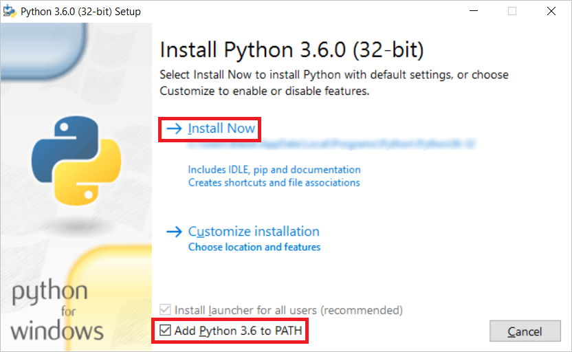

	_Installing Python_

1. Wait for the installer to finish. Then close the installer, go to https://github.com/Azure/batch-shipyard/releases, and download the latest version of Batch Shipyard.

	

	_Downloading Batch Shipyard_

1. Once the download completes, open the downloaded zip file and copy the folder named "batch-shipyard-2.x.x" inside the zip file to the clipboard.

1. Paste the folder onto the Desktop, and then rename the folder "batch-shipyard."

1. Open a Command Prompt window and use a ```cd``` command to change directories to the "batch-shipyard" folder on the Desktop. Then execute the following command to run PiPy and install the dependencies for Batch Shipyard. When you're finished, leave the Command Prompt window open so you can return to it later.

	````
	pip3 install --upgrade -r requirements.txt
	````

Now **proceed to [Exercise 5](#Exercise5)**. Exercises 3 and 4 are for macOS and Linux users only.

<a id="Exercise3"/></a>
## Exercise 3: Set up Batch Shipyard (macOS)

**Note: If setup fails at any point in this exercise, try using a Windows 10 virtual machine on Azure rather than your local PC.** Instructions for creating a Windows 10 VM can be found [here](https://github.com/MSRConnections/Azure-training-course/blob/master/Content/Batch/Windows%20VM.html).

macOS comes with Python preinstalled, but using the preinstalled version of Python with Azure Batch Shipyard is problematic. Batch Shipyard works best with Python 3 installed on a Mac. Python 3 can coexist with Python 2 without interference. In this exercise, you will download and install Python 3, and then use PiPy, the Python package manager, to install the dependencies for Batch Shipyard.

1. Visit https://www.python.org/downloads/ to download the latest version of Python for the Mac. Click **Download Python 3.x.x** to start the download.

	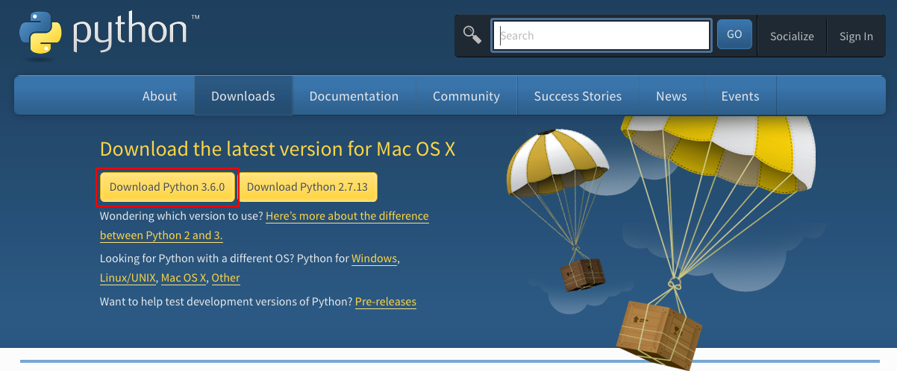

	_Downloading Python for macOS_

1. Once the download completes, launch the installer. The package will need elevated permissions to install Python, so when prompted, enter your password.

1. Wait for the installer to finish. Then close the installer, go to https://github.com/Azure/batch-shipyard/releases, and download the latest version of Batch Shipyard. macOS will automatically unzip the files in the Downloads folder.

	

	_Downloading Batch Shipyard_

1. Open the Downloads folder in Finder. Then rename the "batch-shipyard-2.x.x" folder to "batch-shipyard."

1. Open a terminal window and use a ```cd ~/Downloads/batch-shipyard``` command to change directories to the "batch-shipyard" folder in Downloads. Then execute the following command to run PiPy and install the dependencies for Batch Shipyard. When you're finished, leave the terminal window open so you can return to it later.

	````
	pip3 install --upgrade -r requirements.txt
	````

Now **proceed to [Exercise 5](#Exercise5)**. Exercise 4 is for Linux users only.

<a id="Exercise4"/></a>
## Exercise 4: Set up Batch Shipyard (Ubuntu Linux)

**Note: If setup fails at any point in this exercise, try using a Windows 10 virtual machine on Azure rather than your local PC.** Instructions for creating a Windows 10 VM can be found [here](https://github.com/MSRConnections/Azure-training-course/blob/master/Content/Batch/Windows%20VM.html).

In this exercise, you will install PiPy, the Python package manager, and then use it to install the dependencies for Batch Shipyard. 

1. Begin by launching a terminal. If you're using a desktop version of Linux, the terminal is usually in the Applications menu. It can also be launched by pressing **Ctrl+Alt+F1**. Once the terminal is started, use the following command to install Python, PiPy, and git using apt-get:

	````
	sudo apt-get install python-pip python git
	````

1. Execute the following command to clone Batch Shipyard on the local machine. This will create a folder named "batch-shipyard" and download all the files to that directory.

	````
	git clone https://github.com/Azure/batch-shipyard.git
	````

1. Use a ```cd``` command to change to the "batch-shipyard" folder:

	````
	cd batch-shipyard
	````

1. Use the following command to finish the installation by running the included setup script. The script invokes PiPy to install the dependencies needed by Batch Shipyard.

	````
	./install.sh
	````

Now that Batch Shipyard is installed, it's time to configure it.

<a id="Exercise5"/></a>
## Exercise 5: Configure Batch Shipyard

Batch Shipyard uses four different JSON files — **config.json, pool.json,  jobs.json**, and **credentials.json** — to configure the environment. These four files, the Dockerfiles used to define Docker images, their associated files, and a **readme.md** file define a Batch Shipyard "recipe."

Each of the configuration files configures some portion of Batch Shipyard. **config.json** contains configuration settings for the Batch Shipyard environment. **pool.json** contains definitions for the compute pools used to perform batch jobs. **jobs.json** outlines the job definition and the tasks that are part of that job. **credentials.json** holds the access keys for the batch account and the storage account.

The lab here doesn't go into detail about how to use a Dockerfile, but in short a Dockerfile contains a list of instructions that are used to build Docker images which contain be deployed as containers. The Dockerfile included in the lab is the one used to build the image that is deployed in the lab. For more information about how to create Dockerfiles, check out https://docs.docker.com/engine/getstarted/step_four/.

Three of the four JSON files are already configured in the solution recipe. The only one that needs to be changed is **credentials.json**.

1. Open this lab's "resources" folder, and then copy the "recipe" folder from the "resources" folder into the "batch-shipyard" folder created in the previous exercise.

1. Open the copied "recipe" folder. Open the "config" folder in that folder, and then open the file named **credentials.json** in your favorite text editor. There are two sections in the file: "batch" and "storage." The "batch" section contains the settings for the batch account that Batch Shipyard will use. The "storage" section contains the settings Batch Shipyard will use to access the storage account that was created for the batch account.

1. In **credentials.json**, replace *my_batch_account_name* with the name of the batch account that you created in Exercise 1, Step 3. 

1. Return to the Azure Portal. Click **Resource groups** in the ribbon on the left, and then click the resource group created for the Batch account.

	

	_Opening the resource group_

1. In the resource group, click the Batch account.

	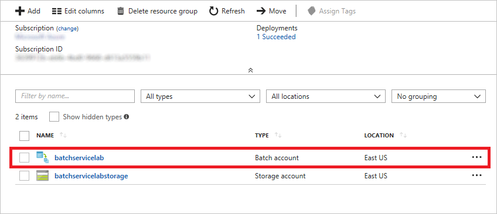

	_Opening the batch account_

1. Click **Keys**, and then click the **Copy** button next to the **PRIMARY ACCESS KEY** field.

	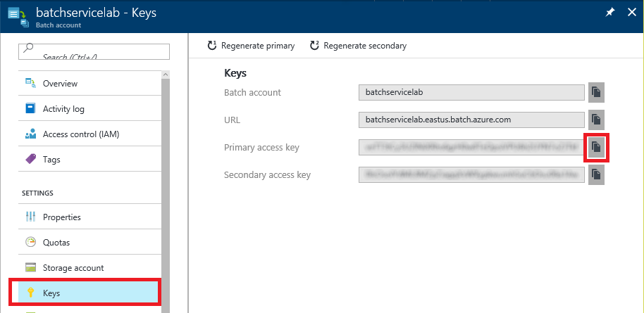

	_Copying the Batch account key_

1. Return to **credentials.json** and replace *my_batch_account_key* with the key that is on the clipboard.

1. In the blade for the Batch account, click **Properties**, and then click the **Copy** button next to the **URL** field.

	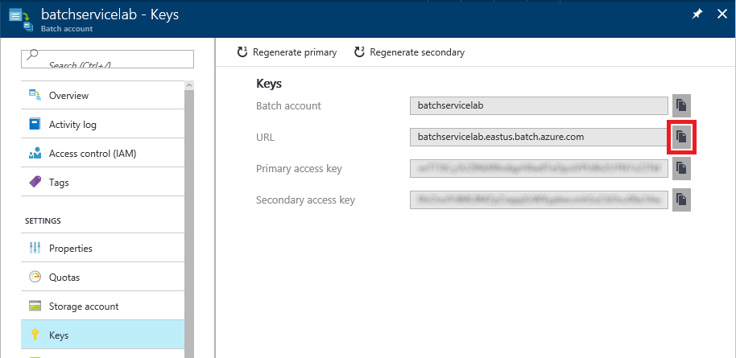

	_Copying the Batch account URL_

1. In **credentials.json**, replace *my_batch_account_url* with the URL that is on the clipboard. The "batch" section of **credentials.json** should now look something like this:

	```JSON
	"batch": {
	    "account": "batchservicelab",
	    "account_key": "ghS8vZrI+5TvmcdRoILz...7XBuvRIA6HFzCaMsPTsXToKdQtWeg==",
	    "account_service_url": "https://batchservicelab.eastus.batch.azure.com"
	},
	```

1. In the Azure Portal, return to the "batch-service-lab" resource group and click the storage account in that resource group.

	

	_Opening the storage account_

1. Click **Access keys**, and then click the **Copy** button next to the **Storage account name** field.

	

	_Copying the storage account name_

1. In **credentials.json**, replace *my_storage_account_name* with the storage-account name that is on the clipboard.

1. Return to the portal and click the **Copy** button next to the **key1** field.

	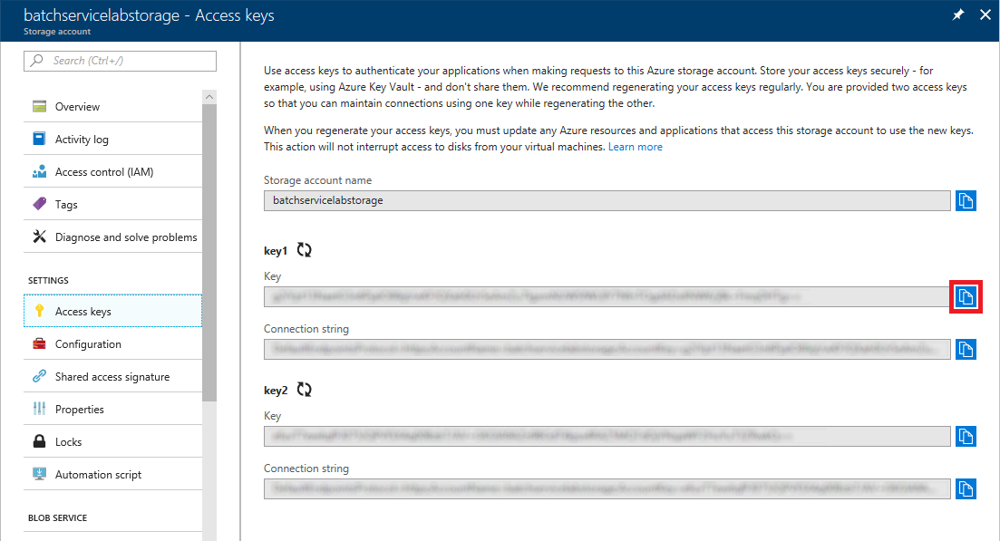

	_Copying the storage account key_

1. In **credentials.json**, replace *my_storage_account_key* with the key that is on the clipboard. The "storage" section of **credentials.json** should now look something like this:

	```JSON
	"storage": {
	    "mystorageaccount": {
	        "account": "batchservicelabstorage",
	        "account_key": "YuTLwG3nuaQqezl/rhEkT...Xrs8+UZrxr+TFdzA==",
	        "endpoint": "core.windows.net"
	    }
	}
	```

Save your changes to **credentials.json** before proceeding to the next exercise.

<a id="Exercise6"/></a>
## Exercise 6: Create a pool

Now that **credentials.json** has been set up and the environment variable created, Batch Shipyard is configured to run. Batch Shipyard uses several commands to control pools of Batch Services. The next step is to create a compute pool in the account using Batch Shipyard.

1. In the terminal or Command Prompt window that you left open, run one of the following commands based on which operating system you are using:

	**Windows**:
	````
	python shipyard.py pool add --configdir .\recipe\config
	````

	**macOS**:
	````
	python3 shipyard.py pool add --configdir ./recipe/config
	````

	**Linux**:
	````
	python shipyard.py pool add --configdir ./recipe/config
	````

This command will take a few minutes to complete. Batch Shipyard is creating virtual machines using Azure Batch, and then provisioning those virtual machines with Docker. You don't have to wait for the provisioning to complete, however.

<a id="Exercise7"/></a>
## Exercise 7: Prepare a job

While the pool is being created, this is a good time to prepare the data for the jobs. The lab uses Azure File Storage for data input and output. The configuration files tell Batch Services to mount an Azure file share inside of a container. The container can read data in and then write data back to the file share as output.

1. In the Azure Portal, return to the "batch-service-lab" resource group and click the storage account in that resource group.

	

	_Opening the storage account_

1. Click **Files**.

	

	_Opening file storage_

1. Click **+ File share**.

	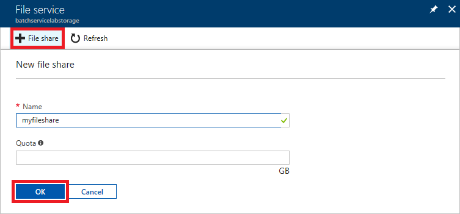

	_Adding a file share_

1. Enter "myfileshare" for the file-share name. Leave **Quota** blank, and then click **Create** at the bottom of the blade.

	

	_Creating a file share_

1. Click the new file share to open it.

	

	_Opening the file share_

1. In the blade for the file share, click **+ Add directory**.

	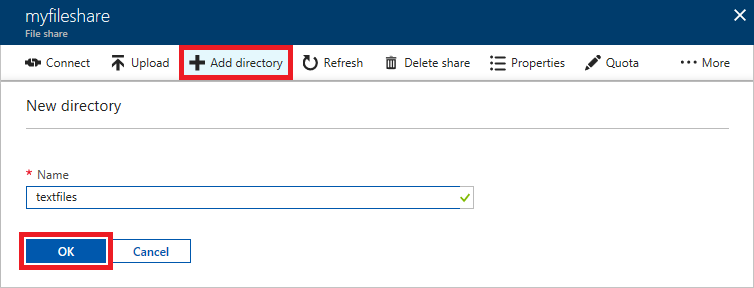

	_Adding a directory_

1. Enter "textfiles" for the directory name, and then click **Create**.

	

	_Creating a directory_ 

1. Back on the "myfileshare" blade, click the directory that you just created.

	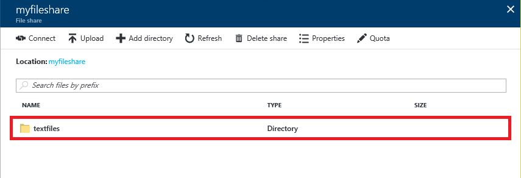

	_Opening the directory_

1. Click **Upload**.

	

	_Uploading to the directory_

1. In the "Upload files" blade, click the **folder** icon. Select the file named **tale-of-2-cities.txt** in the "resources" folder of this lab, and then click the **Upload** button.

	

	_Uploading a text file_

The container is designed to handle multiple text files with a .txt extension and text for content. For each text file, the container will generate a corresponding .ogg file in the root folder.

<a id="Exercise8"/></a>
## Exercise 8: Run the job

Now that Batch Shipyard is configured, the pool is created, and the job data is prepared, it's time to run the job. Running the job requires one simple command that will invoke Batch Services based on all the predefined configurations and containers.

1. To run the job, simply execute one of the following commands based on which operating system you are using. The command will create a job if it doesn't already exist in the Batch account, and then it will create a new task for that job. Jobs can be run multiple times without creating new jobs. Batch Shipyard will simply create a new task each time the **jobs add** command is called.

	**Windows**:
	````
	python shipyard.py jobs add --configdir .\recipe\config
	````
	**macOS**:
	````
	python3 shipyard.py jobs add --configdir ./recipe/config
	````

	**Linux**:
	````
	python shipyard.py jobs add --configdir ./recipe/config
	````

1. Click **Jobs** in the menu on the left side of blade, and then click **batch-lab-job**.

	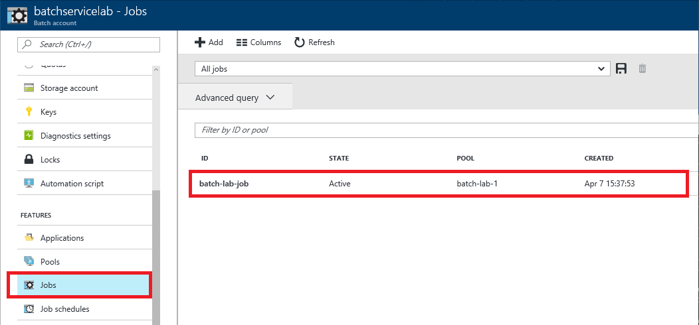

	_Selecting the job_

1. Click **Tasks**. Then click **Refresh** periodically until the job completes with an exit code of 0.

	

	_Waiting for the job to complete_

Once the job has finished running, the next task is to examine the output that it produced.

<a id="Exercise9"/></a>
## Exercise 9: View the results

The results are now available in the storage account. The output file can be downloaded and played back locally in any media player that supports the .ogg file type.

1. In the Azure Portal, return to the "batch-service-lab" resource group and click the storage account in that resource group.

	

	_Opening the storage account_

1. Click **myfileshare**.

	

	_Opening the fileshare_

1. Notice that a new file named **tale-of-2-cities.ogg** has been created. Click it to open a blade for it.

	

	_Opening the output file_

1. Click **Download** to download the file. This will download the file to the local machine where it can be played back in a media player.

	

	_Downloading the results_

The .ogg file contains approximately 12 hours of spoken content, which is indicative of the CPU intensiveness of the batch job.

<a id="Exercise10"/></a>
## Exercise 10: Remove the Batch service

In this exercise, you will delete the resource group created in [Exercise 1](#Exercise1) when you created the Batch account. Deleting the resource group deletes everything in it and prevents any further charges from being incurred for it.

1. In the Azure Portal, open the blade for the resource group created for the Batch account. Then click the **Delete** button at the top of the blade.

	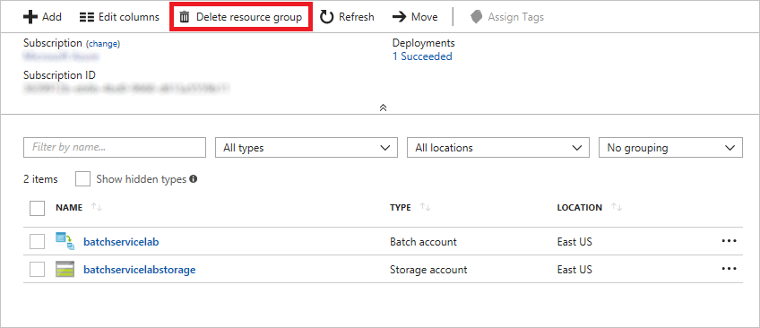

	_Deleting a resource group_

1. For safety, you are required to type in the resource group's name. (Once deleted, a resource group cannot be recovered.) Type the name of the resource group. Then click the **Delete** button to remove all traces of this lab from your account.

After a few minutes, the service and all of its resources will be deleted.

## Summary

This lab provided a hands-on demonstration of how to use Batch Services with Batch Shipyard to run batch jobs in the cloud in Docker containers. Batch on Azure though can perform many types on Docker and non-Docker jobs and even leverage some of the high performance N-seres virtual machines that have GPUs for tasks such as animation rendering.

---

Copyright 2016 Microsoft Corporation. All rights reserved. Except where otherwise noted, these materials are licensed under the terms of the Apache License, Version 2.0. You may use it according to the license as is most appropriate for your project on a case-by-case basis. The terms of this license can be found in http://www.apache.org/licenses/LICENSE-2.0.
