
# Data Analytics with Apache Spark for Azure HDInsight #
---

## Overview ##

Today data is being collected in ever-increasing amounts, at ever-increasing velocities, and in an ever-expanding variety of formats, both structured and unstructured. This explosion of data is colloquially known as the Big Data phenomenon.

In order to gain actionable insights into big-data sources, new tools need to be leveraged that allow the data to be cleaned, analyzed, and visualized quickly and efficiently. Azure HDInsight provides a solution to this problem by making it exceedingly simple to create high-performance computing clusters provisioned with [Apache Spark](http://spark.apache.org/) and members of the Spark ecosystem. Rather than spend time deploying hardware and installing, configuring, and maintaining software, you can focus on your research and apply your expertise to the data rather than the resources required to analyze that data.

[Apache Spark](http://spark.apache.org/) is an open-source parallel-processing platform that makes use of in-memory processing to run large-scale data analytics jobs. Spark’s combined use of in-memory and disk data storage delivers performance improvements that allow it to process some tasks up to 100x faster than Hadoop. With Microsoft Azure, deploying Apache Spark clusters becomes significantly simpler and gets you working on your data analysis that much sooner.

In this lab, you will experience [Apache Spark for Azure HDInsight](https://azure.microsoft.com/en-us/services/hdinsight/apache-spark/) first-hand. After provisioning a Spark cluster, you will use the [Azure Storage Explorer](http://storageexplorer.com/) to upload several Jupyter notebooks to the cluster. You will then use these notebooks to explore, visualize, and build a machine-learning model around actual food inspection data — more than 100,000 rows of it — collected by the city of Chicago. The goal is to learn how to create and utilize your own Spark clusters, experience the ease with which they are provisioned and used in Azure, and, if you're new to Spark, get a working introduction to Spark data analytics.

### Objectives ###

In this hands-on lab, you will learn how to:

-   Deploy an HDInsight Spark cluster
-   Work with content stored in Azure Blob Storage and accessed by the Spark cluster as an HDFS volume
-   Use a Jupyter notebook to interactively explore a large dataset
-   Use a Jupyter notebook to develop and train a machine-learning model
-   Delete a Spark cluster to avoid incurring unnecessary charges

### Prerequisites ###

The following are required to complete this hands-on lab:

-   A Microsoft Azure subscription – [sign up for a free trial](http://aka.ms/WATK-FreeTrial)
-   The Microsoft Azure Storage Explorer, which can be downloaded from [here](http://storageexplorer.com/)

---

## Exercises ##

This hands-on lab includes the following exercises:

1.  [Exercise 1: Create a Spark cluster on HDInsight](#Exercise1)
1.  [Exercise 2: Upload Jupyter notebooks to the cluster](#Exercise2)
1.  [Exercise 3: Work with Jupyter notebooks](#Exercise3)
1.  [Exercise 4: Interactively explore data in Spark](#Exercise4)
1.  [Exercise 5: Use Jupyter to develop a machine-learning model](#Exercise5)
1.  [Exercise 6: Remove the HDInsight Spark cluster](#Exercise6)

Estimated time to complete this lab: **60** minutes.

## Exercise 1: Create a Spark Cluster on HDInsight ##

In this exercise, you will create an HDInsight cluster running [Apache Spark](http://spark.apache.org/). Spark is renowned for its ease of use and is built for speed, performing some operations 100 times faster than Hadoop in memory and 10 times faster on disk.

1.  Go to the [Azure Portal](https://portal.azure.com/) and sign in using your Microsoft account.

1.  Click **+ NEW** in the upper-left corner. Then click **Data + Analytics**, followed by **HDInsight** to display the "New HDInsight Cluster" blade.

    
    _Creating an HDInsight cluster_

    The "New HDInsight Cluster" blade asks you to enter several parameters for the cluster that is about to be created.

1.  **Cluster Name** specifies a unique Domain Name System (DNS) name for the cluster. Enter a name, and make sure a green check mark appears next to it indicating that the name is valid and unique.

	> In case someone else in the lab selects the same name, try to make it as unique as possible by including birth dates, initials, and anything else you care to add. The name you entered may be unique right now, but it might NOT be unique a few minutes into the deployment.

    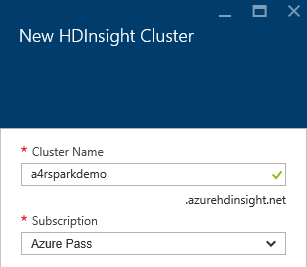
    _Specifying a cluster name_

1.  **Subscription** allows you to specify under which of your currently available Azure subscriptions the cluster will be provisioned. If you have more than one subscription, make sure **Azure Pass** is selected.

1.  **Select Cluster Type** opens the "Cluster Type configuration" blade that allows you to choose an HDInsight Cluster type (Hadoop, HBase, Spark, and so on), the operating system on which to deploy the cluster, the cluster version, and whether you would like to deploy a Standard or Premium cluster. For this lab:

    -   Select **Spark** from the list of cluster types
    -   Make sure **Linux** is the selected operating system
    -   Select the latest Spark version, which is **1.6.1 (HDI 3.4)** at the time of this writing
    -   Select the **STANDARD** cluster tier – be sure to actually click on the **Standard** box in order to enable the **Select** button at the bottom of the page
    -   Click the **Select** button to lock in your selections and close the blade
    
    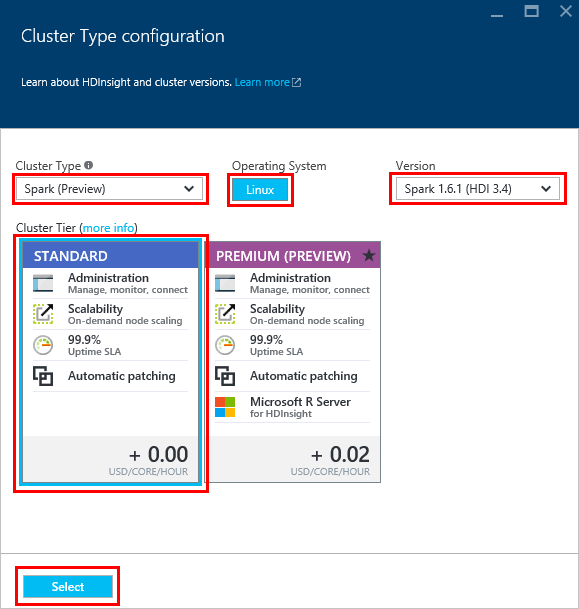
    _Specifying the cluster type_

1.  **Credentials** will open the “Cluster Credentials” blade, where you enter the cluster administration and SSH credentials used when working with your cluster.

    -   Leave **Cluster Login Username** set to "admin"
    -   Set **Cluster Login Password** to "A4rsparkdemo!"
    -   Set **SSH Username** to "sshuser" (without quotation marks)
    -   Leave **SSH Authentication Type** set to **Password**
    -   Set **SSH Password** to "A4rsparkdemo!" (without quotation marks)
    -   Click the **Select** button to lock in your selections and close the blade

    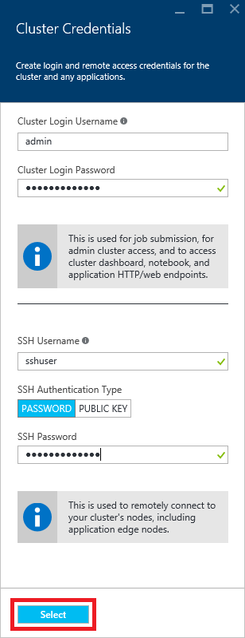
    _Specifying cluster credentials_

1.  **Data Source** will open the “Data Source” blade, which allows you to specify the location and name of the Blob Storage container that will be used as the default HDFS storage volume for your cluster.

    -   Leave **Selection Method** set to **From All Subscriptions**
    -   In the **Create a new storage account** box, enter a storage-account name similar to “a4rsparkdemo,” making sure the value you type is unique. Consider adding your own initials or birth date in order to ensure uniqueness.
    -   For **Choose Default Container**, enter "sparklab" (without quotation marks)
    -   The **Location** value you select here will not only be the location for your cluster storage, but also for the cluster itself. Select an appropriate location, making sure that HDInsight is supported in that region. You can see what services are offered in what regions by checking [here](https://azure.microsoft.com/regions/#services) and scrolling down to the **Analytics** section.
    -   Click the **Select** button to lock in your selections and close the blade

    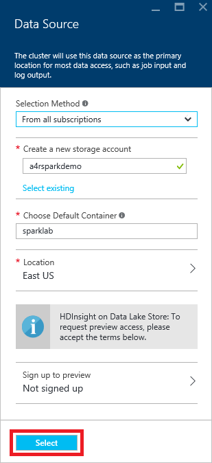
    _Specifying the data source_

1.  **Node Pricing Tiers** will open the “Node Pricing Tiers” blade. This allows you to specify the size of the VMs for the cluster's head nodes, as well as the size and initial quantity of VMs for the worker nodes. For this lab:

    -   Leave **Number of Worker nodes** set to **4**
    -   Leave **Worker Nodes Pricing Tier** set to **D4 v2 (4 nodes, 32 cores)**
    -   Leave **Head Node Pricing Tier** set to **D4 vs (2 nodes, 16 cores)**
    -   Click the **Select** button to lock in your selections and close the blade

    
    _Specifying the node pricing tier_

1.  **Optional Configuration** opens the “Optional Configuration” blade and allows you to configure advanced settings such as membership in a Virtual Network, post-provisioning script actions, and additional storage accounts to link to this cluster. For this lab, accept the default values.

1.  Leave **Resource Group** set to **Create new** and enter “a4rsparkdemo” (without quotation marks) into the **New resource group name** box.

    
    _Specifying a resource group_

1.  Now check the **Pin to Dashboard** box and click the **Create** button at the bottom of the “New HDInsight Cluster” blade to start deploying the cluster.

    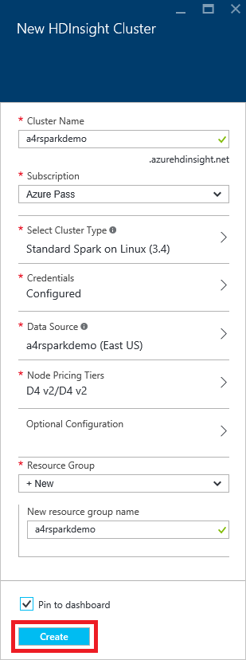
    _Beginning the deployment_

1.  Open the blade for the “a4rsparkdemo” resource group. (An easy way to do that is to click **Resource groups** in the ribbon on the left side of the portal, and then click the resource group's name.) The "Last deployment" section of the blade shows the deployment status. Once the cluster has been deployed, the status will change from "Deploying" to "Succeeded." Deployment typically requires about 20 minutes. Wait for the deployment to finish, and then proceed to the next exercise.

    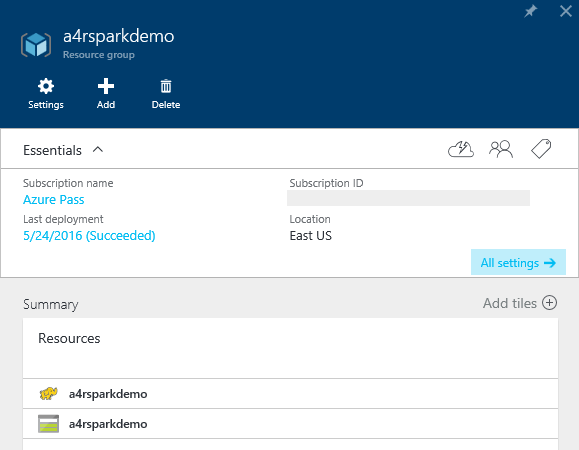
    _Successful cluster deployment_

In this exercise, you learned how to provision an HDInsight Spark cluster on Azure, and about some of the options you can choose from when doing so.

## Exercise 2: Upload Jupyter notebooks to the cluster ##

You will be using Jupyter notebooks to do the data-exploration and machine-learning portions of this lab. The notebooks have been prepared for you ahead of time, and need to be uploaded into your cluster’s storage. In this exercise, you’ll use the cross-platform [Microsoft Azure Storage Explorer](http://storageexplorer.com/) to upload the notebooks. If you did the Azure Storage lab earlier, Storage Explorer is already installed on your computer. If you haven't done that lab, follow the instructions in Exercise 2 of the Azure Storage lab to download and install the Microsoft Azure Storage Explorer.

1.  Start the Microsoft Azure Storage Explorer. If you’re prompted for credentials, log in with the user name and password for your Microsoft account.

1.  In the Storage Explorer window, find the storage account that was created when you deployed the Spark cluster (the storage account name you entered in Exercise 1, Step 7.) Expand the list of items underneath that storage account and click the small arrow next to **Blob Containers** to show the “sparklab” container.

1.  Double-click the “sparklab” container to show its contents. Notice that the provisioning process has pre-populated this container with several folders of content. This container is treated as the root folder for your Spark cluster.

    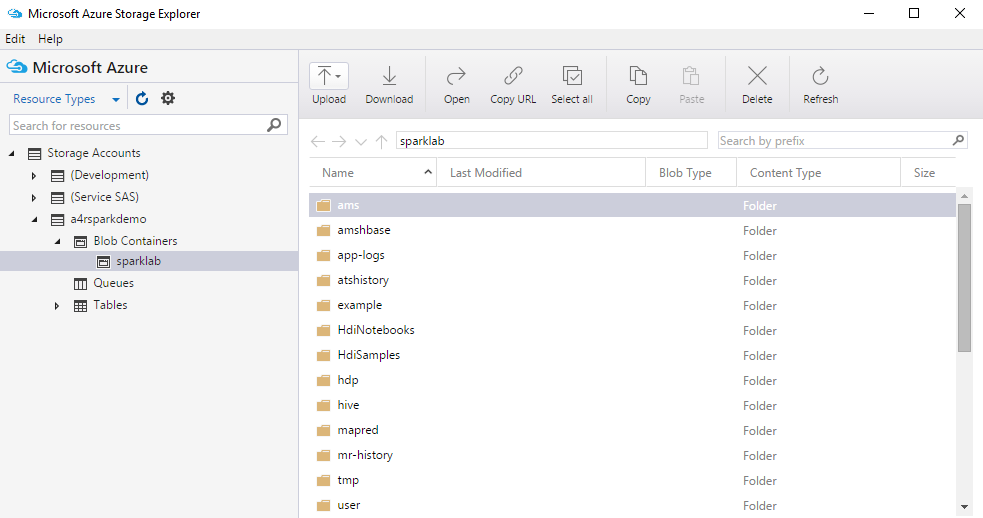
    _Content of the SparkLab container_

1.  Double-click on the “HdiNotebooks” folder to open it. The Jupyter installation in your Spark cluster treats this folder as the root folder for its notebooks.

1.  Click the **Upload** button and select **Upload Files** from the menu.

    
    _Uploading notebook files to the “HdiNotebooks” folder_

1.  Click the **...** button to the right of the field labeled "Files." In the ensuing dialog, navigate to this lab's "resources " subdirectory and select the three files in that subdirectory. Then close the dialog and click the **Upload** button.

    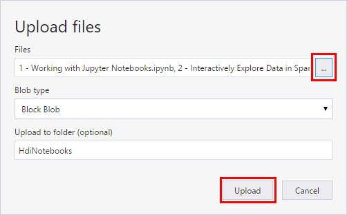
    _Uploading files to blob storage_

1.  Confirm that the files were uploaded to the “HdiNotebooks” folder.

    
    _Uploaded notebooks_

The notebooks are uploaded and ready to go. Let's put them to work.

## Exercise 3: Work with Jupyter Notebooks ##

[Jupyter notebooks](http://jupyter.org/) are web applications that allow you to create shareable, interactive documents containing text, equations, code, and data visualizations. The Jupyter notebook platform supports the ability to use different programming languages by allowing different interpreters – called *kernels* – to be installed. Jupyter notebooks are proving to be extraordinarily useful for data scientists exploring and manipulating data sets in order to gain insights and share results. Spark clusters on HDInsight include Jupyter notebooks along with the Spark and PySpark kernels (Scala and Python, respectively) that you can use with your data. In this exercise, you will learn how to access Jupyter notebooks from your Spark cluster and acquire basic skills for using them.

1.  In the Azure Portal, click the tile for your cluster to open its management blade.

1.  In the blade for the HDInsight Spark cluster, click **Cluster Dashboards.**
  
    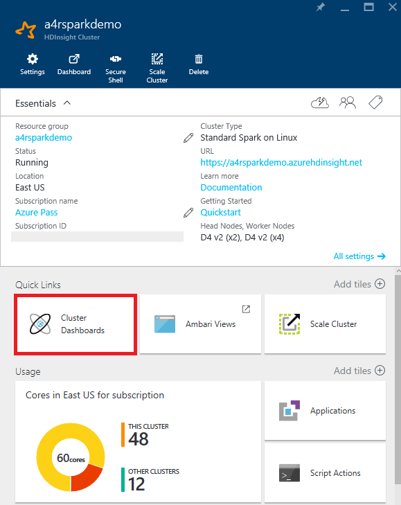
    _Opening the cluster dashboards_

1.  In the "Cluster Dashboards" blade, click **Jupyter Notebook**.
  
    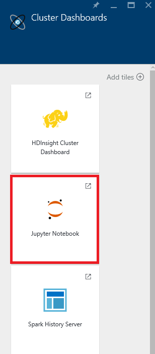
    _Opening Jupyter_

1.  When prompted for a user name and password, log in with your cluster administration credentials (“admin” and “A4rsparkdemo!”) from Exercise 1, Step 6.

1.  A new browser window will open showing the Jupyter notebooks in your cluster’s notebook storage folder. Here, you can manage your notebooks, including creating, uploading, and deleting notebooks. You can also see which notebooks are currently “running”, meaning they are currently consuming resources in your Spark cluster.

1.  Confirm that you see the notebooks that you uploaded in Exercise 2:

    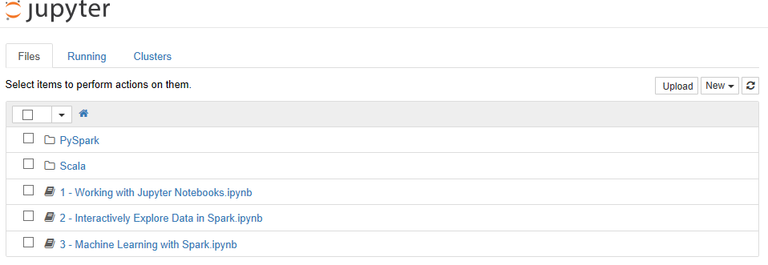
    _Notebooks available to the cluster_

1.  Click **1 – Working with Jupyter Notebooks** to open that notebook.

    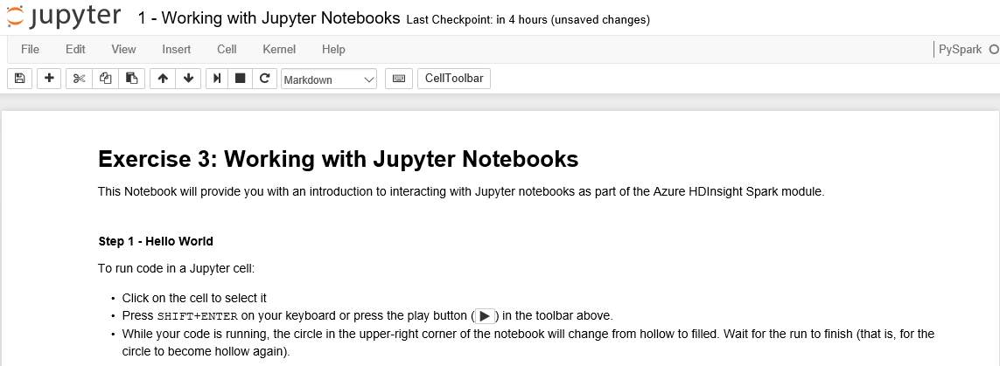
    _Opening the lab notebook_

1.  Jupyter notebooks consist of a series of cells into which you can insert commands, HTML, or Markdown text. The notebook you opened contains the remaining instructions for this exercise. Please follow the instructions, and return to this document once you have completed all the steps.

When you have completed the steps specified in the notebook, close the notebook's browser window.

## Exercise 4: Interactively explore data in Spark ##

One of the ways in which researchers and data scientists use Jupyter notebooks in Spark is to explore datasets in order to understand their content and structure. Notebooks can also be used to visualize data, as well as apply structure to it. DataFrames are particularly helpful in this regard because they make it simple to apply schemas to raw data. DataFrames can also be used to create temporary tables that can be queried using [Apache Hive SQL](http://hortonworks.com/blog/hive-cheat-sheet-for-sql-users/), also known as HiveQL or simply HQL. Libraries such as *matplotlib*, which is already provisioned on your Spark cluster, provide support for graphing, charting, and visualizing datasets and query results. Put them all together and you have a powerful set of tools for exploring and analyzing datasets large and small.

You have already learned how to access and run Spark notebooks on your Azure HDInsight Spark cluster. In this exercise, you will take the learning a level deeper by using DataFrames, HiveQL, and matplotlib to explore actual food inspection data compiled by the city of Chicago. In addition to analyzing the contents of the data, you will apply structure to it, query it, and graph it to discover key relationships.

1.  Go back to the browser window showing the Jupyter notebooks stored in your cluster. If necessary, open the Azure Portal and follow the steps from the previous exercise to find the notebooks.

1.  Click **2 – Interactively Explore Data in Spark** to open that notebook.

    
    _Opening the lab notebook_

1.  Follow the instructions found in the notebook, returning to this document once you have completed all the steps.

When you have completed the steps specified in the notebook, close the notebook’s browser window.

## Exercise 5: Use Jupyter to develop a machine-learning model ##

In the previous exercise, you interactively explored a set of food-inspection data and obtained key insights by looking at it in different ways. However, sometimes the sheer volume and complexity of the data makes relationships difficult to identify. One solution is machine learning, a technique that algorithmically finds patterns in data and exploits those patterns to perform predictive analytics.

Your Azure HDInsight Spark cluster includes several libraries from which you build sophisticated machine-learning models. In this exercise, you will use some of these tools to build, train, and score a machine-learning model using the food inspection data featured in the previous exercise. In that model, you will use a popular classification algorithm to predict which restaurants will be successful and which ones won't based on certain features of the input data.

1.  Go back to the browser window that displays the Jupyter notebooks stored in your cluster. If necessary, open the Azure portal and follow the steps from the previous exercise.

1.  Click **3 - Machine Learning with Spark** to open that notebook.

1.  Follow the instructions found in the notebook, returning to this document once you have completed all the steps.

When you complete the steps specified in the notebook, close the notebook’s browser window.

## Exercise 6: Remove the HDInsight Spark cluster ##

When you are finished with an HDInsight Spark cluster, you should remove it because you are charged for it while it exists, regardless of whether it's doing any work. In this exercise, you will delete the cluster used in the previous exercises.

1.  If the resource group containing your HDInsight Spark cluster is not open in the Azure Portal, click **Resource groups** in the ribbon on the left side of the page, and then click the resource group's name. This will open a blade for the resource group.

1.  In the blade for the resource group, click the **Delete** button.

    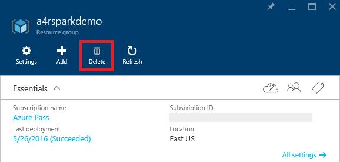
    _Deleting a resource group_

1.  As a safeguard against accidental deletion, you must type the resource group's name to delete it. Type in the name, and then click the **Delete** button at the bottom of the blade.

    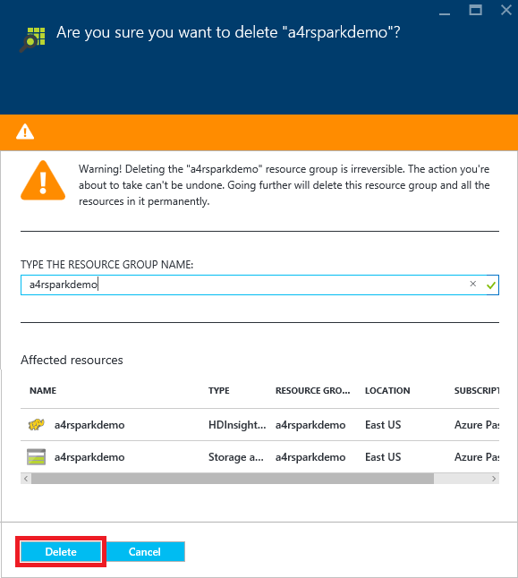
    _Confirming deletion of a resource group_

After approximately 10 minutes, the cluster and all of its associated resources will be deleted.

### Summary ###

Here is a quick summary of the key items you learned in this lab:

-   Apache Spark for Azure HDInsight is Microsoft Azure's implementation of Hadoop, Spark, and supporting big-data tools
-   The Azure Portal makes it easy to create, configure, and delete HDInsight Spark clusters
-   HDInsight Spark clusters come with Jupyter support preinstalled
-   Jupyter notebooks provide a powerful means for querying, analyzing, and visualizing data
-   HDInsight Spark clusters should be deleted when they're no longer needed to avoid incurring unwanted charges

With Apache Spark for Azure HDInsight, high-performance computing clusters with all the tools you need to handle big data are just a few button clicks away. It's just one example of why cloud computing is changing the face of research.

---

Copyright 2016 Microsoft Corporation. All rights reserved. Except where otherwise noted, these materials are licensed under the terms of the Apache License, Version 2.0. You may use it according to the license as is most appropriate for your project on a case-by-case basis. The terms of this license can be found in http://www.apache.org/licenses/LICENSE-2.0.
