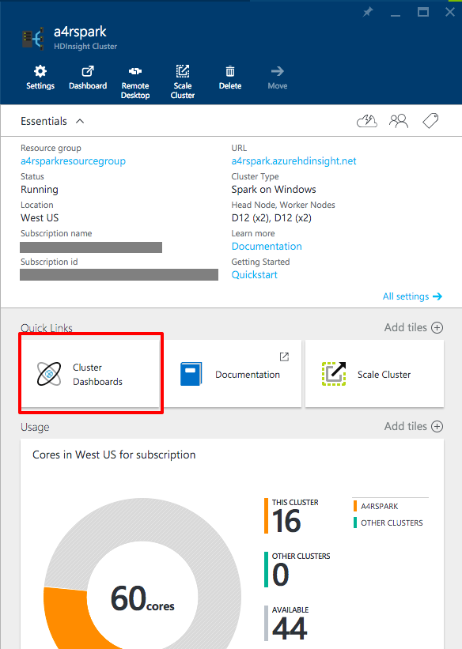
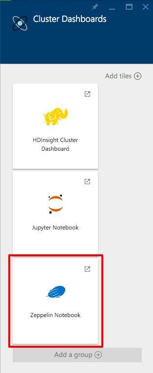
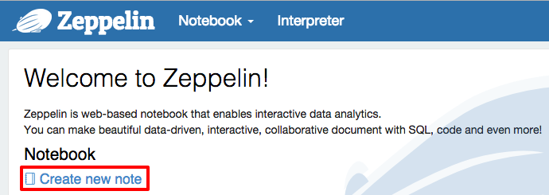
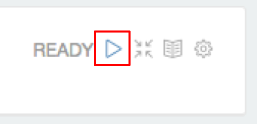
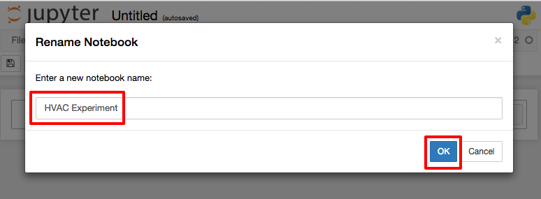
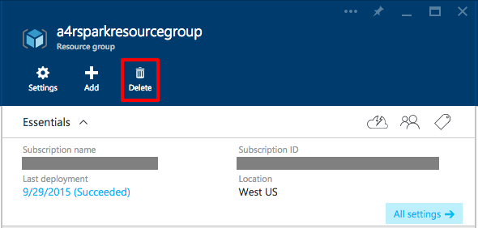

# Data Analytics with Apache Spark for Azure HDInsight #

---

## Overview ##

In 2014, Gartner, Inc., a leading information research company, predicted that in 2015 there would be [4.9 billion connected "things"](http://www.gartner.com/newsroom/id/2905717) in use. When you consider that all those "things" are running serious amounts of software producing equally serious amounts of data, you begin to understand the true implications of **BIG DATA**. Data is being collected in ever-escalating volumes, at increasingly high velocities, and in a widening variety of formats, and it's being used in increasingly diverse semantic contexts. "Data" used to be something stored in a table in a SQL database, but today it can be a sensor reading, a tweet from Twitter, a GPS location, or almost anything else you can imagine. The challenge for information scientists is to make sense of that data.

Traditionally, [Apache Hadoop](https://hadoop.apache.org/) was the choice for big-data analysis. Hadoop enjoys tremendous mindshare in the research community, but because it is inherently disk-based, it is comparatively slow. A new tool that is garnering a lot of attention is [Apache Spark](http://spark.apache.org/). Spark is an open-source framework for large-scale data-analytics applications. Because it is memory-based, Spark can process data up to 100 times faster than Hadoop. Azure HDInsight reduces the complexity of deploying Spark clusters to a few button clicks, with no hardware to buy and no software to install and configure. Additionally, Spark clusters created with Azure HDInsight come complete with the popular notebooking tools [Apache Zeppelin](https://zeppelin.incubator.apache.org/) and [Jupyter](https://jupyter.org/) and offer seamless integration with third-party business-intelligence tools such as Microsoft Power BI.

In this lab, you will experience Apache Spark for Azure HDInsight first-hand. After creating a Spark cluster, you will analyze a data set and use Zeppelin and Jupyter to visualize the results. The goal for this hands-on-lab is that you learn the steps to creating and running your own Azure HDInsight clusters. For this lab, we will work with some simple heating, air-conditioning, and ventation (HVAC) data to see the entire process.

### Objectives ###

In this hands-on lab, you will learn how to:

- Provision an Apache Spark cluster on HDInsight
- Run interactive queries on data loaded into a Spark cluster
- Use Zeppelin and Jupyter to visualize query results
- Delete a Spark cluster to avoid incurring unnecessary charges

### Prerequisites ###

The following are required to complete this hands-on lab:

- A Microsoft Azure subscription - [sign up for a free trial](http://aka.ms/WATK-FreeTrial)
- Completion of the "Azure Storage and Azure CLI" hands-on lab

---

## Exercises ##

This hands-on lab includes the following exercises:

1. [Exercise 1: Creating a Spark cluster on HDInsight](#Exercise1)
1. [Exercise 2: Using Zeppelin to Analyze Data on a Spark cluster](#Exercise2)
1. [Exercise 3: Using Jupyter to Analyze Data on a Spark cluster](#Exercise3)
1. [Exercise 4: Removing an HDInsight Spark cluster](#Exercise4)

Estimated time to complete this lab: **60** minutes.

## Exercise 1: Creating a Spark cluster on HDInsight

Hadoop is a well-established tool for big-data analysis, but it's not the only choice that Azure HDInsight offers you. In this exercise, you will learn how to create an HDInsight cluster running [Apache Spark](http://spark.apache.org/). Spark is renowned for its ease of use and is built for speed, performing some operations 100 times faster than Hadoop in memory and 10 times faster on disk. The in-memory computation capabilities are excellent for interactive algorithms in machine learning and graph computations. Like HDInsight's Hadoop implementation, HDInsight Spark is architected to work seamlessly with Azure blob storage.

1. Log into the [Azure Portal](https://portal.azure.com) with your Microsoft ID.

1. Click **+ NEW** in the upper-left corner. Then click **Data + Analytics**, followed by **HDInsight** to display the "New HDInsight Cluster" blade.

    

    _Creating an HDInsight cluster_

1. The "New HDInsight Cluster" blade accepts several parameters regarding the cluster that's about to be created. **Cluster Name** specifies a unique Domain Name System (DNS) name for the cluster so it can be accessed through a browser. Enter a name, and make sure a green check mark appears next to it indicating that the name is valid. Be sure to **remember this name**, because you will need it to log into the HDInsight cluster in Exercise 2.
 
	**Cluster Type** allows you to choose between various types of clusters (Hadoop, HBase, and so on). For this lab, select **Spark (PREVIEW)** from the list of cluster types.

	**Cluster Operating System** specifies the operating system for all the nodes in the cluster. At the time of this writing, HDInsight Spark clusters only run on Windows Server, so you can accept the default for this field.

	**Subscription** specifies which Azure subscription you want to assign the HDInsight cluster to. If you have multiple subscriptions, select the appropriate one from the drop-down list.

    

    _Specifying the cluster's name and type_

1. In the **Resource Group** section of the "New HDInsight Cluster" blade, click **Create New** and enter a resource-group name. The name you enter must be unique to your subscription, but it doesn't have to be unique across Azure. Look for the green check mark next to the name before proceeding.

	> Resource groups are a relatively recent addition to Azure. They allow you to keep everything associated with an Azure deployment organized into a single cohesive unit. With each grouping, you can use Role-Based Access Control (RBAC) to prevent multiple people using the same account from accessing other people's resources. Another advantage of resource groups is that the resources inside  share the same lifetime. When you're finished with an experiment, you can delete the resource group and thereby delete all the resources inside it. Before resource groups were introduced, deleting an HDInsight cluster was a tedious process that required you to individually delete the virtual machines, networks, storage accounts, and other resources comprising it. You can read more about resource groups in the [documentation](https://azure.microsoft.com/en-us/documentation/articles/resource-group-overview/). When you create anything new in Azure, it's generally advisable to assign it to a resource group.

    

    _Creating a new resource group_

1. The next step is to provide credentials for logging in to the cluster. Click **Credentials** to bring up the "Cluster Credentials" blade. Then enter a password. The password must be at least 10 characters in length and contain at least one digit, one non-alphanumeric character, and one uppercase or lowercase letter. Remember these credentials because you will need them later. When both password boxes show green check marks, click the **Select** button at the bottom of the blade.
 
	> If you wanted to access the Spark cluster directly through Remote Desktop, you could enable that in this blade. You won't be using Remote Desktop to access the cluster in this lab, so you can leave **Enable Remote Desktop** set to **NO**.

    

    _Entering cluster credentials_

1. When creating an HDInsight cluster, you have the choice of using an existing storage account or creating a new one. For this exercise, you want to create a new storage account. Click **Data Source** in the "New HDInsight Cluster" blade. Then click **Create New** under **Select storage account** and enter a name for the new storage account. Remember, the name must be all lowercase, and it must be unique within Azure. Then enter a container name into the **Choose Default Container** field. This is the container that the cluster will use for blob storage. Optionally select the region nearest you under **Location**, and then click the **Select** button at the bottom of the blade.

    > For nearly all Hadoop file operations, the Azure blob storage implementation is seamless if you are coming from your own Hadoop clusters. One small caveat is that native Hadoop Distributed File System (HDFS) commands such as **fschk** and **dfsadmin**, which are platform-dependent, work differently when applied to blob storage.

    

    _Specifying the data source_

1. Click **Node Pricing Tiers** to bring up the "Node Pricing Tiers" blade. Here, you specify the number of nodes in the cluster and the type of virtual machines you want to run. You have complete control over the size of the cluster so you can strike the right balance between processing power and cost. Set the number of worker nodes to 2. Then click the **Select** button at the bottom of the blade.

    

    _Specifying the size of the cluster_

1. The final section of the "New HDInsight Cluster" blade is **Optional Configuration**, but you don't need to change anything there. Feel free to look at it if you are interested. Among other things, you can use this section to enter access keys so your cluster can access blobs in other storage accounts. Now that the "New HDInsight Cluster" blade is filled out, click the **Create** button at the bottom of the blade to start deploying the cluster. The deployment should take approximately 10 to 20 minutes.

    

    _Deploying a Spark cluster_

1. To monitor the deployment, click **Resource groups** in the upper-left corner of the portal. In the "Resource groups" blade, click the resource group whose name you entered in Step 4. This will bring up the blade for your resource group.

	

	_Browsing resource groups_

1. The "Last deployment" section of the resource-group blade shows the date and deployment status. Once the cluster has been deployed, the status will change from **(Deploying)** to **(Succeeded)**. Wait for the deployment to finish, and then proceed to the next exercise.

	

	_Successful cluster deployment_

In this exercise, you learned how easy it is to spin up a Spark cluster on Azure, and about some of the options you can choose from when creating a cluster. In the next exercise, you will employ Zeppelin to analyze a data set and visualize the results.

## Exercise 2: Using Zeppelin to Analyze Data on a Spark cluster

In this exercise, you will process data in a [Zeppelin](https://zeppelin.incubator.apache.org/) notebook. Zeppelin is built in to HDInsight Spark clusters, so no installtion is required. You will analyze and graph heating, ventilating, and air-conditioning (HVAC) data for a group of buildings. You'll get first-hand experience working with HDInsight Spark clusters using Zeppelin, and see just how easy it is to put it to work on real-world data sets.

1. If the resource group containing your HDInsight Spark cluster is not open, click **Resource groups** in the portal. In the "Resource groups" blade, click the resource group you created in Exercise 1. This will bring up the blade for your resource group.

	

	_Browsing resource groups_

1. Click the **Hadoop elephant icon** in your resource group.

	

	_Selecting the Spark cluster from the resource group_

1. In the blade for your HDInsight Spark cluster, click **Cluster Dashboards** in the "Quick Links" section.

	

	_Opening the cluster dashboards_

1. In the "Cluster Dashboards" blade, click **Zeppelin Notebook**.

	

	_Opening a Zeppelin notebook_

1. A new browser tab or window will open and prompt you for a user name and password. Enter the user name and password you specified when you created the HDInsight Spark cluster in Exercise 1, Step 5. Then click the **Log In** button.

	**_Note that your login prompt may look different depending on the browser you are using._**

	

	_Login prompt for the Zeppelin notebook_

1. When you log into Zeppelin in an HDInsight Spark cluster, you have to enter your user name and password multiple times to satisfy Spark's gateway and proxy servers. In the page that opened when you clicked **Log In** in the previous step, click **(link)**. This will open another browser tab or window and prompt you for your user name and password again. Log in a second time. Don't be alarmed by the 502 error; it's expected. You can then close this page in your browser.

	

	_The next step in logging in_

1. Return to the dashboard page and click **(Zeppelin portal)**. Once more, you will be prompted for the cluster's user name and password. Log in for the third time.

	

	_The final step in logging in_

1. Verify that a green light accompanied by the word "Connected" appears in the upper-right corner of the page. If it doesn't, repeat Steps 6 and 7.

	

	_Connected to Zeppelin_

1. With the login to Zeppelin successful, the next step is to create a new note. Click **Create new note**. This will create a new Zeppelin note named "Note XXXXXXXXX" (where the X's are random characters). Click the link informing you that a new note was created to open the note.

	

	_Creating a new note_

1. Click on the notebook name and change it to something appropriate, such as "Research." To commit the name, press the ENTER key.

	

	_Renaming the Zeppelin notebook_

1. The first step in analyzing data is loading it into a temporary table in the HDInsight Spark cluster. The sample data you will use is provided by Microsoft in a storage account associated with this cluster, but you'll have to write some code to load it from storage. Begin by copying the following statements to the clipboard:

	<pre>
	// Create an RDD using the default Spark context, sc
	val hvacText = sc.textFile("wasb:///HdiSamples/SensorSampleData/hvac/HVAC.csv")

	// Define a schema
	case class Hvac(date: String, time: String, targettemp: Integer, actualtemp: Integer, buildingID: String)

	// Map the values in the .csv file to the schema
	val hvac = hvacText.map(s => s.split(",")).filter(s => s(0) != "Date").map(
	    s => Hvac(s(0),
	            s(1),
	            s(2).toInt,
	            s(3).toInt,
	            s(6)
	    )
	).toDF()

	// Register as a temporary table called "hvac"
	hvac.registerTempTable("hvac")
	</pre>

1. In a Zeppelin notebook, you work in paragraphs. Click the empty paragraph in the notebook in preparation for pasting the code you copied to the clipboard in the previous exercise.

	

	_The empty Zeppelin paragraph_

	If you cannot place the cursor into the paragraph and type, that means the paragraph or notebook is set to read-only. To enable editing, click the second button from the left (the one with four arrows pointing to the center).

	

	_Setting a paragraph to edit mode_

	Now paste in the code from the clipboard. The paragraph should now look like this:

	

	_Code pasted into the paragraph_

1. Now you're ready to run the code to import the HVAC data into your cluster. To run the paragraph, either press SHIFT+ENTER, or click the **Run** button highlighted below.

	

	_Running the paragraph_

1. The word "READY" will turn to "PENDING" and the paragraph will gray out. The run is complete when "PENDING" changes to "FINISHED." Additionally, a new paragraph will appear in the notebook. If you would like, you can give a title to the paragraph by clicking the **Settings** button in the paragraph options and choosing **Show title**. If you do change the title, remember to press Enter to complete the change.

	

	_A finished run_

1. With the data now loaded into a temporary table named "hvac," you can run Spark SQL queries on it. Copy the following code to the clipboard and paste it into the new paragraph in your notebook. Then click the **Run** button or press SHIFT+ENTER.

	<pre>
	%sql
	select buildingID, (targettemp - actualtemp) as temp_diff, date
	from hvac
	where date = "6/1/13"
	</pre>

	> The first line of the code tells Spark to use the built-in Spark SQL interpreter. You can see all the provided interpreters by clicking the **Interpreter** link at the top of the page.

1. The query you just executed created a table containing columns for the building ID, the difference between the target temperature and the actual temperature for that building, and the date the data was recorded. The default output is the table itself. But part of Zeppelin's appeal is that it allows you to visualize data in various ways. To demonstrate, click the bar-graph icon. The resulting graph shows the temperature differences in each building. The graph indicates that the actual temperature in building 2 was 58 degrees less than the target temperature, which is deceptive because it's actually the sum of all temperature differences recorded for that building. 

	

	_Bar graph showing temperature differences in each building_

1. A more useful graph would be one that shows the *average* difference between target temperature and actual temperature for each building. Click **Settings** to reveal boxes labeled Keys, Groups, and Values. In the Values box, click **temp_diff SUM** and change SUM to AVG to compute an average.

	

	_Modifying graph settings_

	The new graph shows the *average* difference between target temperature and actual temperature in each building:

	

	_Bar graph showing average temperature differences_

1. Spark SQL allows you to work with data interactively by including variables in your queries. To demonstrate, copy the query below into a new paragraph in your notebook, and then run the query. Because the query includes a variable named "Temp" (short for "Temperature"), you will be prompted to enter a value for it.

	<pre>
	%sql
	select buildingID, date, targettemp, (targettemp - actualtemp) as temp_diff
	from hvac
	where targettemp > "${Temp}" 	
	</pre>

	

	_Prompting for a variable value_

1. In the **Temp** field, enter 65 so the result set will only include buildings in which the target temperature is greater than 65 degrees. Press the ENTER key to execute the query. Then click the bar-graph icon under the **Temp** field to graph the results. By default, the resulting graph uses the first field as the key, and the sum of the second field as the value. The latter isn't very useful because in this case, the second field holds a set of dates.

	

	_Graph showing building numbers and date sums_

1. To make this graph more useful, click **Settings**. Then drag **buildingID** from "All fields" at the top to the Keys box, **targettemp** to the Groups box, and **temp\_diff** to the Values box. Change SUM to AVG for the **temp_diff** field. The resulting graph reveals that the HVAC systems are running below the target temperature on cooler days and above the target temperature on warmer days.

	

	_Graph showing average temperature differences grouped by target temperature_

1. Spark SQL is one way to query data loaded into Spark, but it's not the only way. Spark supports several other languages, including Scala, a functional programming language that is getting a lot of traction in the big-data world. In fact, Spark is written in Scala.

	Suppose you wanted to determine which buildings are the hottest and coldest. One way to do that would be to sum up all the temperature differences recorded for each building and look for the values that are highest and lowest. You could then explore various heating and cooling options for the buildings to get the actual temperatures more in line with the target temperatures.

    The following code shows one way to go about that with Scala. The first line executes a SQL query from Scala to query the "hvac" table created earlier and sum temperature differences for each building. The second and third lines use Scala to sort the data and grab the first row. The fourth and fifth lines register the resulting data set as a Spark table and run a SQL query against it, sorting items in descending order and grabbing the top item. The final two lines display the results.

    <pre>
    // Pull the sum of all temp differences into a DataFrame
    val temp = sql("select buildingID, SUM(targettemp-actualtemp) as sumTemp from hvac group by buildingID")

    // The pure Scala way of manipulating the data to get the coolest building.
    val tempSorted = temp.sort("sumTemp")
    val coolestBuilding = tempSorted.first()

    // Add this as a table and do the SQL way of getting the hottest building.
    temp.registerTempTable("test")
    val hottestBuilding = sql("select * from test order by sumTemp DESC limit 1")

    // Display the data in a rudimentary way. :)
    coolestBuilding.toString()
    hottestBuilding.show()
    </pre>

    In a new editing element on the Zeppelin page, paste the code above and run it. Which buildings are the hottest and coldest?

For more information about Zeppelin, visit the [Zeppelin Web site](https://zeppelin.incubator.apache.org/), where you'll find documentation and numerous examples regarding its use.

## Exercise 3: Using Jupyter to Analyze Data on a Spark cluster

Zeppelin notebooks make it very easy to do interactive data analysis in Spark. Another popular tool is [Jupyter](https://jupyter.org/), which also uses a notebook paradigm, but boasts support for more than 40 programming languages including Python, R, and Scala. Jupyter excels at numerical simulation, statistical modeling, machine learning, and more. In this exercise, you will use a Jupyter notebook and a Python script to query the HVAC sample data provided with your cluster.

1. To start a Jupyter notebook for your HDInsight Spark cluster, browse for the cluster in the Azure Portal by clicking **BROWSE ALL** and clicking on your cluster in the "All resources" blade. Then click **Cluster Dashboards** to display the "Cluster Dashboards" blade, and click **Jupyter Notebook**. This will open a new browser tab or window, depending on the browser.

	

	_Opening a Jupyter notebook_

1. Log in using the user name and password you specified for your cluster in Exercise 1. Once logged in, you will see the default Jupyter workspace. With the **Files** tab selected, click the **New** button on the right-hand side and select **Python 2** from the menu.

	

	_Creating a new Jupyter notebook_

1. The default name for a new Jupyter notebook is "Untitled," which you will want to change. Click "Untitled" and enter a name such as "HVAC Experiment." When you're done, click the **OK** button.

	

	_Renaming a Jupyter notebook_

1. The following Python code imports several required libraries and initializes a Spark SQL context so you can execute Spark SQL commands using the **sqlContext** variable. Copy this code into the edit box in your notebook.

	<pre>
	from pyspark import SparkContext
	from pyspark.sql import SQLContext
	from pyspark.sql.types import *

	# Create Spark and SQL contexts
	sc = SparkContext('spark://headnodehost:7077', 'pyspark')
	sqlContext = SQLContext(sc)
	</pre>

1. Click the **Run** button in the toolbar to run the code.

	

	_Running code in a Jupyter notebook_

1. When code is running in a Jupyter notebook, the circle in the upper-right corner changes from hollow to filled. Wait for the run to finish (that is, for the circle to become hollow again).

	

	_The running-code indicator_

1. After the code finishes running, a new code-entry box will appear. Copy the following code into the box. This code uses the Spark SQL interpreter to load the HVAC data file, create a schema, and run a query against the data:

	<pre>
	# Load the data
	hvacText = sc.textFile("wasb:///HdiSamples/SensorSampleData/hvac/HVAC.csv")

	# Create the schema
	hvacSchema = StructType([StructField("date", StringType(), False),StructField("time", StringType(), False),StructField("targettemp", IntegerType(), False),StructField("actualtemp", IntegerType(), False),StructField("buildingID", StringType(), False)])

	# Parse the data in hvacText
	hvac = hvacText.map(lambda s: s.split(",")).filter(lambda s: s[0] != "Date").map(lambda s:(str(s[0]), str(s[1]), int(s[2]), int(s[3]), str(s[6]) ))

	# Create a data frame
	hvacdf = sqlContext.createDataFrame(hvac,hvacSchema)

	# Register the data fram as a table to run queries against
	hvacdf.registerAsTable("hvac")

	# Run queries against the table and display the data
	data = sqlContext.sql("select buildingID, (targettemp - actualtemp) as temp_diff, date from hvac where date = \"6/1/13\"")
	data.show()
	</pre>

1. After pasting the code, either click the **Run** button or press SHIFT+ENTER to execute the code. When the code finishes running, you'll see the following output:

	<pre>
	buildingID temp_diff date  
	4          8         6/1/13
	3          2         6/1/13
	7          -10       6/1/13
	12         3         6/1/13
	7          9         6/1/13
	7          5         6/1/13
	3          11        6/1/13
	8          -7        6/1/13
	17         14        6/1/13
	16         -3        6/1/13
	8          -8        6/1/13
	1          -1        6/1/13
	12         11        6/1/13
	3          14        6/1/13
	6          -4        6/1/13
	1          4         6/1/13
	19         4         6/1/13
	19         12        6/1/13
	9          -9        6/1/13
	15         -10       6/1/13
	</pre>

The fact that Jupyter is preinstalled in Spark clusters created with Azure HDInsight means that you can get a notebook up and running with minimal effort. If you're new to Jupyter and want to learn more about its features and capabilities, visit the [Jupyter Web site](http://jupyter.org/) and check out the documentation and examples.

## Exercise 4: Removing an HDInsight Spark cluster

When you are finished with an HDInsight Spark cluster, you should remove it because you are charged for it while it exists, regardless of whether it's doing any work. In this exercise, you will delete the cluster used in the previous exercises. Note that because it's so easy to create and delete clusters, these tasks are frequently scripted using the Azure CLI or Azure PowerShell.

1. The first step in removing an HDInsight cluster is to log into the [Azure Portal](https://portal.azure.com).

1. If the resource group containing your HDInsight Spark cluster is not open, click **Resource groups** in the main menu on the left side of the page. In the "Resource groups" blade, click the resource group you created in Exercise 1. This will bring up the blade for your resource group.

	

	_Browsing resource groups_

1. In the blade for your resource group, click the **Delete** button.

    

    _Deleting a resource group_  

1. As a safeguard against accidental deletion, you must type the resource group's name to delete it. Type in the name, and then click the **Delete** button at the bottom of the blade.

    

    _Confirming deletion of a resource group_  

    After 10 minutes or so, the cluster and all of its associated resources will be deleted.

## Summary ##

Here is a quick summary of the key items you learned in this lab:

- HDInsight is Microsoft Azure's implementation of Hadoop, Spark, and supporting big-data tools
- The Azure Portal makes it easy to create, configure, and delete HDInsight Spark clusters
- HDInsight Spark clusters come with Zeppelin and Jupyter preinstalled
- Zeppelin and Jupyter notebooks provide powerful means for querying and visualizing data
- HDInsight Spark clusters should be deleted when they're no longer needed to avoid incurring unwanted charges

---

Copyright 2015 Microsoft Corporation. All rights reserved. Except where otherwise noted, these materials are licensed under the terms of the Apache License, Version 2.0. You may use it according to the license as is most appropriate for your project on a case-by-case basis. The terms of this license can be found in http://www.apache.org/licenses/LICENSE-2.0.
