
# Creating and Using a SLURM Linux Cluster #

---

## Overview ##

In this lab, you will create a Simple Linux Utility for Resource Management ([SLURM](https://computing.llnl.gov/linux/slurm/overview.html)) cluster of Ubuntu computers running on Azure and use it to parallelize the task of converting color images to grayscale. You will learn how easy it is to configure many virtual machines at once using Azure resource manager templates, as well as how to get resources from your local workstation into your Azure virtual machines with the cross-platform [Azure CLI](https://azure.microsoft.com/en-us/documentation/articles/xplat-cli/) command-line tools. In addition, you will gain first-hand experience working with blob storage containers.

### Objectives ###

In this hands-on lab, you will learn how to:

- Create a resource group to hold your SLURM cluster
- Deploy preconfigured virtual machines using the Azure Quick Start Templates
- Copy local resources to the SLURM cluster
- Copy files into blob storage
- Use ssh to remote into the master machine of the SLURM cluster
- Kick off a SLURM job
- View the status of a SLURM job
- Retrieve the results of the job from blob storage
- Suspend virtual machines
- Delete a resource group to remove all traces

### Prerequisites ###

The following are required to complete this hands-on lab:

- A Microsoft Azure subscription - [sign up for a free trial](http://aka.ms/WATK-FreeTrial)
- Completion of the "Azure Storage and Azure CLI" hands-on lab
- For OS X and Linux users:
    - The [Azure CLI](https://azure.microsoft.com/en-us/documentation/articles/xplat-cli/) command-line tool for your workstation operating system.
- For Windows Users:
	- [PuTTY](http://www.chiark.greenend.org.uk/~sgtatham/putty/download.html). Install the latest full package that includes PuTTY and the PSCP programs. Your best option is to use the install program to get these tools on your system. When you run the installer, note the directory where the tools are installed. You will need that directory to run the tools. The default installation location is "C:\Program Files (x86)\PuTTY".
	- The latest [Azure PowerShell module](http://go.microsoft.com/fwlink/p/?linkid=320376&clcid=0x409). Accept all the defaults when installing.

---

## Exercises ##

This hands-on lab includes the following exercises:

1. [Exercise 1: Create the resource group to hold the SLURM cluster and resources](#Exercise1)
1. [Exercise 2: Create the SLURM Ubuntu cluster from an Azure Quickstart resource template](#Exercise2)
1. [Exercise 3: Create storage containers for input and output](#Exercise3)
1. [Exercise 4: Update the script files with your Azure information](#Exercise4)
1. [Exercise 5: Copy the input images to blob storage](#Exercise5)
1. [Exercise 6 (OS X and Linux): Copy SLURM project scripts, configure the SLURM nodes, and execute the SLURM job](#Exercise6)
1. [Exercise 7 (Windows): Copy SLURM project scripts, configure the SLURM nodes, and execute the SLURM job](#Exercise7)
1. [Exercise 8: Verify that the images were converted](#Exercise8)
1. [Exercise 9: Suspend the SLURM cluster](#Exercise9)
1. [Exercise 10: Delete the resource group to remove the SLURM cluster](#Exercise10)

Estimated time to complete this lab: **60** minutes.

## Exercise 1: Create the resource group to hold the SLURM cluster and resources
In this exercise, you will create a resource group to store the SLURM cluster of virtual Ubuntu machines and the Azure resources used by the cluster, including Network Interface Cards, IP addresses, and storage accounts. Resource groups are a great feature of Microsoft Azure that allow you to group together logical the logical resources that comprise an application — resources such as virtual machines, networks, and databases — so that entire applications can be deployed, managed, and even deleted with a few simple steps. Another advantage of resource groups is that you can consolidate all the charges for the individual resources so you can quickly and easily find out how much the entire application costs to operate.

Yet another advantage of Azure resource groups is that you can apply security rights to individual users using Role-Based Access Control (RBAC). This allows you to have multiple people using a single Azure account without interfering with one another's deployments and resources. In addition, you can use the Azure CLI to script the creation and management of resource groups and thereby automate common tasks.

All resources in Azure have to be contained in a resource group. When you create resources without specifying a resource group, those resources get added to a default resource group. You can create additional resource groups as needed, and when creating Azure applications, it is considered best practice to create a resource group up front to hold the application's resources. One of the best features of resource groups is that when you are finished with a group, you can delete everything in it simply by deleting the group. This is particularly helpful in a lab environment because it makes experimentation and trials much easier to manage.

1. Log into the [Microsoft Azure Portal](https://portal.azure.com) to get started.

    

    _Microsoft Azure Management Portal_

1. From the Azure Portal, click **+NEW -> Management -> Resource Group** to bring up the "Resource group" blade

    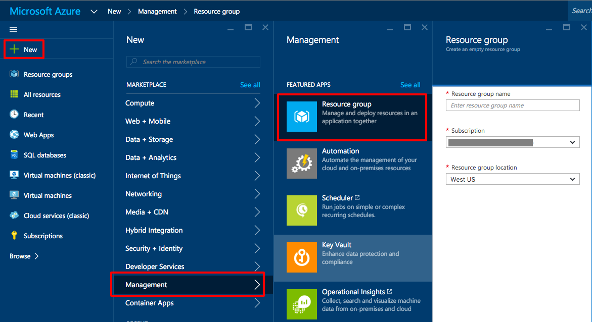

    _Resource group blade_

1. In the "Resource group" blade, enter a name for the resource group that you will create for this lab — for example, "SLURMLabResourceGroup". Resource-group names do not have to be globally unique as storage-account names do, but they must be unique within your Azure account.

	After entering the name, click **Resource group location** and choose the location closest to where you are. Optionally, if you have multiple Microsoft Azure subscriptions, you can select the subscription you wish to use by clicking **Subscription**. Leave **Pin to Startboard** checked so the resource group appears on your Azure Portal home screen. Once you're finished, click the **Create** button at the bottom of the blade.

	> If there are any errors, such as spaces in the resource-group name, the fields containing the errors will be flagged with red excalamation points. Hover the mouse over an exclamation point to get help resolving the error.

1. Resource group creation is quick. To browse to your new resource group, click **Resource group** on the left side of the portal and click on the named resource group in the **Resource groups** blade. In the screen shot below, the resource group named is "SLURMLabResourceGroup".

    

    _Empty Resource group blade_

You created a resource group, but that group is currently empty. The next step is to create something to go in it.

## Exercise 2: Create the SLURM Ubuntu cluster from an Azure Quickstart resource template
The Azure Resource Manager allows you to provision applications using declarative templates. A template contains a complete description of everything in your application, including virtual machines, databases, Web apps, IP addresses, and other resources. Templates can include parameters that users will be prompted to fill in each time an application is deployed. And templates can invoke scripts (on Windows, a script could even apply a PowerShell Desired State Configuration, or DSC) to initialize resources to a known and consistent state. The idea is that you can use the same template repeatedly and consistently during every stage of your application or research lifecycle.

As an example, suppose you are working on a High-Performance Computing (HPC) experiment. By creating a template, you can easily share the complete application, and optionally the data that goes with it, with colleagues. This makes it easy for others to spin up their own instances of the application, which means more time researching and less time configuring. To learn more about Azure Resource Manager templates, you can read the [documentation](https://azure.microsoft.com/en-us/documentation/articles/resource-group-template-deploy/) online.

For this lab, you will use a deployment template built by the Azure team. You will find many excellent templates on the [Azure Quickstart Templates](http://azure.microsoft.com/en-us/documentation/templates/) page and in the Quickstart templates [GitHub repository](https://github.com/Azure/azure-quickstart-templates). Most people use the GitHub location because it is updated more often and offers an easy way to browse changes made to the templates.

The template you are going to use, which you can [view here](https://github.com/Azure/azure-quickstart-templates/tree/master/slurm) on GitHub, is titled "Deploy a slurm cluster." It performs the following steps:

- Creates a storage account to contain the virtual machines
- Deploys three Ubuntu servers named "master," "worker0," and "worker1"
- Creates a private network for the three servers
- Creates a public IP address for master server
- Creates the same user account on all three machines
- Executes a shell script to configure ssh and install and configure SLURM on all three machines

Let's get started!

1. In a browser tab, navigate to [https://github.com/Azure/azure-quickstart-templates/tree/master/slurm](https://github.com/Azure/azure-quickstart-templates/tree/master/slurm). In the middle of the page, click the **Deploy to Azure** button. This will load the template into the Azure Portal for you.

    

     _Deploying from GitHub_

1. In the Azure Portal, you will be prompted to enter values for various parameters defined in the template.

    

     _Filling in the template parameters_

1. For the DNSNAME and NEWSTORAGEACCOUNTNAME, you will have to enter names that are unique to the Internet. Fortunately, you will be notified if they're not unique. A common convention is to assign NEWSTORAGEACCOUNTNAME the DNS name with the word "storage" appended to it (for example, "slurmlab" and "slurmlabstorage"). Fill in these two values. **Remember that storage account names can only contain numbers and lowercase letters**.

1. For ADMINUSERNAME and ADMINPASSWORD, enter values you can easily remember; you will need them in subsequent exercises. Do note that little error checking is performed on these values. For example, if you include a space in ADMINUSERNAME, the deployment will fail with a cryptic error message. Also, passwords longer than 32 characters are not handled correctly. Microsoft is aware that error checking for template parameters needs to improve and is working on it. For ADMINUSERNAME, either use the default or your given name, and keep the ADMINPASSWORD length to less than 16 characters just to be safe.

1. For SCALENUMBER, the default of 2 is sufficient for this lab. This value specifies the number of virtual-machine worker nodes in the cluster. The template automatically creates an additional VM to serve as the master node.

1. For LOCATION, type in the location that you selected for the resource group from [Exercise 1](#Exercise1).

1. Click the *OK* button on the bottom of the Parameters blade. Fix any errors reported.

1. Back in the "Custom deployment" blade, click **Resource group**, and in the "Resource group" blade, select the resource group you created in [Exercise 1](#Exercise1). This will automatically fill in the resource-group location in the "Custom deployment" blade.

    

     _Selecting the resource group_

1. The final step before clicking **Create** is to review the legal terms. Click **Legal terms** and once you have read the terms, click the **Buy** button on the bottom of the "Buy" blade. Note that all the templates provided by Microsoft are free, but there is a cost for running the machines. Other vendors may charge for the template itself.

    

     _Agreeing to the legal terms_

1. In the bottom of the "Custom deployment" blade, click the **Create** button to start the deployment process. If there are errors, fix them and try again. You should leave **Pin to Startboard** checked so you can quickly access this deployment from your home screen.

    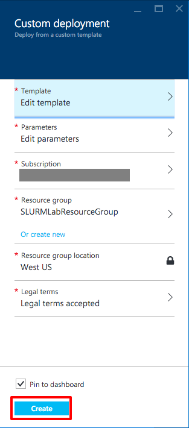

     _Starting the deployment_

1. The provisioning and loading of the SLURM cluster can take 10 minutes or more. You can monitor the status of the deployment by looking at the resource group. If you pinned the resource group you created in [Exercise 1](#Exercise1), you can double-click it to open it in a blade and see what's happening. If you did not pin the resource group, on the left-hand side of the portal, select **Resource group** followed by resource group name you created in in [Exercise 1](#Exercise1). Either way, you will see a blade like the one shown below.

    

     _Checking the deployment_

1. As a deployment occurs, you can monitor the steps Azure is performing by double-clicking on the graph in "Monitor" section of the resource group's blade. The graphic below shows the events currently associated with the deployment.

    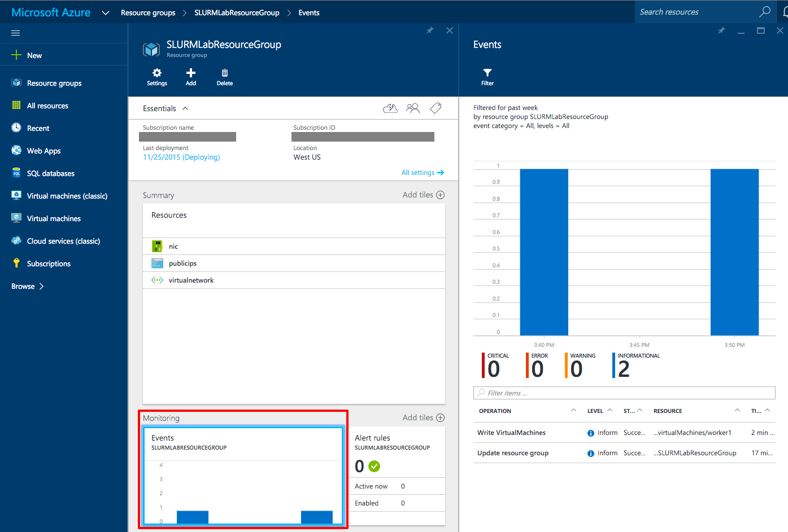

     _Deployment events_

1. When the deployment finishes, you'll see a notification in the "Notification" blade and in the resource group's blade, "Last deployment" will switch to **Succeeded**.

    

     _Deployment succeeded_

Congratulations! You just deployed a Linux cluster using a predefined deployment template. Now let's create a couple of storage containers to hold the color images that the cluster will process and the grayscale images generated from the color images.

## Exercise 3: Create storage containers for input and output

The Python script you will be running on the SLURM cluster to generate grayscale images from color images requires two blob storage containers: one for input and one for output. Because these containers are unique to the experiment and not to the deployment, you will create them now that the deployment has completed.

1. In the blade for the resource group you created in [Exercise 1](#Exercise1), look for the storage account whose name you entered in [Exercise 2](#Exercise2) as a template parameter. Click on it to open a blade for the storage account.

    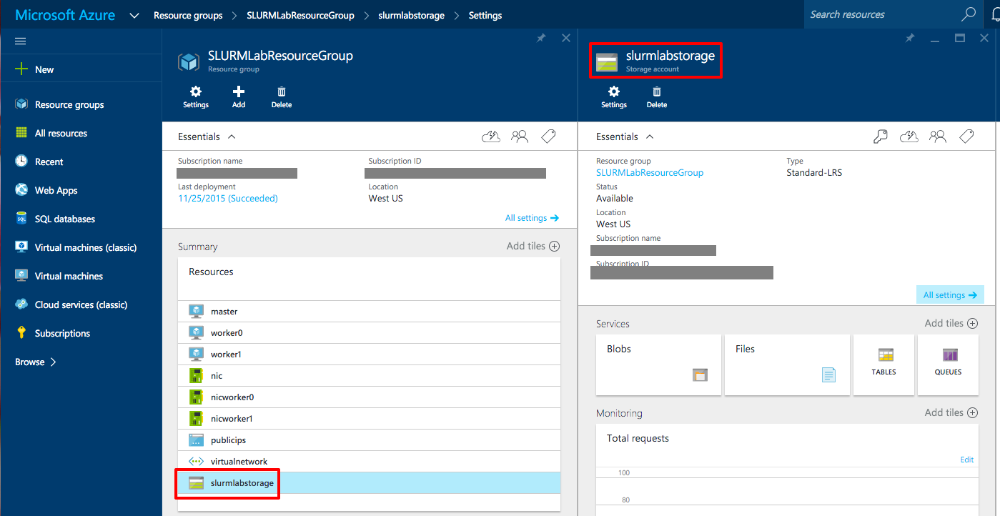

    _Storage account blade_

1. In the storage account's blade, click on **Blobs** to bring up the "Blobs Service" blade. You'll notice that you already have one container named "vhd." That container was created by the deployment template to hold the virtual hard disks (VHDs) for the three virtual machines.

    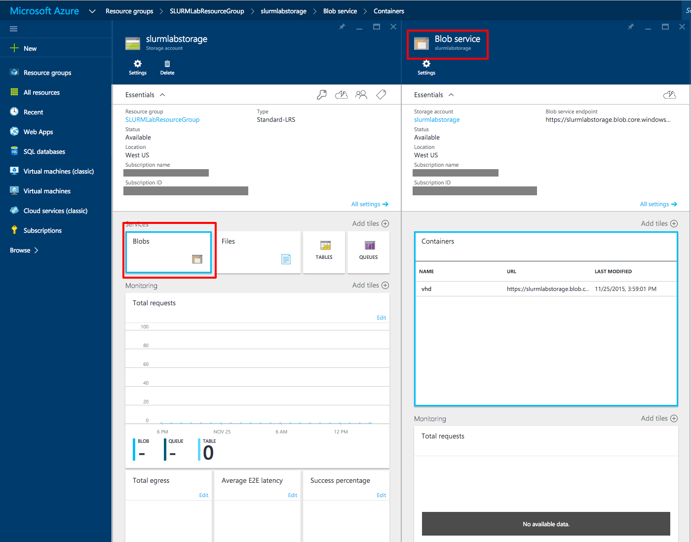

    _Blobs blade_

1. In the "Blobs" blade, click the **Containers** area to bring up the "Containers" blade. Click on the **Add** button to bring up the "New container" blade. the **Name** field, enter "input" and click the **Create** button at the bottom of the blade. Leave **Access type** set to Private to protect your data. Now add a second blob container named "output".

    

    _Creating a new container_

    The screen shot below shows what the blade will look like after adding the two containers.

    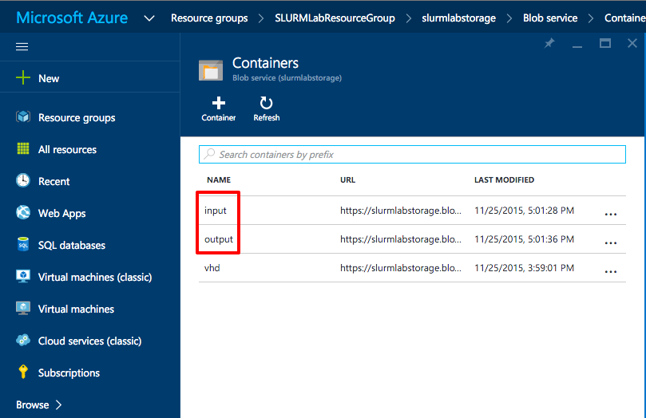

    _Input and output containers_

That's it! You now have containers to hold the input and output. The next step is to update the scripts that you will use to process the images.

## Exercise 4: Update the script files with your Azure information

With the SLURM cluster initialized and running, you now need to modify the job scripts with information from your Azure account. In the same directory as this file is a directory named "SLURMSource." You will need to edit the script files in that directory. For editing on OS X or Linux, it is probably safer to use terminal programs than graphical editors, because the latter can change line endings and break the scripts (especially on OS X). If you are used to vi or EMACS, you're in good shape. If you're not comfortable with those editors, OS X and most Linux operating systems come with [Pico](https://en.wikipedia.org/wiki/Pico_%28text_editor%29), or derivatives named _nano_ or _rnano_ which are very simple to use. If you are on Windows, Notepad works fine.

The information you need from Azure is the access keys and connection strings for the storage account that was created from the deployment template in [Exercise 2](#Exercise2) and that you initialized with containers in [Exercise 3](#Exercise3). All storage is accessible through [Representational State Transfer (REST)](https://en.wikipedia.org/wiki/Representational_state_transfer) Application Programming Interfaces (APIs), but since you made the containers private rather than public, these keys and connection strings are required to access them.

1. In the portal, open the resource group you created in [Exercise 1](#Exercise1). In the blade, click on the storage account to open the "Storage account" blade.

1. In the "Storage account" blade, click the key icon to bring up the "Access keys" blade as shown below. Leave the "Access keys" blade open in your browser as you work on the script files.

    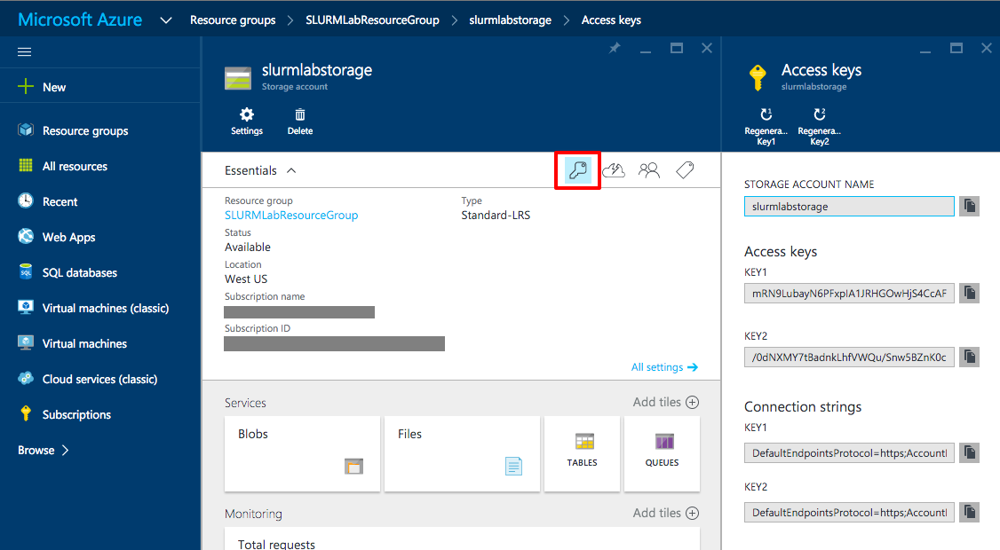

    _Access keys_

1. Copy the SLURMSource directory to a new location on your workstation.

1. If you are on OS X or Linux, open your terminal-window tool of choice. On Windows, start PowerShell from the Windows menu.

1. In your terminal program or PowerShell window, change to the directory where you copied the SLURMSource files.

1. **If you are running OS X or Linux**: In your editor, open copyimages.sh. This script copies the sample images to the input container.

1. **If you are running Windows**: In Notepad or your favorite editor, open copyimages.ps1. This PowerShell file copies the sample images to the input container.

1. Back in the Azure Portal, in the "Access keys" blade you left open, click the button to the right of the primary connection string to copy the string to the clipboard.

    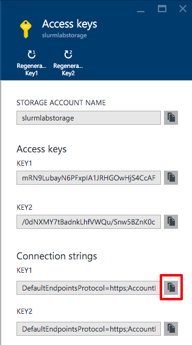

    _Copying the primary connection string_

1. On OS X or Linux, replace **<Your Container Key Here\>** in copyimages.sh with the connection string on the clipboard, as shown below. **Make sure that the string starts and ends with quotation marks**. Then save the file and close the editor.

    <pre>
    azure config mode arm
    cd Images
    for f in *.jpg
    do
    	azure storage blob upload -c "DefaultEndpointsProtocol=https;AccountName=..." "${f##*/}" input "${f##*/}"
    done
    cd ..
    </pre>

1. On Windows, replace **<Your Container Key Here\>** in copyimages.ps1 with the connection string on the clipboard, as shown below. **Make sure that the string starts and ends with quotation marks**. Then save the file and close the editor.

    <pre>
	Import-Module Azure
	Set-Location .\Images
	$context = New-AzureStorageContext -ConnectionString "DefaultEndpointsProtocol=https;..."
	dir *.* | ForEach-Object { Set-AzureStorageBlobContent -Container "input" -Blob $_.Name -File $_.Name -Context $context -Force }
	Set-Location ..\
    </pre>

1. Open slurmdemo.py file in a text editor and find the following section near the top of the file:

	<pre>
    ########################################################
    # Update these two variables to those for your account.
    #######################################################
    ACCOUNT_NAME = '&ltaccount name&gt'
    ACCOUNT_KEY = '&ltaccount key&gt'
    #######################################################
    </pre>

1. Switch back to the Azure Portal "Access key" blade and click the button next to **STORAGE ACCOUNT NAME** to copy the name to the clipboard.

1. In the editor, replace **<account name\>** with the account name you just copied. Make sure the account name is surrounded by single quotes.

1. Back in the Azure portal Access key blade, click the button next to the primary access key to copy that key to the clipboard.

1. In the editor, replace **<account key\>** with the key you just copied. Make sure the account key is surrounded by single quotes. The final output will look like the following:

	<pre>
    ########################################################
    # Update these two variables to those for your account.
    #######################################################
    ACCOUNT_NAME = 'jrslurmlabstorage'
    ACCOUNT_KEY = 'jWdpHOyfIdJ+VdTRgJvpWsf0bgrz+8+qrunWbGym/ULY....'
    #######################################################
    </pre>

1. Save your changes to slurmdemo.py and exit your editor.

1. Open slurmdemo.setup.sh in your editor. Search for all instances of **<admin account\>** and replace them with the ADMINUSERNAME property you specified in the template in [Exercise 2](#Exercise2). There are six instances that need to be changed. Save the file and exit the editor.

    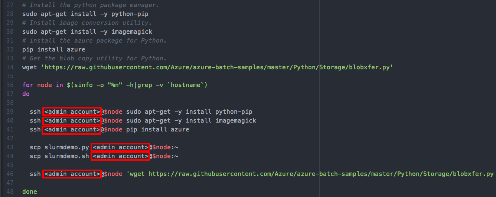

    _Changing slurmdemo.setup.sh to use your ADMINUSERNAME_

1. Leave the terminal running to do the next exercise.

You've updated the script files with the necessary information. Now it's time to copy the color image files into the input container so you can put your Linux cluster to work.

## Exercise 5: Copy the input images to blob storage

With the scripts now customized for your particular Azure instance, you need to upload the images to be processed into the input container you set up in [Exercise 2](#Exercise2). So that you don't have to upload them manually, OS X and Linux and Linux users can use copyimages.sh to copy the files, and Windows users can use CopyImages.ps1.

1. **For OS X and Linux users**: In your terminal window, execute the following command:

	<pre>
    sh copyimages.sh
    </pre>

	If you entered the connection string properly when you modified the script, you will see output similar to the following:

    <pre>
    info:    New mode is arm
    info:    Executing command storage blob upload
    + Checking blob Consoles_superhero_1920x768.jpg in container input
    + Uploading Consoles_superhero_1920x768.jpg to blob Consoles_superhero_1920x768.jpg in container input
    Percentage: 100.0% (217.11KB/217.11KB) Average Speed: 217.11KB/S Elapsed Time: 00:00:01
    + Getting Storage blob information
    data:    Property       Value
    data:    -------------  -------------------------------
    data:    container      input
    data:    blob           Consoles_superhero_1920x768.jpg
    data:    blobType       BlockBlob
    data:    contentLength  222321
    data:    contentType    image/jpeg
    data:    contentMD5     03bLcVuf9gvn/rQtw5nb/Q==
    info:    storage blob upload command OK
    info:    Executing command storage blob upload
    + Checking blob Desktop-surface-3-Docking-Station.jpg in container input
    + Uploading Desktop-surface-3-Docking-Station.jpg to blob Desktop-surface-3-Docking-Station.jpg in container input
    Percentage: 100.0% (67.26KB/67.26KB) Average Speed: 67.26KB/S Elapsed Time: 00:00:00
    + Getting Storage blob information
    data:    Property       Value
    data:    -------------  -------------------------------------
    data:    container      input
    data:    blob           Desktop-surface-3-Docking-Station.jpg
    data:    blobType       BlockBlob
    data:    contentLength  68875
    data:    contentType    image/jpeg
    data:    contentMD5     WLHLtPArkcLziEyX6pbhqw==
    info:    storage blob upload command OK
    info:    Executing command storage blob upload
    + Checking blob Desktop-surface-3-Dockset.jpg in container input
    + Uploading Desktop-surface-3-Dockset.jpg to blob Desktop-surface-3-Dockset.jpg in container input
    Percentage: 100.0% (55.98KB/55.98KB) Average Speed: 55.98KB/S Elapsed Time: 00:00:00
    + Getting Storage blob information
    data:    Property       Value
    data:    -------------  -----------------------------
    data:    container      input
    data:    blob           Desktop-surface-3-Dockset.jpg
    data:    blobType       BlockBlob
    data:    contentLength  57321
    data:    contentType    image/jpeg
    data:    contentMD5     EEOqgQwRbuAZUsZ0EJzXYQ==
    info:    storage blob upload command OK
    info:    Executing command storage blob upload
    </pre>

1. **For Windows users**: In a PowerShell window, execute the following command:

	<pre>
	.\CopyImages.ps1
	</pre>

	If you entered the connection string properly when you modified the script, you will see output similar to the following:

	<pre>

	   Container Uri: https://jrslurmlabstorage.blob.core.windows.net/input

	Name                                          BlobType  Length ContentType              LastModified                 Sn
	                                                                                                                     ap
	                                                                                                                     sh
	                                                                                                                     ot
	                                                                                                                     Ti
	                                                                                                                     me
	----                                          --------  ------ -----------              ------------                 --
	chandler_xboxone_accessories_hero_960x450.jpg BlockBlob 33755  application/octet-stream 8/20/2015 11:02:33 PM +00:00
	chandler_xboxone_hardware_960x540_01.jpg      BlockBlob 39287  application/octet-stream 8/20/2015 11:02:33 PM +00:00
	chandler_xboxone_hardware_960x540_02.jpg      BlockBlob 30261  application/octet-stream 8/20/2015 11:02:33 PM +00:00
	chandler_xboxone_hardware_960x540_03.jpg      BlockBlob 37750  application/octet-stream 8/20/2015 11:02:34 PM +00:00
	Chat-pad_accessories_470x300.png              BlockBlob 112410 application/octet-stream 8/20/2015 11:02:34 PM +00:00
	Consoles_superhero_1920x768.jpg               BlockBlob 222321 application/octet-stream 8/20/2015 11:02:35 PM +00:00
	Desktop-pro3-docking-station.png              BlockBlob 173133 application/octet-stream 8/20/2015 11:02:35 PM +00:00
	</pre>

1. Leave the terminal or PowerShell window running for future exercises.

In this exercise, you learned how to batch copy files into Azure blob storage using a combination of shell scripting and Azure CLI commands. Now you're ready for the next step: using the SLURM cluster to process the images. If you're running OS X or Linux, proceed to [Exercise 6](#Exercise6). If you're running Windows, skip to [Exercise 7](#Exercise7).

## Exercise 6 (OS X and Linux): Copy SLURM project scripts, configure the SLURM nodes, and execute the SLURM job

*This exercise is for OS X and Linux operating systems. If you are doing this lab on Windows, jump to [Exercise 7](#Exercise7).*

It is time to connect to the SLURM cluster remotely and configure it to do the work you need to do. That means uploading some of the files you modified in [Exercise 4](#Exercise4) to the master node of the SLURM cluster. Here's a quick summary of those files and what they do:

- copyimages.sh - Copies the images from the ./Images directory to the input blob storage container you created in [Exercise 3](#Exercise3) on OS X and Linux
- CopyImages.ps1 - Copies the images from the ./Images directory to the input blob storage container you created in [Exercise 3](#Exercise3) on Windows
- slurmdemo.py - The Python script that runs on the SLURM nodes to process the images
- slurmdemo.setup.sh - The script that sets up the SLURM nodes with the dependencies and packages needed for the Python script to run
- slurmdemo.sh - The SLURM control script that runs on each of the SLURM nodes to perform a single unit of work

The goal of this exercise to get the slurmdemo.* files uploaded to the master node of the SLURM cluster.

1. The deployment template you used created an IP address and a publicly addressable Domain Name System (DNS) name for the master virtual machine. To find that name, open the blade for the resource group you created in [Exercise 1](#Exercise1). Then click **publicips** under "Summary" to bring up the "Public IP address" blade. There you will find the DNS name. If you move the mouse to the right of the DNS name, a button will magically appear that lets you copy the DNS name to the clipboard. Click the button.

    

    _Finding the public DNS name for the master SLURM Node_

1. If you closed the terminal window you opened in [Exercise 4](#Exercise4), open another one and navigate to the directory containing the scripts you modified in the same exercise. Before you do a secure copy, you want to check that you can Secure Shell (ssh) into the master node. In your terminal window, enter the following command to initiate an ssh connection, replacing **_masterDNS_** with the DNS name on the clipboard, and replacing **_adminuser_** with the admin user you set up in the ADMINUSERNAME field of the deployment template in [Exercise 2](#Exercise2).

    <pre>
    ssh -l <i>adminuser</i> <i>masterDNS</i>
    </pre>

	After pressing Enter, and after entering your ADMINPASSWORD from [Exercise 2](#Exercise2), you should see something similar to the following:

    <pre>
    The authenticity of host 'jrslurmlab.westus.cloudapp.azure.com (104.XX.XXX.XXX)' can't be established.
    RSA key fingerprint is 92:c2:1c:54:18:9f:ef:b7:97:07:57:XX:XX:XX:XX:XX.
    Are you sure you want to continue connecting (yes/no)? yes
    Warning: Permanently added 'jrslurmlab.westus.cloudapp.azure.com,104.XX.XX.XXX' (RSA) to the list of known hosts.
    XXXXXXXXXX@jrslurmlab.westus.cloudapp.azure.com's password:
    Welcome to Ubuntu 15.04 (GNU/Linux 3.19.0-25-generic x86_64)

     * Documentation:  https://help.ubuntu.com/

      System information as of Sun Aug  9 03:33:04 UTC 2015

      System load:  0.09              Processes:           104
      Usage of /:   4.3% of 28.42GB   Users logged in:     0
      Memory usage: 5%                IP address for eth0: 10.0.0.254
      Swap usage:   0%

      Graph this data and manage this system at:
        https://landscape.canonical.com/

      Get cloud support with Ubuntu Advantage Cloud Guest:
        http://www.ubuntu.com/business/services/cloud

    12 packages can be updated.
    2 updates are security updates.

    The programs included with the Ubuntu system are free software;
    the exact distribution terms for each program are described in the
    individual files in /usr/share/doc/*/copyright.

    Ubuntu comes with ABSOLUTELY NO WARRANTY, to the extent permitted by
    applicable law.

    To run a command as administrator (user "root"), use "sudo <command>".
    See "man sudo_root" for details.
    </pre>

1. Type an **exit** command in your terminal to return to your workstation.

1. To copy files to the master node, you will use secure copy, or scp. Enter the following command in your terminal, replacing **_adminuser_** with your ADMINUSERNAME and **_masterDNS_** with your public DNS address. When prompted, enter your ADMINPASSWORD.

    <pre>
    scp *.py sl*.sh <i>adminuser</i>@<i>master DNS</i>:~
    </pre>

1. If the scp command succeeded, you will see output similar to the following:

    <pre>
    user@machine:~$ scp *.py sl*.sh <i>admin user</i>@jrslurmlab.westus.cloudapp.azure.com:~
    XXXXXXXXXX@jrslurmlab.westus.cloudapp.azure.com's password:
    slurmdemo.py                                                                       100% 5041     4.9KB/s   00:00
    slurmdemo.setup.sh                                                                 100% 1863     1.8KB/s   00:00
    slurmdemo.sh                                                                       100%  468     0.5KB/s   00:00
    </pre>

1. With the SLURM job files now copied to the master node, it is time to set up the nodes with the packages and languages necessary to run this particular job. To do that, you must log back into the master node and execute the setup script that configures every node in the cluster. Log in with the following command, using the same user name and password as before:

    <pre>
    ssh -l &lt;admin user&gt; &lt;masterDNS&gt;
    </pre>

1. The configuration script you want to run is in the file named slurmdemo.setup.sh. Execute the command below to run the script. It takes 10 minutes or so to run, so as it runs, take time to examine the script to see the steps required to configure a SLURM cluster and think about how you could modify it to fit other needs.

    <pre>
    sh slurmdemo.setup.sh
    </pre>

1. Once all nodes are configured, it is time to run the SLURM job. Still logged into the master node, execute the following command to kick everything off.

    <pre>
    python slurmdemo.py
    </pre>

	> As the job is running, you can use the **sinfo** command to check the state of the SLURM job.

In this exercise, you learned how to copy files to the master SLURM node and to execute a SLURM job. Next, you'll check the output to verify that the job ran correctly.

## Exercise 7 (Windows): Copy SLURM project scripts, configure the SLURM nodes, and execute the SLURM job

*This exercise is for Windows operating systems. If you are doing this lab on OS X or Linux, jump to [Exercise 8](#Exercise8)*

It is time to connect to the SLURM cluster remotely and configure it to do the work you need to do. That means uploading some of the files you modified in [Exercise 4](#Exercise4) to the master node of the SLURM cluster. Here's a quick summary of those files and what they do:

- copyimages.sh - Copies the images from the ./Images directory to the input blob storage container you created in [Exercise 3](#Exercise3) on OS X and Linux
- CopyImages.ps1 - Copies the images from the ./Images directory to the input blob storage container you created in [Exercise 3](#Exercise3) on Windows
- slurmdemo.py - The Python script that runs on the SLURM nodes to process the images
- slurmdemo.setup.sh - The script that sets up the SLURM nodes with the dependencies and packages needed for the Python script to run
- slurmdemo.sh - The SLURM control script that runs on each of the SLURM nodes to perform a single unit of work

The goal of this exercise to get the slurmdemo.* files uploaded to the master node of the SLURM cluster.

1. The deployment template you used created an IP address and a publicly addressable Domain Name System (DNS) name for the master virtual machine. To find that name, open the blade for the resource group you created in [Exercise 1](#Exercise1). Then click **publicips** under "Summary" to bring up the "Public IP address" blade. There you will find the DNS name. If you move the mouse to the right of the DNS name, a button will magically appear that lets you copy the DNS name to the clipboard. Click the button.

    

    _Finding the oublic DNS name for the master SLURM Node_

1. Before you do a secure copy, you need to check that PuTTY works and you can Secure Shell (ssh) into the master node. If you installed PuTTY with the installer, press the Windows key and type "putty" to start it. If you installed PuTTY by copying the files, use Explorer to find and run putty.exe. In the PuTTY user interface, paste the Public IP address for your master node into the **Host Name (or IP address field)**. Then click the **Open** button to initiate a connection.

    

    _The PuTTY Host Name field_

1. Because this is the first time you are connecting to the master node, PuTTY will display a warning dialog. Since the virtual machines are ones you created, it is safe to click **Yes**, but you can click **No** if you don't want to cache the RSA2 fingerprint.

    

    _The PuTTY warning_  

1. After you click **Yes** or **No**, a console window will appear and you will be prompted to **login as**. Enter the name of the admin user you entered into the ADMINUSERNAME field of the deployment template in [Exercise 2](#Exercise2). After pressing Enter, and after entering your ADMINPASSWORD from [Exercise 2](#Exercise2), you should see something similar to the following:

    <pre>
    login as: XXXXXXXXXX
    XXXXXXXXXX@jrslurmlab.westus.cloudapp.azuire.com's password:
    Welcome to Ubuntu 15.04 (GNU/Linux 3.19.0-25-generic x86_64)

     * Documentation:  https://help.ubuntu.com/

      System information as of Sun Aug  9 03:33:04 UTC 2015

      System load:  0.09              Processes:           104
      Usage of /:   4.3% of 28.42GB   Users logged in:     0
      Memory usage: 5%                IP address for eth0: 10.0.0.254
      Swap usage:   0%

      Graph this data and manage this system at:
        https://landscape.canonical.com/

      Get cloud support with Ubuntu Advantage Cloud Guest:
        http://www.ubuntu.com/business/services/cloud

    12 packages can be updated.
    2 updates are security updates.

    The programs included with the Ubuntu system are free software;
    the exact distribution terms for each program are described in the
    individual files in /usr/share/doc/*/copyright.

    Ubuntu comes with ABSOLUTELY NO WARRANTY, to the extent permitted by
    applicable law.

    To run a command as administrator (user "root"), use "sudo <command>".
    See "man sudo_root" for details.
    </pre>

1. With an ssh connection established, leave PuTTY running because you will need it in a future step.

1. To copy the files you need to the master node, you will use PuTTY's secure copy, or pscp.exe. In a PowerShell window, navigate to the directory containing the scripts you modified in [Exercise 4](#Exercise4). To ensure you can run pscp.exe, you will first simply run the program in the PowerShell window. Type the full path to where you installed PuTTY followed by "\pscp.exe", as shown below. Note that the default location is **C:\Program Files (x86)\Putty**.

    <pre>
    & 'C:\Program Files (x86)\PuTTY\pscp.exe'
    </pre>

1. Press Enter and confirm that you see the following output. If so, you're ready for the next step.

    <pre>
    PuTTY Secure Copy client
    Release 0.65
    Usage: pscp [options] [user@]host:source target
           pscp [options] source [source...] [user@]host:target
           pscp [options] -ls [user@]host:filespec
    Options:
      -V        print version information and exit
      -pgpfp    print PGP key fingerprints and exit
      -p        preserve file attributes
      -q        quiet, don't show statistics
      -r        copy directories recursively
      -v        show verbose messages
      -load sessname  Load settings from saved session
      -P port   connect to specified port
      -l user   connect with specified username
      -pw passw login with specified password
      -1 -2     force use of particular SSH protocol version
      -4 -6     force use of IPv4 or IPv6
      -C        enable compression
      -i key    private key file for user authentication
      -noagent  disable use of Pageant
      -agent    enable use of Pageant
      -hostkey aa:bb:cc:...
                manually specify a host key (may be repeated)
      -batch    disable all interactive prompts
      -unsafe   allow server-side wildcards (DANGEROUS)
      -sftp     force use of SFTP protocol
      -scp      force use of SCP protocol
    </pre>

3. Enter the following command in your terminal, replacing **_adminuser_** with your ADMINUSERNAME and **_masterDNS_** with your public DNS address. When prompted, enter your ADMINPASSWORD.

    <pre>
     & 'C:\Program Files (x86)\PuTTY\pscp.exe' *.py sl*.sh <i>adminuser</i>@<i>masterDNS</i>:/home/azureuser
    </pre>

1. If the pscp command succeeded, you will see output similar to the following. You will be asked if you want to cache the RSA2 fingerprint. You can answer **y** or **n** as appropriate.

    <pre>
    The server's host key is not cached in the registry. You
    have no guarantee that the server is the computer you
    think it is.
    The server's rsa2 key fingerprint is:
    ssh-rsa 2048 XX:XX:XX:XX:XX:XX:XX:XX:XX:XX:XX:XX:XX:XX:XX:XX
    If you trust this host, enter "y" to add the key to
    PuTTY's cache and carry on connecting.
    If you want to carry on connecting just once, without
    adding the key to the cache, enter "n".
    If you do not trust this host, press Return to abandon the
    connection.
    Store key in cache? (y/n) n
    azureuser@jrslurmwin.westus.cloudapp.azure.com's password:
    slurmdemo.py              | 5 kB |   5.1 kB/s | ETA: 00:00:00 | 100%
    slurmdemo.setup.sh        | 1 kB |   1.9 kB/s | ETA: 00:00:00 | 100%
    slurmdemo.sh              | 0 kB |   0.5 kB/s | ETA: 00:00:00 | 100%
    </pre>

1. One of the challenges you often run into when copying files from Windows machines to Linux machines is line endings. Windows likes lines ending with a carriage return and line feed ("/r/n"), while Linux wants only a line feed ("/n"). Just to be sure there are no problems running the script files, it is always a good idea to do a conversion. In the previously opened PuTTY window where you established the ssh connection, type the following commands to install and run the dos2unix conversion program.

    <pre>
    sudo apt-get install dos2unix
    dos2unix -k -o slurm*
    </pre>

1. With the SLURM job files copied to the master node and the line endings fixed, it is time to set up the nodes with the packages and and languages necessary to run this particular job. To do that, you must return to the master node and execute the setup script that configures every node in the cluster.

	Switch back to the PuTTY ssh session, which is still connected to the master node. The configuration script you want is in slurmdemo.setup.sh. Execute the command below. It takes 10 minutes or so to run, so as it runs, take time to examine the script to see the steps required to configure a SLURM cluster and think about how you could modify it to fit other needs.

    <pre>
    sh slurmdemo.setup.sh
    </pre>

1. Once all nodes are configured, it is time to run the SLURM job. Still connected to the master node, execute the following command to kick everything off.

    <pre>
    python slurmdemo.py
    </pre>

	> As the job is running, you can use the **sinfo** command to check the state of the SLURM job.

In this exercise, you learned how to copy files to the master SLURM node and to execute a SLURM job. Next, you'll check the output to verify that the job ran correctly.

## Exercise 8: Verify that the images were converted

If everything worked correctly, the grayscale images generated from the color images in the input container should be in the output container you created in [Exercise 3](#Exercise3).

1. In the Azure portal, open the blade for the resource group you created in [Exercise 1](#Exercise1), and open the storage account as you did in [Exercise 3](#Exercise3). Then click on the Blobs section to bring up the "Blobs" blade, and click the **output** container.

    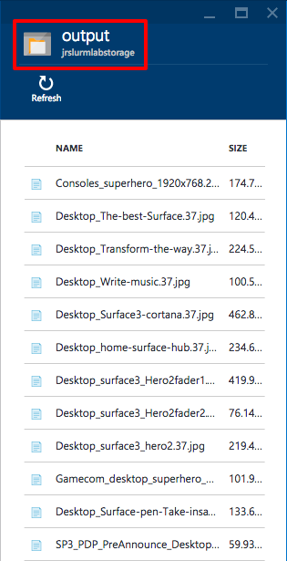

    _Listing the blobs in the output container_

1. Find one of the larger files in the blob and double-click it. In the ensuing blade, click the **Download** button and view the file.

    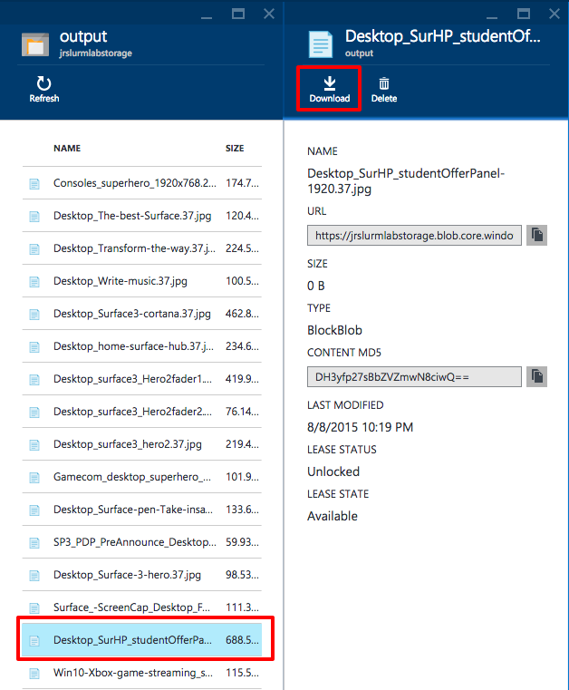

    _Downloading an output blob_

	If the image is grayscale, congratulations! You have a working SLURM cluster.

You know how to set up and configure SLURM clusters and run jobs on them. But when those clusters aren't being used, you probably want to shut them down to avoid incurring unnecessary charges. The next exercise explains how.

## Exercise 9: Suspend the SLURM cluster

When virtual machines are running, you are being charged — even if the VMs are idle. Therefore, it's advisable to stop virtual machines that are not in use. You will still be charged for the storage, but that cost is typically insignificant compared to the cost of running a VM. The Azure portal makes it easy to stop virtual machines. VMs that you stop are easily started again later so you can pick up right where you left off.

1. Open the blade for the resource group you created in [Exercise 1](#Exercise1). Click on the virtual machine named "worker1" in the "Summary" section to bring up the "Virtual machine" blade. Then click the **Stop** button to stop the virtual machine.

    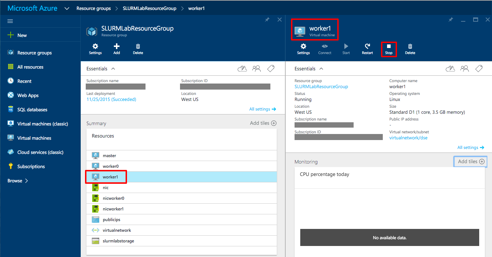

    _Stopping a virtual machine_

1. Repeat this process for the virtual machines named "worker0" and "master."

You can stop and start virtual machines in the Azure portal, but if you have a lot of VMs, that's not very efficient. In the real world, you might prefer to use an Azure CLI script to enumerate all the VMs in a resource group and start or stop them all. For more information on scripting the Azure CLI, refer to the section entitled "How to script the Azure CLI for Mac, Linux, and Windows" in [Install and Configure the Azure CLI](https://azure.microsoft.com/en-us/documentation/articles/xplat-cli/).

## Exercise 10: Delete the resource group to remove the SLURM cluster

Back in [Exercise 1](#Exercise1), you learned that resource groups are an outstanding feature of Azure because they let you manage groups of resources such as the virtual machines in a SLURM cluster. One of the most practical reasons to use resource groups is that when you're finished with a resource group, deleting it deletes all the resources it contains. Rather than go through and delete those resources one by one, you can delete them in one fell swoop and save money on your Azure subscription.

In this exercise, you'll delete the resource group you created in [Exercise 1](#Exercise1).

1. In the Azure portal, open the blade for the resource group you created in [Exercise 1](#Exercise1). Click the **Delete** button at the top of the blade.

	

	_Deleting a resource group_

1. For safety, you are required to type in the resource group's name. (Once deleted, a resource group cannot be recovered.) Type the name of the resource group you wish to delete.

1. Click the **Delete** button to remove all traces of this lab from your account.

### Summary ###

In this hands-on lab, you learned how to:

- Create a resource group
- Deploy preconfigured virtual machines using the Azure Quick Start Templates
- Copy local resources to a SLURM cluster
- Copy files into blob storage
- Use ssh to remote into the master machine of a SLURM cluster
- Kick off a SLURM job
- View the status of a SLURM job
- Retrieve output from blob storage
- Suspend virtual machines
- Delete a resource group

Copyright 2015 Microsoft Corporation. All rights reserved. Except where otherwise noted, these materials are licensed under the terms of the Apache License, Version 2.0. You may use it according to the license as is most appropriate for your project on a case-by-case basis. The terms of this license can be found in http://www.apache.org/licenses/LICENSE-2.0.
