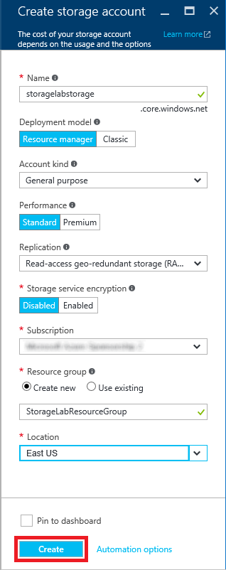
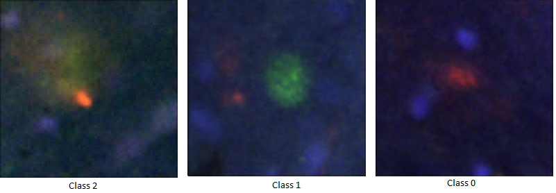
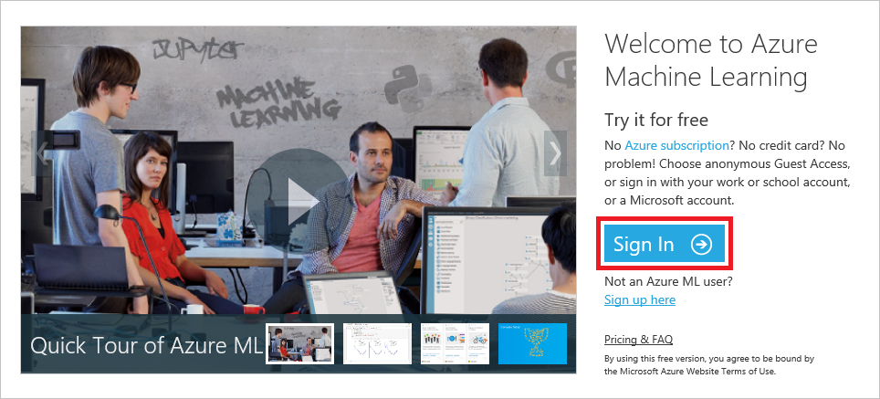
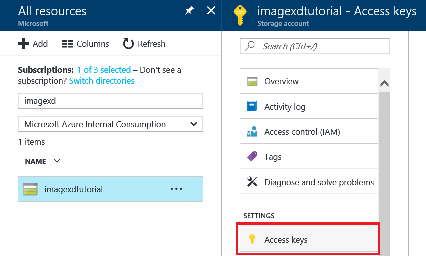
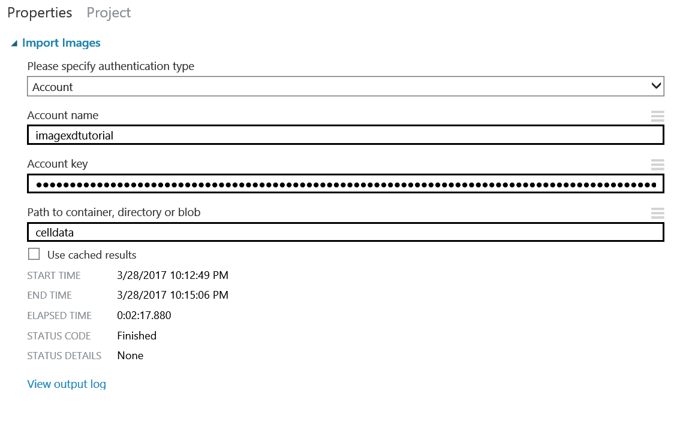
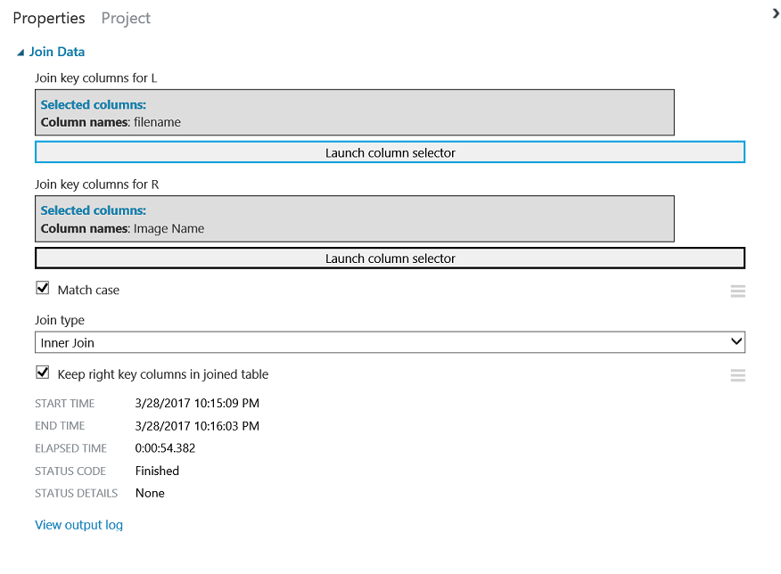
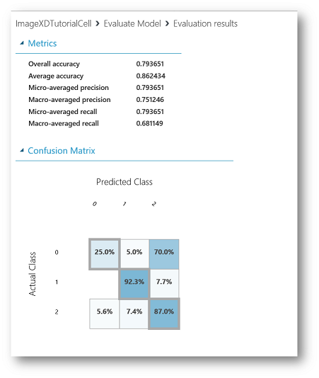
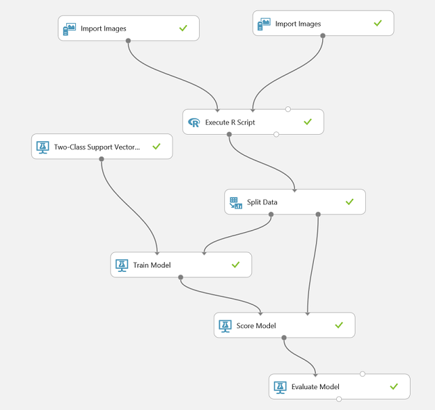
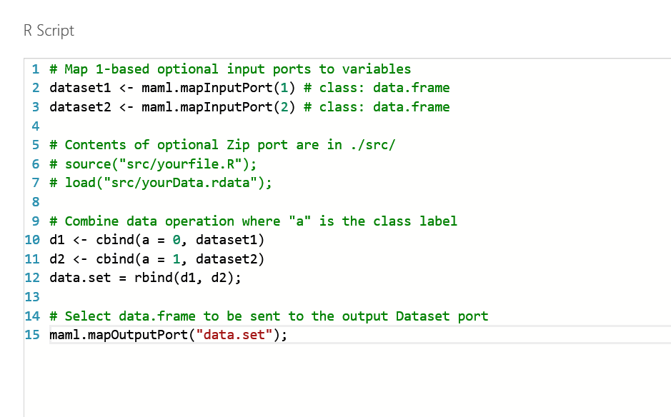
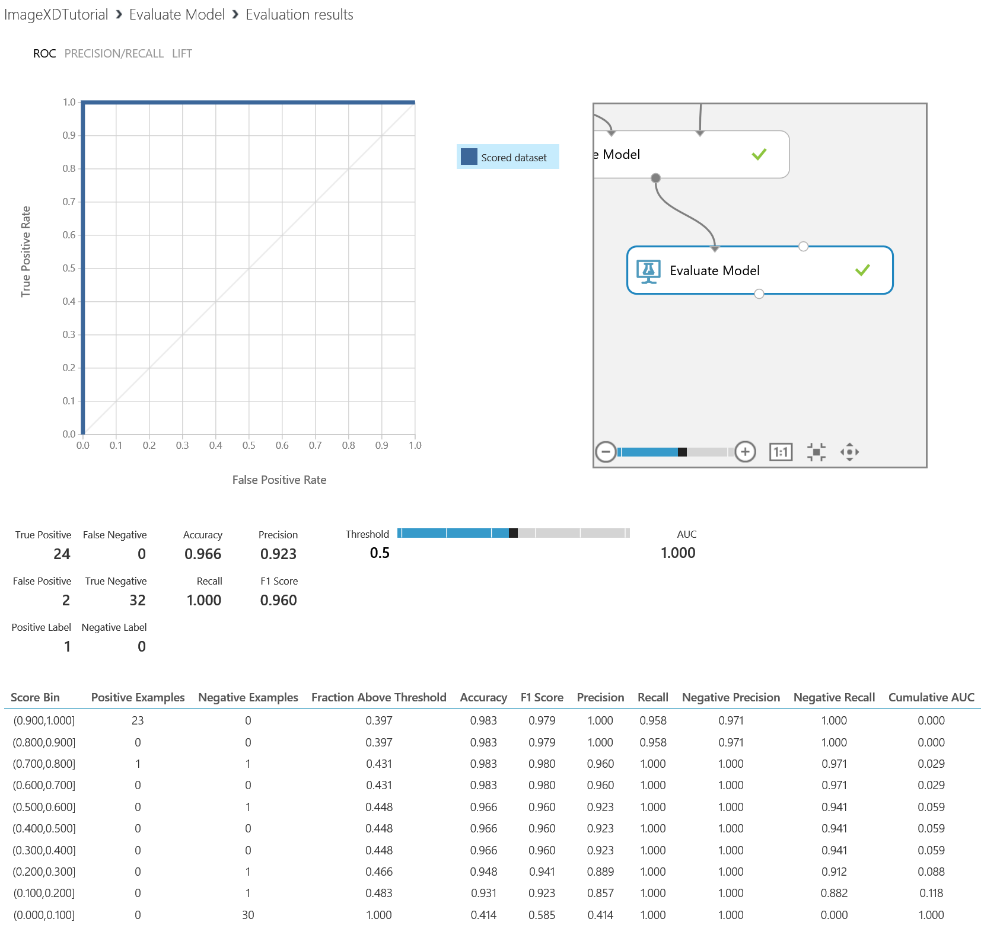

# Image classification with Azure Machine Learning #

---

## Overview ##

Microsoft Azure Storage is a set of services that allows you to store large volumes of data in a cost-effective manner and in a way that makes the data readily and reliably available for consumption. Data committed to Azure Storage can be stored in blobs, tables, queues, or files. [Azure blobs](http://azure.microsoft.com/en-us/services/storage/blobs/) are ideal for storing images, videos, and other types of data, and are frequently used to provide input to and capture output from other Azure services such as [Azure Machine Learning](https://azure.microsoft.com/en-us/services/machine-learning/) and [Azure Stream Analytics](http://azure.microsoft.com/en-us/services/stream-analytics/). [Azure tables](http://azure.microsoft.com/en-us/services/storage/tables/) provide NoSQL storage for semi-structured data. [Azure queues](http://azure.microsoft.com/en-us/services/storage/queues/) support queued message transfers between applications (or parts of applications) and can be used to make applications more scalable and robust by loosely coupling them together. Finally, [Azure Files](http://azure.microsoft.com/en-us/services/storage/files) use the Server Message Block (SMB) protocol to share files through the cloud and access storage as network drives.

Azure Machine Learning is a cloud-based predictive-analytics service that offers a streamlined experience for data scientists of all skill levels. It's accompanied by the Azure Machine Learning Studio (ML Studio), which is a browser-based tool that provides an easy to use, drag-and-drop interface for building machine-learning models. It comes with a library of time-saving experiments and features best-in-class algorithms developed and tested in the real world by Microsoft businesses such as Bing. And its built-in support for R and Python means you can include scripts of your own to customize your model. Once you've built and trained your model in the ML Studio, you can easily expose it as a Web service that is consumable using a variety of programming languages, or share it with the community by placing it in the Cortana Intelligence Gallery.

In this lab, you will learn how to work with storage accounts, storage containers, and storage blobs. You'll also get familiar with some of the tools used to manage them, including the [Microsoft Azure Storage Explorer](http://storageexplorer.com/), a free tool from Microsoft that runs on Windows, macOS, and Linux. The knowledge you gain will be used in later labs featuring Azure services that rely on blob storage for input and output, and will serve you well when you use Azure in your research.
you will then create a machine learning experiment in Azure Machine learning studio and use it to train an SVM based image classifier based on the cell data used in the ImageXD tutorials.

### Objectives ###

In this hands-on lab, you will learn how to:

- Create storage accounts using the Azure Portal
- Create storage containers using the Microsoft Azure Storage Explorer
- Upload blobs to storage using the Microsoft Azure Storage Explorer
- Work with Azure Machine Learning Studio
- Prepare input image data and use it to train an SVM based model
- Score the model and evaluate its accuracy

### Prerequisites ###

The following is required to complete this hands-on lab:

- An active Microsoft Azure subscription. If you don't have one, [sign up for a free trial](http://aka.ms/WATK-FreeTrial).
- [Microsoft Azure Storage Explorer](http://storageexplorer.com/)

----

## Exercises ##

This hands-on lab includes the following exercises:

- [Exercise 1: Use the Azure Portal to create a storage account](#Exercise1)
- [Exercise 2: Use Storage Explorer to create a container and upload blobs](#Exercise2)
- [Exercise 3: Create an experiment and load a dataset](#Exercise3)
- [Exercise 4: Preprocess the data](#Exercise4)
- [Exercise 5: Define the features](#Exercise5)
- [Exercise 6: Select a learning algorithm and train the model](#Exercise6)
- [Exercise 7: Score the model](#Exercise7)

Estimated time to complete this lab: **60** minutes.

## Exercise 1: Use the Azure Portal to create a storage account ##

The [Azure Portal](https://portal.azure.com) allows you to perform basic storage operations such as creating storage accounts, viewing what's stored under those accounts, and managing the access keys associated with the accounts. In this exercise, you'll use the portal to create a storage account.

1. Open the [Azure Portal](https://portal.azure.com/) in your browser. If you are asked to sign in, do so with your Microsoft account.
 
1. The first step in using Azure Storage is to create one or more storage accounts. To create a storage account, click **+ New** in the ribbon on the left. Then click **Storage**, followed by **Storage account**.

    

    _Adding a storage account_

1. In the ensuing blade, enter a name for the new storage account in **Name** field. The name is important, because it forms one part of the URL through which blobs created under this account can be accessed.

	> Storage account names can be 3 to 24 characters in length and can only contain numbers and lowercase letters. In addition, the name you enter must be unique within Azure; if someone else has chosen the same name, you'll be notified that the name isn't available with a red exclamation mark in the **Name** field.

	Once you have a unique name that Azure will accept (as indicated by the green check mark in the **Name** field), select **Create new** under **Resource group** and type "StorageLabResourceGroup" (without quotation marks) into the box below to name the resource group that will be created for the storage account. Select the location nearest you in the **Location** box. Then click the **Create** button at the bottom of the blade.
    
	

    _Creating a storage account_

1. Click **Resource groups** in the ribbon on the left side of the portal to list all of your resource groups. In the "Resource groups" blade, click the **StorageLabResourceGroup** resource group. Once the blade showing the contents of the resource group appears, click the storage account that you created in the previous step.

	

    _Opening a storage account_

1. In the blade for the storage account, click **Blobs** to view a list of blob containers.

    

    _Viewing blob containers_

The storage account currently has no containers. Before you create a blob, you must create a container to store it in. You can create containers and upload blobs in the Azure Portal, or you can use external tools that offer additional features that the portal does not. In Exercise 2, you will use the cross-platform [Microsoft Azure Storage Explorer](http://storageexplorer.com/) to create containers and upload blobs.

## Exercise 2: Use Storage Explorer to create a container and upload blobs ##

A container is similar to a folder in a file system. A storage account can have an unlimited number of containers, and a container can store an unlimited number of blobs. Container names must be from 3 to 63 characters in length and may contain numbers, dashes, and lowercase letters. Dashes cannot be consecutive, and a container name cannot start with a dash. The following diagram illustrates the blob storage schema:

_Blob storage schema_

In this exercise, you will create a container named "images" in the storage account you created  in [Exercise 1](#Exercise1). Then you will upload several blobs to it.

1. In your browser, go to http://storageexplorer.com/ and download and install the Microsoft Azure Storage Explorer.

1. Start Storage Explorer. If you are asked to log in, do so using your Microsoft account — the same one that you used to log in to the Azure Portal. If you are *not* asked to log in and don't see the storage account you created in the previous exercise in Storage Explorer's left pane, click the **Azure Accounts settings** button highlighted below, click **Add an account**, and log in with your Microsoft account.

    

    _Adding an account to Storage Explorer_

1. In Storage Explorer, click the small arrow next to the storage account you created in Exercise 1 to reveal the items underneath it. Then right-click **Blob Containers** (on a Mac, Control-click instead) and select **Create Blob Container** from the context menu.

    

    _Creating a container_

1. Type "images" (without quotation marks) into the box that appears under **Blob Containers**. Then press Enter to create a new container named "images_bcc".

    

    _Creating an "images" container_

1. The next step is to create blobs by uploading files to the container created above. The files you will upload are present in the resources\celldata folder of the lab. Click the **Upload** button in the Storage Explorer. Then select **Upload Files...** from the menu.

    

    _Uploading files to the "images" container_

1. Click the **...** button to the right of the field labeled "Files." In the ensuing dialog, navigate to this files that you previously downloaded and select all the files in each subdirectory.  Then close the dialog and click  the **Upload** button.

1. The cell images in this example were kindly provided by Maryana Alegro (UCSF) for the ImageXD 2017 conference. The data has three different kinds of labeled cells, that we will use to build a classifier to label new cells.
    

    _Creating an "images" container_
    
1. The default blob type — block blob — supports up to approximately 4.75 TB of data per blob. Append blobs are similar to block blobs but are optimized for append operations. Page blobs can hold up to 1 TB of data and are used to hold virtual hard disks (VHDs) for virtual machines.

## Exercise 6: Create an experiment and load a dataset ##

The first step in building a machine-learning model with Azure Machine Learning is to use ML Studio to create an experiment and load data into it. Azure Machine Learning Studio comes with several sample datasets. However, in this exercise, you will load the data that you uploaded to your storage account above. 

1. In your Web browser, navigate to http://studio.azureml.net and click the **Sign In** button. If you are asked to log in, do so using your Microsoft account.

    

    _Signing in to ML Studio_

1. Start a new experiment by clicking **+ NEW** in the lower-left corner of the page, followed by **Blank Experiment**.

    

    _Creating a blank experiment_

1. Click the default experiment name at the top of the canvas and change it to "Image Classifier" (without quotation marks).

    
1. To the left of the experiment canvas is the modules palette. Type "import" in the search box at the top of the modules palette to find the **Import Images** module.

1. Drag the **Import Images** module from the modules palette and drop it onto the experiment canvas.

1. Next, point the Import Images to the cell data in blob storage. In a separate window, visit the Azure Portal (portal.azure.com) where you had set up the storage account and copy the Account Key for the storage account.

    

    _Copy access key from Azure Portal_

1. Next set the Properties of the Import Images module to point to the storage account using the account key and container name for the cell images.

    

    _Connect to blob storage in AzureML_

1. Click the **SAVE** button at the bottom of the canvas to save the experiment.

1. Click the **RUN** button to run the experiment 

1. To see what this dataset looks like, click the output port (the circle in it) at the bottom of the module and select **Visualize**.
    
1. The features in this dataset have been extracted by the OpenCV based Import Images module, with each row representing an cell image and each column representing a feature. 

    

    _Viewing the raw data_

1. Close the visualization window by clicking the "**x**" in the upper-right corner.

In this exercise, you learned how to create a new ML experiment and import a sample dataset. Note that you can upload custom datasets by clicking the **+ NEW** button in the ribbon at the bottom of the window, and then clicking **DATASET** followed by **FROM LOCAL FILE**. Next up: preparing the sample data for use.
Please do so now and upload the Resources\all.csv file that is a 2 column file with the file name and label for the images uploaded in the previous step.
Also to save time going forward, you can also save the dataset of extracted features by selecting **Save as Dataset** on the output port of the Import Images module (one of the commands above the **Visualize** option). This will save the dataset under the **Saved Datasets** -> **My Datasets** of the modules palette on the left. 

## Exercise 4: Preprocess the data ##

No dataset is perfect. Most require some amount of preparation before they can be used to train a model. In this particular instance we are missing the class labels which are present in a different file. 
To add this file, click on the green "+" sign at the bottom left of Azure ML Studio and upload the all.csv file from the \Resources folder of this lab. Once uploaded the csv file will appear under Saved Datasets -> My Datasets 

1. At the top of the modules palette, type "join" (without quotation marks) into the search box to find the **Join Data** module. Drag the module over to the experiment canvas and connect it to the output port of the Import Images and all.csv datasets by dragging an arrow downward from the output port. 
Join the data on filename (Import Images) and Image Name (all.csv). This will ensure that you combined the class labels in the same file as the extracted features. 

    _Joining two datasets_

A key concept to understand in Azure ML Studio is that of ports and connectors. In this step, you connected the output port of the data module to the input port of the **Join Data** module. The data flows from one module to the next through the connector. Some modules have multiple input and output ports. If you want to know what a port does, hover over it with the mouse and a tooltip will pop up. To call up the documentation for an entire module, right-click (on a Mac, Command-click) the module and select **Help** from the ensuing menu.

## Exercise 5: Select a learning algorithm and train the model ##

Now that the data is ready and the features are selected, constructing a robust predictive model requires training and testing the model. You will use part of the dataset to train the model, and another part of it to measure how adept the model is at predicting automobile prices.

Before you can train the model, you must select a learning algorithm to use. _Classification_ and _regression_ are two types of supervised machine-learning algorithms. Classification is used to make a prediction from a defined set of values. Regression is used to make a prediction from a continuous set of values, such as a person's age or the price of an automobile. Azure Machine Learning offers several types of classification and regression algorithms for you to choose from, as well as algorithms of other types.

The Azure Machine Learning team has put together a "cheat sheet" to help you decide which machine-learning algorithm to choose based on the purpose of your model. You can view it at http://aka.ms/MLCheatSheet.

The goal of this lab is predict the class of a cell image from a set of input features that are automatically extracted from the images thanks to OpenCV integration with Azure Machine Learning. The input data set is a labeled set of cell images, and we will use the supervised learning technique of Support Vector Machine commonly used for image data. 

1. You can use a single dataset for training and testing by splitting its output. Find the **Split Data** module in the modules palette and drag it over to the canvas. Then connect the output of the last Join module to the **Split Data** module. Set **Fraction of rows in the first output dataset** to 0.8. This will use 80% of the data to train the model, and hold back 20% for testing. Leave **Random seed** set to 0. This parameter controls the seeding of the pseudo-random number generator and allows you to produce different random samples by entering different values. The left output port has the training dataset and the right output port has the testing dataset. You will use these ports separately as you proceed thorugh building the experiment. 

1. Click the **SAVE** button to save the experiment.

1. Click the **RUN** button to run the experiment.

1. To specify a learning algorithm, type "Support Vector Machine" into the search box in the modules palette. Then drag a **Two-Class Support Vector Machine** module onto the canvas. Since the data has 3 classes, you can use the **One-vs-All-Multiclass** technique before we connect the Train module step. 

1.	Add a **Train Model** module to the canvas. The **Train Model** takes two inputs 1) the left input port takes as input the algorithm that is used for training the model and 2) the right input port takes as input the dataset that the algorithm uses. Connect the output of the **One-vs-All-Multiclass** module to the left input of **Train Model**, and the output from **Split Data** to the right input of **Train Model**. Then select the **Train Model** module and click **Launch column selector** in the Properties pane. Next, you need to select the predicted value that you want to train the module for. 

1. Select **WITH RULES** on the left and make sure **Include** and **column names** are selected in the drop-down lists. Then add the "class" column to the box on the right. This is the value that your model is going to predict. Finish up by clicking the check mark in the lower-right corner.

    

    _Adding a Train Model module_

1. Click the **SAVE** button to save the experiment.

1. Click the **RUN** button to run the experiment.

You now have a trained regression model. The next step is to score the model to see how adept it is at predicting automobile prices.

## Exercise 6: Score the model ##

In this exercise, you will score the model you trained in the previous exercise. Scoring determines how well the model was trained — that is, how adept it is at predicting target values from values presented to it. ML Studio makes the scoring process very easy. You used 80% of the dataset that you uploaded to train the model. You will use the remaining 20% to score it

1. Add a **Score Model** module to the canvas. Connect the output of the **Train Mode**l module to the **Score Model** module's left input port. Then connect the right output port of the **Split Data** module to the right input port of the **Score Model** module. That connection represents the 20% of the data that was not used for training.

1. Click the **SAVE** button to save the experiment.

1. Click the **RUN** button to run the experiment.

1. After the run finishes, click the output port of the **Score Model** module and select **Visualize**. 

1. Close the visualization window by clicking the "**x**" in the upper-right corner.

1. To evaluate the quality of the results, add an **Evaluate Model** module to the experiment canvas. Connect the output port of the **Score Model** module to the left input port of the output of the **Evaluate Model** module. (There are two input ports because **Evaluate Model** can be used to compare two models.). you have completed building the entire workflow for the image classifier and your canvas should look like the below - 

    

    _The complete workflow_
    
1. Click the **SAVE** button to save the experiment.

1. Click the **RUN** button to run the experiment.

1. Click the output port of the **Evaluate Model** module and select **Visualize** from the menu.

    

    _The evaluation results_

1. Close the visualization window by clicking the "**x**" in the upper-right corner.

Once the model is adequately refined, you might want to be able write programs that utilize the model. You can deploy it as a Web service and interact with it programmatically. Before deploying as a Web service, you need to streamline your experiment. This involves creating a new experiment from your trained model, removing unnecessary modules, and adding Web-service input and output modules. Fortunately, ML Studio can do all of this for you

1. At the bottom of the screen, the **SET UP WEB SERVICE** button helps ou do just this. you can do this as an optional exercise as time permits. 

1. Alternately if you built a classifier using the bcc / hcpnone data, the workflow looks like the below (as this is a 2 class dataset). Each of the Import Images module takes as input the images under bcc and hcpnone labels from 

    

    _2 class image classifier_

1. The Execute R script module merely assigns class labels to the two different sets of images and combines them. Here is the code that you need to add for this module

    

    _2 class image classifier results_

1. This is a better dataset and has a much higher accuracy in the trained model

    

    _2 class image classifier results_

## Summary ##

Here's a quick summary of the important concepts that you learned in this lab:

- Azure Storage is a set of services for storing data durably and reliably
- Azure Storage blobs can contain any type of data, just like files in a file system, and are frequently used for input and output to other Azure services
- The Azure Portal enables you to perform basic storage operations, such as creating storage accounts, creating blob containers, and uploading and downloading blobs
- Create a new experiment in Azure Machine Learning Studio
- Import a sample dataset and prepare it for analysis
- Define the features of a model and select a learning algorithm
- Train and score the model

---

Copyright 2017 Microsoft Corporation. All rights reserved. Except where otherwise noted, these materials are licensed under the terms of the Apache License, Version 2.0. You may use it according to the license as is most appropriate for your project on a case-by-case basis. The terms of this license can be found in [http://www.apache.org/licenses/LICENSE-2.0](http://www.apache.org/licenses/LICENSE-2.0).
