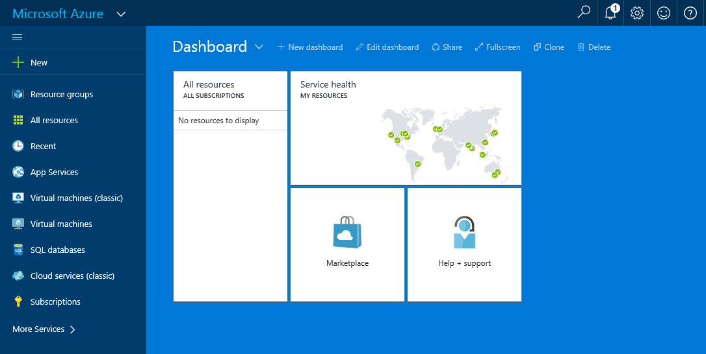
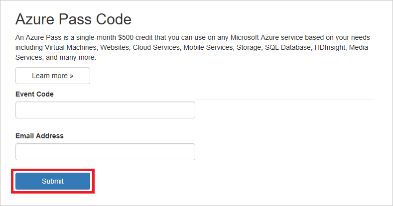

# Using the Azure Portal #

---

## Overview ##

[Microsoft Azure](https://azure.microsoft.com) is Microsoft's cloud computing platform. It offers dozens of services to help developers write cloud-based applications and researchers process and analyze big data. And it is supported by more than 20 data centers around the world, producing unprecedented scale, availability, and reliability, all while offering massive economy of scale to consumers.

The entry point to Azure is the [Azure Portal](https://portal.azure.com), which you will become familiar with as you work through the labs. In order to use the portal, you must have an Azure subscription. When you consume Azure services through the portal — when, for example, you store data in a storage account or deploy a high-performance computing (HPC) cluster — those services are billed against your subscription. A free subscription has been provided for you for this class in the form of an [Azure Pass](https://www.microsoftazurepass.com/). Activating your Azure Pass allows you to get started exploring Azure without worrying about the cost.

_The Azure Portal_

In this lab, you will activate an Azure Pass using a new Microsoft account created just for you. Then you will log in to the Azure Portal and confirm that the Azure Pass was properly activated.

### Objectives ###

In this hands-on lab, you will learn how to:

- Activate an Azure Pass
- Log in to the Azure Portal with a Microsoft account
- View the Azure subscriptions associated with your account

---

## Exercises ##

This hands-on lab includes the following exercises:

- [Exercise 1: Activate an Azure Pass](#Exercise1)
- [Exercise 2: Access the Azure Portal and view subscription information](#Exercise2)

Estimated time to complete this lab: **15** minutes.

## Exercise 1: Activate an Azure Pass ##
 
In this exercise, you will activate an Azure Pass that provides you with $500 worth of Azure credits for up to one month. You will also receive a brand new Microsoft account for activating your Azure Pass and logging in to the Azure Portal.

1. Start a **private or incognito session** in the browser of your choice. In Chrome, you can start an incognito session by clicking the  button in the upper-right corner and selecting **New Incognito Window**. In Microsoft Edge, click the **...** button in the upper-right corner and select **New InPrivate window**.

1. In the private or incognito browsing session, navigate to https://azure4research.org.

1. Type the event code provided by the instructor into the **Event Code** box and your e-mail address into the **Email Address** box. Then click **Submit**.

    

    _Requesting an Azure Pass_

1. Enter your first and last name and click **Submit**.

1. If an Azure Pass code and login credentials aren't shown to you, wait for the instructor to approve the request. Then refresh the page in your browser.

1. Copy the Azure Pass code and the user name and password assigned to you into your favorite text editor so you can retrieve them later. Then click the **Redeem** button.

    

    _Azure Pass code and login credentials_
 
1. Select a country, and type the Azure Pass code you received in the previous step into the box underneath the drop-down list. Then click the **Submit** button.

    

    _Entering the Azure Pass code_

1. Click the **Sign in** button.

    

    _Signing in_

1. What happens next will vary depending on how many and what types of Microsoft accounts you have. The goal is to sign in using the credentials you received in Step 6, **not** with an existing Microsoft account. When you are asked to sign in, enter the user name and password from Step 6 and click the **Sign in** button.

1. When prompted to update your password, type the old password and the new password (twice) and click **Update password and sign in**. *Remember the new password because you will need it to log in to the Azure Portal*.

    

    _Updating your password_

1. Confirm that your first name, last name, and user name are correct, and then click the **Submit** button.

    

    _Verifying your Microsoft account information_

1. Click the **Activate** button to activate your Azure Pass.

    

    _Activating your Azure Pass_

1. You will be asked to provide additional information, including a contact phone number. Enter the required information and click the **Sign up** button to finish activating your Azure Pass.

1. After a few minutes, you'll be told "Your subscription is ready for you!" *Do not* click the **Start managing my service** button. Instead, close the browser window.

    

    _Your subscription is ready!_

Now let's confirm that your Azure Pass was activated.

## Exercise 2: Access the Azure Portal and view subscription information ##

In this exercise, you will learn how to open the Azure Portal and view the subscriptions associated with your account.

1. Open a new browser window and navigate to the Azure Portal at https://portal.azure.com. Log in with the user name you received in Exercise 1, Step 6, and the new password you entered in Step 10.

	> If you are automatically logged in to the portal using another Microsoft account, sign out of the portal and **sign in with your new credentials**.

1. Click **Subscriptions** in the ribbon on the left side of the page.

    

    _Viewing Azure subscriptions_

1. Confirm that **Azure Pass** appears among the list of subscriptions associated with your account, and that the subscription status is **Active**.

    

    _Your Azure Pass subscription_

You can click a subscription to retrieve billing and usage information for it. However, since your Azure Pass subscription is brand new, no data is presently available. Make a note to return to the "Subscriptions" blade later today and see if there is billing and usage information available for your Azure Pass. 

### Summary ###

In this hands-on lab, you learned how to:

- Activate an Azure Pass
- Log in to the Azure Portal with a Microsoft account
- View the Azure subscriptions associated with your account

The portal will be your home for everything Azure and your gateway for using the cloud.

---

Copyright 2016 Microsoft Corporation. All rights reserved. Except where otherwise noted, these materials are licensed under the terms of the Apache License, Version 2.0. You may use it according to the license as is most appropriate for your project on a case-by-case basis. The terms of this license can be found in http://www.apache.org/licenses/LICENSE-2.0.
