
# Using Azure Machine Learning #

---

## Overview ##

Machine learning, which facilitates the analysis of large volumes of data by employing algorithms that iteratively learn from that data, is one of the hottest and fastest growing areas of computer science. Its uses range from credit-card fraud detection and self-driving cars to optical character recognition (OCR) and online shopping recommendations. It makes us smarter by making computers smarter. And its usefulness will only increase as more and more data comes available and our desire to perform predictive analysis from that data grows, too.

Azure Machine Learning is a cloud-based predictive-analysis service that offers a streamlined experience for data scientists of all skill levels. It's accompanied by the Azure Machine Learning Studio (ML Studio), which is a browser-based tool that allows you to build models using simple drag-and-drop gestures. It comes with a library of time-saving experiments and features best-in-class algorithms developed and tested in the real world by Microsoft businesses such as Bing. And its built-in support for [R](https://www.r-project.org/) and [Python](https://www.python.org/) means you can build custom scripts  to further automate your model. Once you've built and trained your model in the ML Studio, a couple of button clicks exposes the model as a Web service that is consumable by your programming language of choice, or shares it with the community by placing it in the product gallery. On its own, Azure Machine Learning can ingest as much as 10 GB of input data, but if that's not enough, it can also read from Hive or Azure SQL Databases.

In this lab, you will use Azure Machine Learning to model automobile prices and extract predictive data from the model. You will employ the following steps to build this experiment in Machine Learning Studio and to create, train, and score your model:

1. Create a model
    - Get the data
    - Preprocess the data
    - Define features
1. Train the model
    - Choose and apply a learning algorithm
1. Score and test the model
    - Predict new automobile prices

### Objectives ###

In this hands-on lab, you will learn how to:

- Log in to Azure Machine Learning Studio
- Work with the Azure Machine Learning Studio
- Acquire and process data for machine-learning experiments
- Apply and test learning algorithms
- Deploy your model as a Web service so it can be accessed from code or scripts

### Prerequisites ###

There are no prerequisites for this lab.

---

## Exercises ##

This hands-on lab includes the following exercises:

1. [Exercise 1: Log in to Azure Machine Learning Studio](#Exercise1)
1. [Exercise 2: Get the data](#Exercise2)
1. [Exercise 3: Preprocess the data](#Exercise3)
1. [Exercise 4: Define the features](#Exercise4)
1. [Exercise 5: Select and apply a learning algorithm](#Exercise5)
1. [Exercise 6: Predict new automobile prices](#Exercise6)
1. [Exercise 7: Deploy as a Web service](#Exercise7)
1. [Exercise 8 (Optional): Compare two models](#Exercise8)

Estimated time to complete this lab: **60** minutes.

## Exercise1: Log in to Azure Machine Learning Studio

The first step in employing Azure Machine Learning is to log in.

1. In your web browser, navigate to [http://studio.azureml.net](http://studio.azureml.net) and click the **Get started** button

    

    _Getting started with Azure ML_

1. You can either use a guest account or sign in with your Azure subscription. You should do the latter because the guest account is both time-limited (8 hours) and size-limited (max data file size is 100 MB and experiments are limited to 50 or fewer modules), and it doesn't support R or Python. Therefore, click the **SIGN IN** button to sign in with your Microsoft Azure account.

    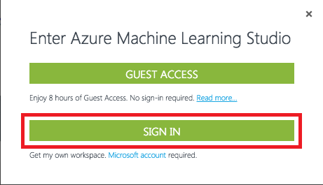

    _Choosing the login type_

Now that you're logged in, the next step is to import some data and begin building a model around it.

## Exercise 2: Get the data

In this exercise, you will create an experiment and add a dataset to it.

> When working with the Azure Machine Learning Studio, get in the habit of saving your experiments often, as in after each step of this lab. That way, if you encounter a problem, you will not have to replicate steps to get caught up. Also, be aware that due to a known issue in ML Studio, you will **lose your work if you click the Back button without saving your experiment first.**

Azure Machine Learning Studio comes with several sample datasets. In this lab, you will utilize the sample dataset named "Automobile price data (Raw)." This dataset includes entries for a number of individual automobiles, including make, model, technical specifications, and price.

1. Start a new experiment by clicking **Blank Experiment**.

    

    _Creating a blank experiment_

1. Click the default experiment name at the top of the canvas and change it to something more meaningful, such as "Automobile price prediction."

    

    _Renaming the experiment_

1. To the left of the experiment canvas is a palette of datasets and modules. Type "automobile" in the search box at the top to find the dataset labeled "Automobile price data (Raw)."

    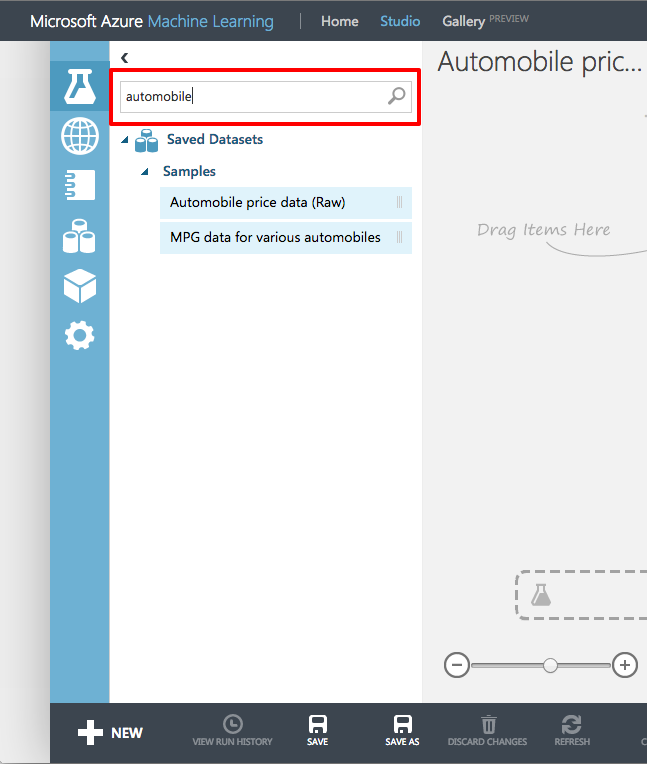

    _Finding a dataset_

1. Drag the "Automobile price data (Raw)" dataset and drop it onto the experiment canvas.

    

    _Adding a dataset_

1. To see what this dataset looks like, click the output port (the circle with the "1" in it) at the bottom of the dataset and select **Visualize**.

    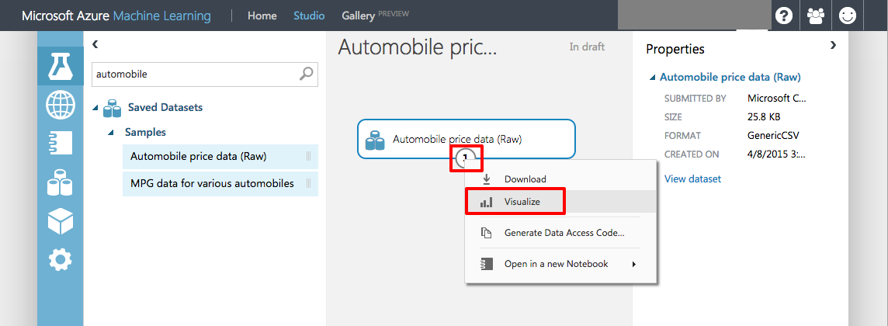

    _Visualizing the dataset_

1. The variables in the dataset appear as columns, and each instance of an automobile appears as a row. The far-right column (column 26, titled "price") is the target variable for your predictive analysis.

    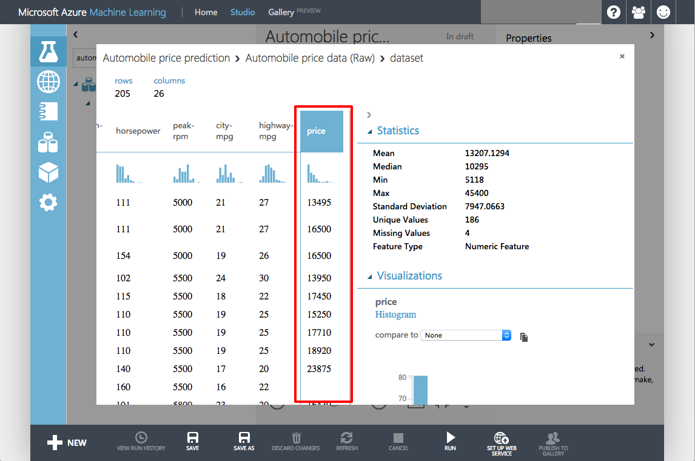

    _Viewing the raw data_

1. Close the data-visualization window by clicking the "**x**" in the upper right corner.

In this exercise, you learned how to create a new ML experiment and add a dataset to it. Next up: preparing the data for use.

## Exercise 3: Preprocess the data

No dataset is perfect; most require some amount of preprocessing before they can be analyzed. When you visualized the data, you may have noticed that some rows of automobile data contained missing values. These missing values need to be cleaned up before analysis begins. In this example, you will simply remove any rows that have missing values. In addition, the "normalized-losses" column has a lot of missing values, so you'll exclude that column from the model.

1. At the top of the modules pallet, type "project columns" into the search box to find the [Project Columns](https://msdn.microsoft.com/library/azure/1ec722fa-b623-4e26-a44e-a50c6d726223/) module. Drag that box over to the experiment canvas and connect it to the output port of the of the "Automobile price data (Raw)" dataset by dragging an arrow downward from the output port. The Project Columns module allows you to specify which columns of data to include or exclude in the model.

    _A key concept to understand about Azure ML are connectors. In this step you a "connecting" the raw data module to a project columns module. That means that the data flows from one module to the next. Some modules, such as Train Model have multiple connectors going in, one for the untrained model and one for the data set, for example. If you want to know what a connector does, move you mouse over the connector to see a quick tip popup. If you want more information, right click on the module and select help from the popup menu._

    

    _Connecting the dataset output to the Project Columns input_

1. Select the Project Columns module on the experiment canvas and click the **Launch column selector** button in the Properties pane on the right.

    

    _Launch column selector_

1. Select **All columns** in the drop-down list labeled "Begin With." This tells the Project Columns modules to pass through all the columns (except those you're about to exclude). In the next row, select **Exclude** and **column names**, and then click inside the text box. A list of columns appears. Select **normalized-losses** to add that column to the text box. Now click the check mark to close the column selector.

    _Note that in FireFox it can take up to a minute for the column name to automatically pop up. This does not happen in other browsers. Either wait for the popup or type the complete column name **normalized-losses** to work around the issue._

    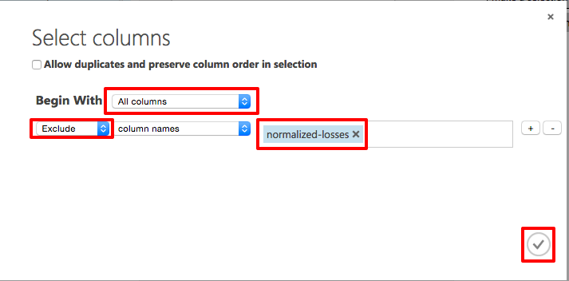

    _Selecting columns for the model_

1. The Properties pane indicates that the Project Columns module will pass through all columns from the dataset except "normalized-losses."

    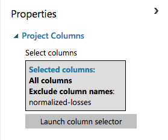

    _Final column selection_

1. You are building a real model in this lab, but it is a relatively simple one. In larger and more complex experiments containing many modules, it's easy to lose track of what each module does and why. A nice feature of Azure Machine Learning Studio is that if you double-click a module on the experiment canvas, you can annotate it with comments. Double-click the Project Columns module and type the comment "Exclude normalized-losses" in the text box that pops up. To display the comment, click the down arrow in the Project Columns box. If you wish to change the comment, you can right-click the module and select **Edit Comment** from the menu that pops up.

    

    _Adding and viewing comments_

1. Now it's time to remove rows containing blank values. Type "clean" into the search box and drag the [Clean Missing Data](https://msdn.microsoft.com/library/azure/d2c5ca2f-7323-41a3-9b7e-da917c99f0c4/) module to the experiment canvas and connect it to the output of the Project Columns module. In the Properties pane, select **Remove entire row** to clean the data by removing rows that have at least one missing value.

    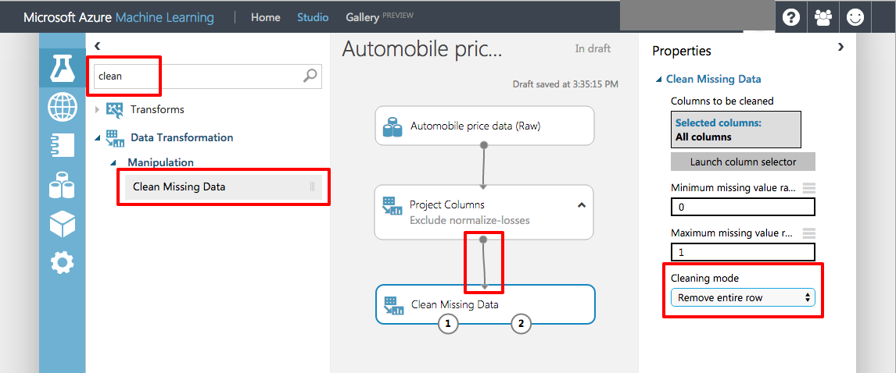

    _Removing rows with missing values_

1. Double-click the Clean Missing Data module and enter the comment "Remove rows with missing values."

1. Click the **SAVE** button at the bottom of the canvas to save a draft of the experiment.

1. Click the **RUN** button at the bottom of the canvas to run the experiment.

1. When the experiment finishes running, both modules will be tagged with a green check mark to indicate that they performed successfully. In addition, the status in the upper-right corner will change to "Finished running".

    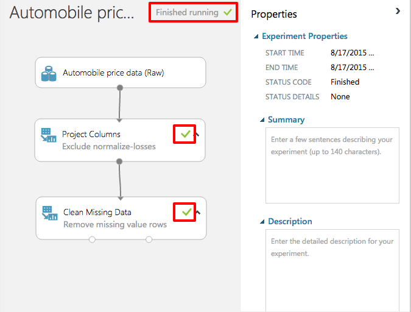

    _Successful run_

1. The output from the Clean Missing Data module is a dataset with the "normalized-losses" column removed and all rows with at least missing value removed. To view the cleaned dataset, click the left output port of the module ("Cleaned dataset") and select **Visualize**. Notice that the "normalized-losses" column is no longer present, and there are no missing values.

1. Close the data-visualization window by clicking the "**x**" in the upper-right corner.

In this exercise, you learned how to clean input to provide the best possible data to your experiments. The data is ready; now it's time to work on the model itself.

## Exercise 4: Define the features

In machine learning, _features_ are individually measurable properties of the data that you're analyzing. In the Automobile price data (Raw)" dataset, each row represents one automobile, and each column represents a feature of that automobile. Identifying features for a robust and accurate predictive model frequently requires experimentation and domain knowledge of the problem you're trying to solve. Some features are better for predicting target values than others. For example, it's likely that there is some correlation between engine size and price, because larger engines cost more. But intuition tells us that miles per gallon might not be a strong indicator of price. In addition, some features have a strong correlation with other features (for example, city-mpg versus highway-mpg), and can therefore be excluded since they add little to the model.

It is time to build a model that uses a subset of the features in the dataset. You'll start with the following features (columns), which include the "price" feature that the model will attempt to predict:

- make
- body-style
- wheel-base
- engine-size
- horsepower
- peak-rpm
- highway-mpg
- price

Later, you can always come back and refine the model by selecting different features.

1. Drag another Project Columns module to the experiment canvas and connect it to the left output port of the Clean Missing Data module. Double-click the new Project Columns module and type "Select features for prediction" as the comment.

1. Select the module you just added and click **Launch column selector** in the Properties pane.

1. In the column selector, select **No columns**, and then select **Include** and **column names** in the filter row. This directs the module to pass through only the columns that are specified. Then click the box to the right of **column names** and select the columns pictured below.

    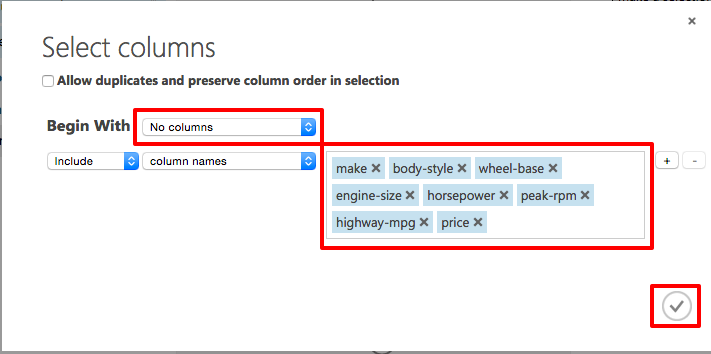

    _Selecting columns for the experiment_

1. Click the check mark to close the column selector. The Properties pane will show the selected columns.

    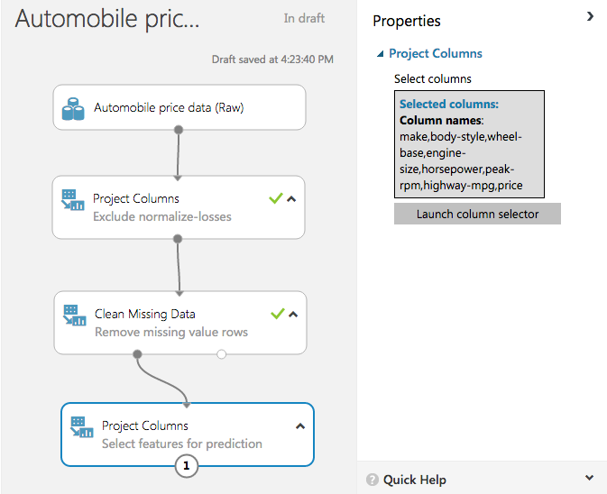

    _Columns selected for the experiment_

1. Click the **SAVE** button at the bottom of the canvas to save a draft of the experiment.

You're getting close! Now comes perhaps the most important part of the process: selecting a learning algorithm to use in the experiment.

## Exercise 5: Select and apply a learning algorithm

Now that the data is ready and the features are selected, constructing a robust predictive model requires training and testing. You will use the part of dataset to train the model, and another part of the dataset to ascertain how adept the model is at predicting automobile prices.

Before you can train and test the model, you must select a learning algorithm for it to use. _Classification_ and _regression_ are two types of supervised machine-learning algorithms. Classification is used to make a prediction from a defined set of values, such as the make of a car (for example, Honda or BMW). Regression is used to make a prediction from a continuous set of values, such as a person's age or the price of an automobile.

The goal is to predict the price of an automobile, so you will use a regression model. In this exercise, you will train a simple linear-regression model, and in the next exercise, you will test the results.

1. You can use one dataset for training and testing by splitting it into separate datasets. Select and drag the [Split](https://msdn.microsoft.com/en-us/library/azure/dn905969.aspx) module to the canvas and connect it to the output of the last Project Columns module. Set "Fraction of rows in the first output dataset" to 0.8. This will use 80% of the data to train the model, and hold back 20% for testing. For this lab leave "Random seed" set to 0. This parameter controls the seeding of the pseudo-random number generator and allows you to produce different random samples by entering different values.

    

    _Splitting the data_

1. Click the **RUN** button to allow the Project Columns and Split modules to pass column definitions to the modules you will be adding next.

1. To specify a learning algorithm, type "linear regression" into the search box in the module palette. Then drag the [Linear Regression](https://msdn.microsoft.com/en-us/library/azure/dn905978.aspx) module onto the canvas.

    

    _Adding the Linear Regression module_

1.	Find the [Train Model](https://msdn.microsoft.com/en-us/library/azure/dn906044.aspx) module and add it to the experiment. Then select the module, click **Launch column selector** in the Properties pane, and select the "price" column. This is the value that your model is going to predict. Finish up by clicking the check mark.

    

    _Training the model on price_

1. Connect the output port of the Linear Regression module to the left input port of the Train Model module. Then connect the left output port of the Split module to the right input port of the Train Model module.

    

    _Connecting the modules_

1. Click the **SAVE** button to save a draft of the experiment.

1. Click the **RUN** button to run the experiment. After the run finishes, you will have a trained regression model that can be used to score new samples to make predictions.

Now comes the fun part: testing the model to see how well it's able to predict automobile prices!

## Exercise 6: Predict new automobile prices

With a trained model that uses 80% of the data, you can use it to score the other 20% of the data to judge how well the model functions.

1.	Find and drag the [Score Model](https://msdn.microsoft.com/en-us/library/azure/dn905995.aspx) module to the  canvas and connect the left input port to the output of the Train Model module. Then connect the right input port to the test-data output (right) port of the Split module. That connection represents the 20% of the data that was not used for training.

    

    _Adding the Score Model module_

1. Click the **SAVE** button to save a draft of the experiment.

1. Click the **RUN** button to run the experiment.

1. After the run finishes, click the output port of Score Model and select **Visualize**. The output shows the predicted values for price and the known values from the test data. You may have to scroll the table to the right to see the "price" and "Scored Labeled" columns.

    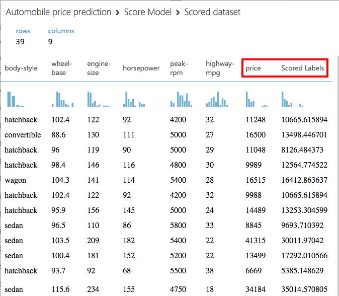

    _The scored data_

1. Close the data-visualization window by clicking the "**x**" in the upper right corner.

1.	To evaluate the quality of the results, select and drag the [Evaluate Model](https://msdn.microsoft.com/en-us/library/azure/dn905915.aspx) module to the experiment canvas, and connect the left input port to the output of the Score Model module. (There are two input ports because the Evaluate Model module can be used to compare two models.)

    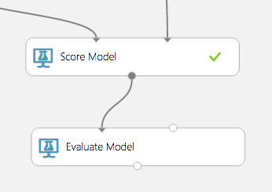

    _The Evaluate Model module_

1. Run the experiment again by clicking the **RUN** button.

1. Click on the output port of the Evaluate Model and select Visualize from the popup menu.

    

    _The evaluation results_

	Here is a quick explanation of the results:

    - **Mean Absolute Error** (MAE): The average of absolute errors (an error is the difference between the predicted value and the actual value).
    - **Root Mean Squared Error** (RMSE): The square root of the average of squared errors of predictions made on the test dataset.
    - **Relative Absolute Error**: The average of absolute errors relative to the absolute difference between actual values and the average of all actual values.
    - **Relative Squared Error**: The average of squared errors relative to the squared difference between the actual values and the average of all actual values.
    - **Coefficient of Determination**: Also known as the **R squared value**, this is a statistical metric indicating how well a model fits the data.

    For each of the error statistics, smaller is better. A smaller value indicates that the predictions more closely match the actual values. For **Coefficient of Determination**, the closer its value is to 1.0, the better the predictions. In this case, the model was able to predict the price of a car from the test data with slightly more than 90% accuracy.

1. Close the data-visualization window by clicking the "**x**" in the upper right corner.

Now that the model is adequately refined (90% is indicative of a reasonably strong correlation between the input data and results), you might want to be able write programs that utilize the model. That is the subject of the next exercise.

## Exercise 7: Deploy as a Web service

Once you have a trained model, you can deploy it as a Web service in order to interact with it programmatically. That way, you can use your favorite programming language to pump data in and get results back.

Before deploying as a Web service, you need to streamline your experiment for scoring. This involves creating a _scoring experiment_ from your trained model, removing unnecessary modules needed for training but are not needed for scoring, and adding Web-service input and output modules. Fortunately, Azure Machine Learning Studio can do this for you.

A very common question about hosting and using Azure ML web services is: how much do they cost? You can find the current pricing information in the [Machine Learning Pricing](https://azure.microsoft.com/en-us/pricing/details/machine-learning/) page.

1. Even though you have already run your model, there's a bug in ML Studio whereby visualizing the data sometimes disables one of the Web-service menu items. To work around this, click the **RUN** button to rerun your model.

1. At the bottom of the screen, click the **SET UP WEB SERVICE** button and in the ensuing menu, select **Predictive Web Service [Recommended]**. If this option is grayed out, click the **RUN** button and try again.

    

    _Creating a predictive Web service_

1. The predictive experiment setup will spin for a few seconds, after which you will see a set of tabs at the top of the canvas indicating which model is your training experiment and which is the predictive experiment. When you look at the predictive experiment, you will find that the Train Model module has been replaced by a module named "Automobile price prediction [trained model]," and that new modules were added at the top and bottom for Web-service input and output.

    

    _The predictive experiment_

1. To create a Web service to use for your predictions, click **RUN** once more. After the run completes, click the **DEPLOY WEB SERVICE** button to deploy your price-predicting Web service. This will take you to the dashboard for the new Web service. Testing your Web service is easy: simply click the **Test** button in the middle of the screen. In the "APPS" column, you can download an Excel spreadsheet for working with your Web service. At the current time, that spreadsheet only runs on Windows-based operating systems.

    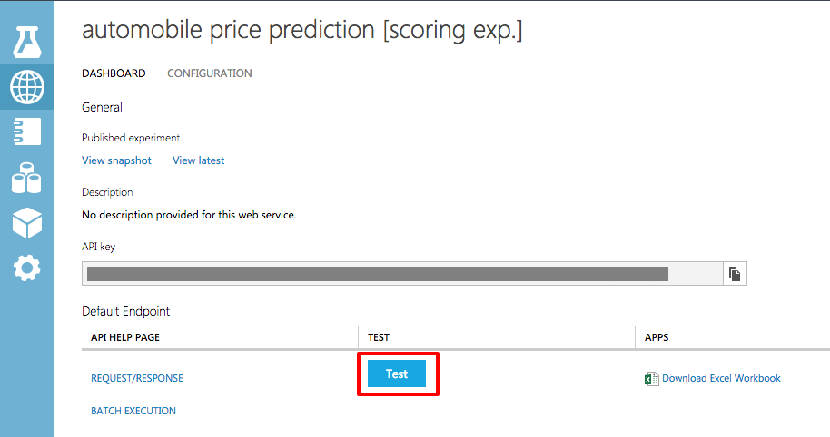

    _Testing your Web service_

1. Click the **Test** button to display a window for entering test parameters.

    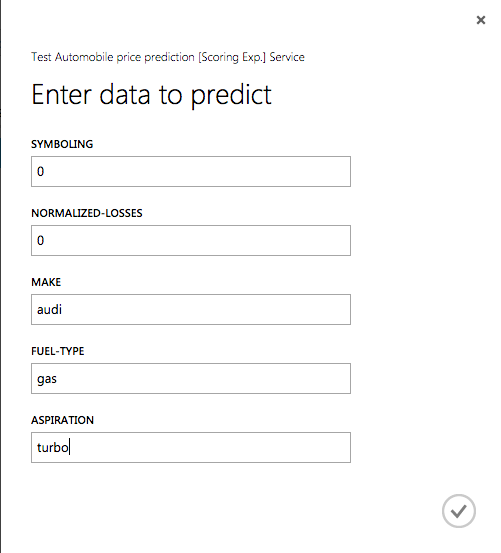

    _Entering data_

1. Enter the following parameter values:

    <table>
        <tbody>
            <tr>
                <th>Field</th>
                <th>Value</th>
            </tr>
            <tr>
                <td>symboling</td>
                <td>0</td>
            </tr>
            <tr>
                <td>normalized-losses</td>
                <td>0</td>
            </tr>
            <tr>
                <td>make</td>
                <td>audi</td>
            </tr>
            <tr>
                <td>fuel-type</td>
                <td>gas</td>
            </tr>
            <tr>
                <td>aspiration</td>
                <td>turbo</td>
            </tr>
            <tr>
                <td>num-of-doors</td>
                <td>two</td>
            </tr>
            <tr>
                <td>body-style</td>
                <td>hatchback</td>
            </tr>
            <tr>
                <td>drive-wheels</td>
                <td>4wd</td>
            </tr>
            <tr>
                <td>engine-location</td>
                <td>front</td>
            </tr>
            <tr>
                <td>wheel-base</td>
                <td>99.5</td>
            </tr>
            <tr>
                <td>length</td>
                <td>178.2</td>
            </tr>
            <tr>
                <td>width</td>
                <td>67.9</td>
            </tr>
            <tr>
                <td>height</td>
                <td>52</td>
            </tr>
            <tr>
                <td>curb-weight</td>
                <td>3053</td>
            </tr>
            <tr>
                <td>engine-type</td>
                <td>ohc</td>
            </tr>
            <tr>
                <td>num-of-cylinders</td>
                <td>five</td>
            </tr>
            <tr>
                <td>engine-size</td>
                <td>131</td>
            </tr>
            <tr>
                <td>fuel-system</td>
                <td>mpfi</td>
            </tr>
            <tr>
                <td>bore</td>
                <td>3.13</td>
            </tr>
            <tr>
                <td>stroke</td>
                <td>3.4</td>
            </tr>
            <tr>
                <td>compression-ratio</td>
                <td>7</td>
            </tr>
            <tr>
                <td>horsepower</td>
                <td>160</td>
            </tr>
            <tr>
                <td>peak-rpm</td>
                <td>5500</td>
            </tr>
            <tr>
                <td>city-mpg</td>
                <td>16</td>
            </tr>
            <tr>
                <td>highway-mpg</td>
                <td>22</td>
            </tr>
            <tr>
                <td>price</td>
                <td>0</td>
            </tr>
        </tbody>
    </table>

1. Click the check mark to pass the data to your Web service.

1. After a short pause, a report will appear at the bottom of the screen. Click the **DETAILS** button to see the full results. The final number in the "Scored Labels" column is the projected price.

    

    _Projected price_

## Exercise 8 (Optional): Compare two models

When you build a predictive model, it is often useful to try different algorithms and compare the results to see which algorithm delivers the best results. The Evaluate Model module is very effective in comparing the metrics between two different algorithms.

1. If time permits and you're so inclined, compare the results of the linear-regression model to a different model. Which model performs better?

    

    _Comparing two models_

### Summary ###

In this hands-on lab, you learned how to:

- Log in to the Azure Machine Learning Studio
- Import a sample dataset and prepare it for analysis
- Define the features of a model and select an algorithm
- Train and test the model
- Deploy the model as a Web service

There's much more than you can do with Azure Machine Learning, but this is a start. Feel free to experiment with it on your own and explore the exciting world of predictive analysis with a tool that is not only productive, but fun!

----

Copyright 2016 Microsoft Corporation. All rights reserved. Except where otherwise noted, these materials are licensed under the terms of the Apache License, Version 2.0. You may use it according to the license as is most appropriate for your project on a case-by-case basis. The terms of this license can be found in http://www.apache.org/licenses/LICENSE-2.0.
