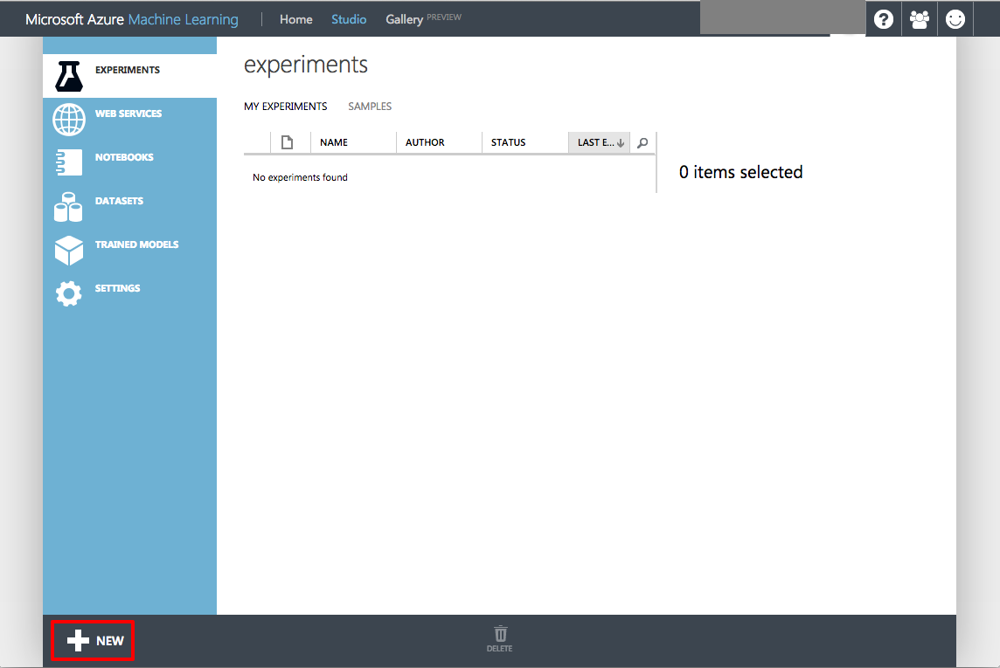
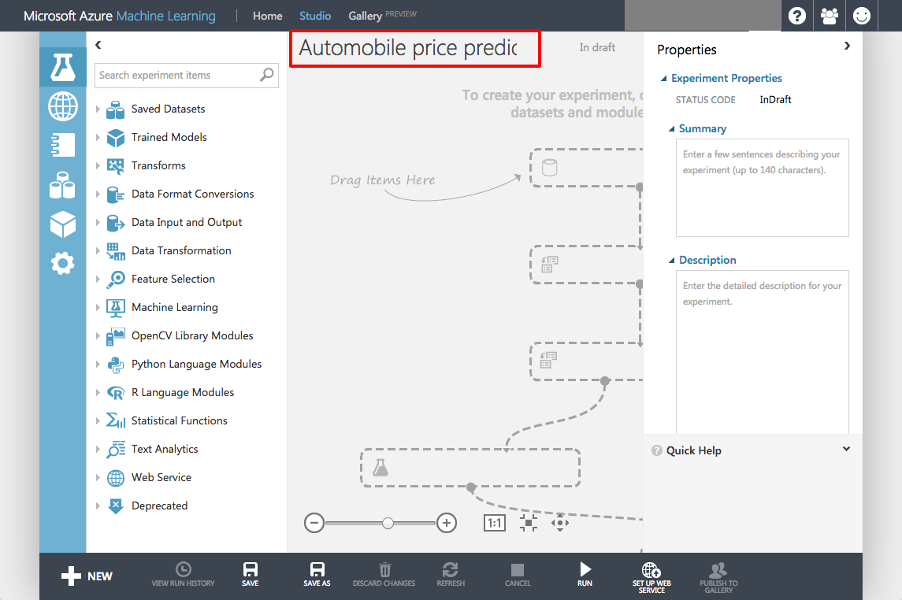
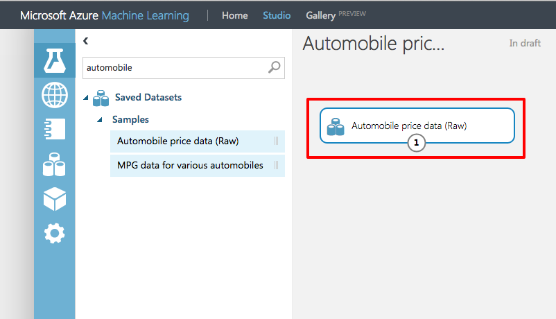
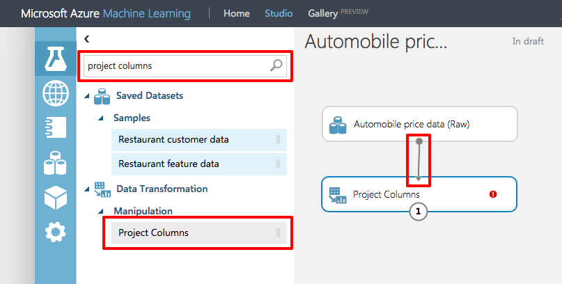
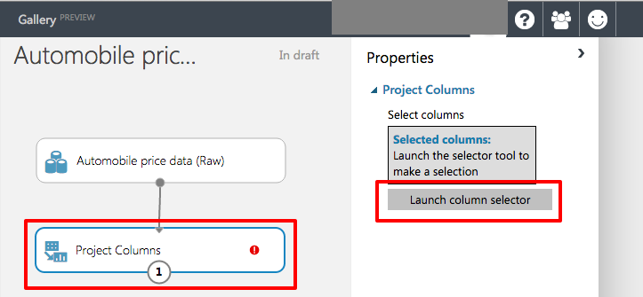
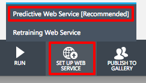
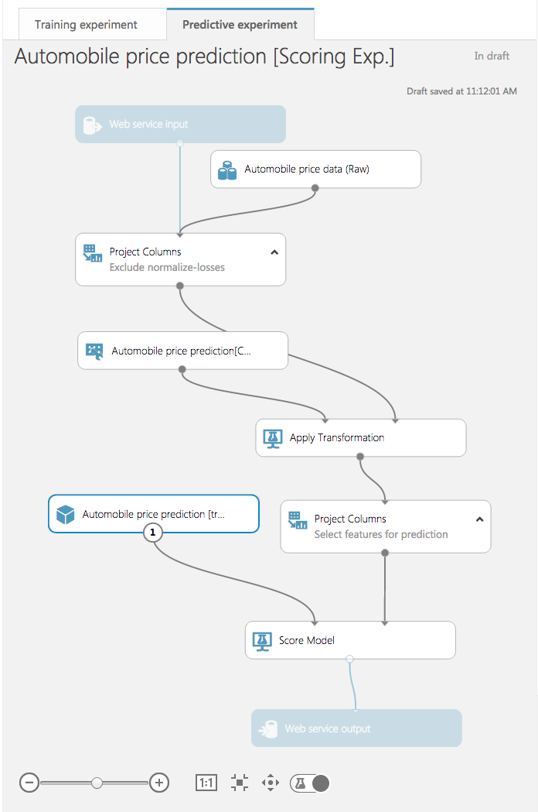

<a name="HOLTitle"></a>
# Machine Learning Hands On Lab #

---

<a name="Overview"></a>
## Overview ##

Machine Learning is one of the hottest areas of research and interest in the computer world today. With the amount of data being produced in the world today, being able to apply predictive and learning approaches to that data is critical. Everything from optical character recognition (OCR), predicting traffic patterns, to credit-card fraud detection are all problems solvable with machine learning.

Azure's Machine Learning offers many features to help you easily build the right approach to solving your problems. The Azure Machine Learning Studio (ML Studio) is a browser-based tool that graphically lets you build up complicated models. It comes with many common building blocks, but also lets you leverage your own custom [R](https://www.r-project.org/) and Python scripts. Once you've built and trained your model in the ML Studio, with a couple of button clicks you can expose that model as a web service that is consumable by your programming language of choice. On it's own Azure Machine Learning can ingest input data up to 10 GB in size, but if you need more it can also read from Hive or Azure SQL Databases. Overall, Azure Machine Learning is a very easy to work with service that brings machine learning capabilities to everyone.

In this machine learning tutorial, you will build and evaluate a Machine Learning model to predict automobile prices. You will follow five basic steps to build this experiment in Machine Learning Studio in order to create, train, and score your model:

1. Create a model
    - Get the data
    - Preprocess the data
    - Define features
1. Train the model
    - Choose and apply a learning algorithm
1. Score and test the model
    - Predict new automobile prices

<a name="Objectives"></a>
### Objectives ###

In this hands-on lab, you will learn how to:

- Create an account on, or use an existing account on the Azure Machine Learning Studio
- How to work with the Azure Machine Learning Studio
- How to acquire and process data for machine learning experiments
- Apply and test learning algorithms
- How to convert your model to a web service so you can use it in your research programs or scripts

<a name="Prerequisites"></a>
### Prerequisites ###

There are no prerequisites for this lab.

---
<a name="Exercises"></a>
## Exercises ##

This hands-on lab includes the following exercises:

1. [Exercise 1: Logging in to the Azure Machine Learning Studio.](#Exercise1)
1. [Exercise 2: Getting the data.](#Exercise2)
1. [Exercise 3: Preprocessing the data.](#Exercise3)
1. [Exercise 4: Defining the features.](#Exercise4)
1. [Exercise 5: Choosing and applying a learning algorithm.](#Exercise5)
1. [Exercise 6: Predicting new automobile prices.](#Exercise6)
1. [Exercise 7: Deploying as a web service.](#Exercise7)
1. [Optional Exercise 8: Compare two models.](#Exercise8)

Estimated time to complete this lab: **60** minutes.

<a name="Exercise1"></a>
## Exercise1: Logging in to the Azure Machine Learning Studio.

The first step to any Azure Machine Learning process it getting logged in.

1. In your web browser, navigate to http://studio.azureml.net. In the middle of the page, click the Get started button

    

    _Getting Started_

1. You can either use a guest account or sign in with your Azure subscription. Click the appropriate button. You should use your Azure subscription login as the Guest account is limited in the following ways:
    - It is a time limited environment with an 8 hour window between workspace represents
    - The largest data file supported is 100 MB.
    - The R and Python modules are not available.
    - Only experiments with 50 or fewer modules will run.

    

    _Choosing the Login Type_

In this exercise you learned how to log into Azure ML Studio.

<a name="Exercise2"></a>
## Exercise 2: Getting the data.

Now that you are logged in feel free to look around Azure ML Studio. In this exercise you are going to create a new experiment and add the data source to it.

When working with the Azure Machine Learning Studio, get in the habit of saving your experiments every time you perform a step in this lab. That way if there's a problem you will not have to replicate steps to get caught up. **Also, there is a known issue in Azure ML Studio that if you click the back button, and your experiment is not saved, you can lose your work.**

Azure Machine Learning Studio comes with a good number of sample datasets you can experiment with on your own. For this lab you are going to utilize the included sample data set **Automibile price data (Raw)**. This dataset includes entries for a number of individual automobiles, including information such as make, model, technical specifications, and price.

1. Start a new experiment by clicking **+NEW** at the bottom of the Azure Machine Learning Studio window, and select **EXPERIMENT**, and then select **"Blank Experiment"**.

    

    _Clicking the +NEW Button_

    

    _Clicking the Blank Experiment_

1. Select the default experiment name at the top of the canvas and rename it to something meaningful, for example, **Automobile price prediction**.

    

    _Renaming the Experiment_

1. To the left of the experiment canvas is a palette of datasets and modules. Type **automobile** in the search box at the top of this palette to find the dataset labeled **Automobile price data (Raw)**.

    

    _Searching in the Data Palette_

1. Drag the "Automobile price dat (Raw)" dataset to the experiment canvas.

    

    _The Dataset on the Experiment Canvas_

1. To see what this data looks like, click the output port at the bottom of the automobile dataset and select **Visualize**. A popup menu will appear and select the Visualize menu option.

    

    _Selecting Visualize Menu_

1. The variables in the dataset appear as columns, and each instance of an automobile appears as a row. The far-right column (column 26 and titled "price") is the target variable we're going to try to predict.

    

    _Viewing the Raw Data_

1. Close the data visualization window by clicking the "**x**" in the upper right corner.

In this exercise you learned how to add a data set to an Azure ML experiment.

<a name="Exercise3"></a>
## Exercise 3: Preprocessing the data.

No dataset is perfect so they usually requires some preprocessing before it can be analyzed. You may have noticed the missing values present in the columns of various rows when you viewed the data in the last exercise. These missing values need to be cleaned so the model can analyze the data properly. In this case, you will remove any rows that have missing values. Also, the **normalized-losses** column has a large proportion of missing values, so we'll exclude that column from the model altogether.

1. At the top of the modules pallet type **project columns** in the search box to find the [Project Columns](https://msdn.microsoft.com/library/azure/1ec722fa-b623-4e26-a44e-a50c6d726223/) module. Drag that box to the experiment canvas and connect it to the output port of the of the **Automobile price data (Raw)** dataset. The Project Columns module allows us to select which columns of data we want to include or exclude in the model.

    

    _Connecting the Dataset output to the Project Columns Input_

1. Select the **Project Columns** module on the experiment canvas and click the **Launch column selector** button in the properties pane.

    

    _The Launch Column Selector Button_

1. Make sure **All columns** is selected in the filter drop-down list, **Begin With**. This tells **Project Columns** to pass through all the columns (except those we're about to exclude).

1. In the next row, select **Exclude** and **column name**s, and then click inside the text box. A list of columns is displayed. Select **normalized-losses** and it will be added to the text box.

    

    _The Column Selector Dialog Properly Filled Out_

1. Click the check mark (OK) button to close the column selector

1. The properties pane for **Project Columns** indicates that it will pass through all columns from the dataset except **normalized-losses**

    

    _Final Project Column Properties_

1. While you are building a real model in this lab, it is a relatively simple one. As you start doing bigger machine learning projects with many modules, it's easy to get lost. A nice feature of the Azure Machine Learning Studio is that if you double click on a module on the experiment canvas, you can enter a text comment about what that module is doing. Double click on the **Project Columns** module and type the comment "Exclude normalize-losses" in the edit box that pops up. To see the comment, click the down arrow in the Project Columns box. You can also change the comment text by right clicking on a module and select **Edit Comment** from the popup menu.

    

    _Seeing Module Box Comments_

1. With the column removed, you can now turn to removing rows that have blank values. Drag the [Clean Missing Data](https://msdn.microsoft.com/library/azure/d2c5ca2f-7323-41a3-9b7e-da917c99f0c4/) module to the experiment canvas and connect it to the output of the Project Columns module. In the **Properties** pane, select **Remove entire row** under **Cleaning mode** to clean the data by removing rows that have missing values.

    

    _Clean Missing Data Properties_

1. Double-click the Clean Missing Data module and type the comment "Remove missing value rows."

1. Click the **Save** button on the bottom of the experiment canvas to save a draft of the experiment.

1. Click the **Run** button at the bottom of the experiment canvas to execute the experiment you have built to this point.

1. When the experiment finishes running, all the modules will have a green check mark to indicate that they completed successfully. Notice also the **Finished running** status in the upper-right corner.

    

    _Finished Run_

1. All you have done in the experiment to this point is clean the data. To view the cleaned dataset, click the **left** output port of the Clean Missing Data module ("Cleaned dataset") and select **Visualize**. Notice that the normalized-losses column is no longer included, and there are no missing values.

1. Close the data visualization window by clicking the "**x**" in the upper right corner.

In this exercise you learned how to clean input data to ensure your experiments are using the best data possible.

<a name="Exercise4"></a>
## Exercise 4: Defining the features.

In machine learning, _features_ are individual measurable properties of something you are interested in. In your dataset, each row represents one automobile, and each column is a feature of that automobile. Finding a good set of features for creating a predictive model requires experimentation and knowledge about the problem you want to solve. Some features are better for predicting the target than others. Also, some features have a strong correlation with other features (for example, city-mpg versus highway-mpg), so they will not add much new information to the model and they can be removed.

It is time to build a model that uses a subset of the features in our dataset. You can come back and select different features, run the experiment again, and see if you get better results. As a first guess, you will select the following features (columns) with the Project Columns module. Note that for training the model, we need to include the _price_ value that we're going to predict.

```
make, body-style, wheel-base, engine-size, horsepower, peak-rpm, highway-mpg, price

```

1. Drag another Project Columns module to the experiment canvas and connect it to the left output port of the Clean Missing Data module. Double-click the new Project Columns module and type "Select features for prediction" as the comment.

1. Click **Launch column selector** in the **Properties** pane

1. In the column selector, select **No columns** for **Begin With**, and then select **Include** and **column names** in the filter row. Enter our list of column names. This directs the module to pass through only columns that we specify. Note that because we've run the experiment, the column definitions for our data have passed from the original dataset through the Clean Missing Data module. When you connect Project Columns to Clean Missing Data, the Project Columns module becomes aware of the column definitions in our data. When you click the **column names** box, a list of columns is displayed, and you can select the columns that you want to add to the list.

    

    _Selected Columns for the Experiment_

1. Click the check mark (OK) button to close the Select columns dialog. The property page will show the selected columns.

    

    _Property Page for the New Project Columns_

1. Click the **Save** button on the bottom of the experiment canvas to save a draft of the experiment.

In this exercise you learned how to select just the appropriate data out of datasets for your experiments.

<a name="Exercise5"></a>
## Exercise 5: Choosing and applying a learning algorithm.

Now that the data is ready, constructing a predictive model consists of training and testing. You will use the data to train the model and then test the model to see how close it is able to predict prices.

_Classification_ and _regression_ are two types of supervised machine learning techniques. Classification is used to make a prediction from a defined set of values, such as a color (red, blue, or green). Regression is used to make a prediction from a continuous set of values, such as a person's age.

You want to predict the price of an automobile, which can be any value, so you will use a regression model. For this example, you will train a simple linear regression model, and in the next step, you will test it.

1. You can use the data for both training and testing by splitting it into separate training and testing sets. Select and drag the [Split](https://msdn.microsoft.com/en-us/library/azure/dn905969.aspx) module to the experiment canvas and connect it to the output of the last Project Columns module. Set **Fraction of rows in the first output dataset** to 0.8. This way, you will use 80% of the data to train the model, and hold back 20% for testing. For this lab leave the **Random seed** field to the default of zero. This parameter controls the seeding of the pseudo-random number generator and can produce different random samples by setting different values.

    

    _Choosing the Split Percentage_

1. Click the **Run** button at the of the screen to allow the Project Columns and Split modules to pass column definitions to the modules you will be adding next.

1.	To select the learning algorithm, expand the **Machine Learning** category in the module palette to the left of the canvas, and then expand **Initialize Model**. This displays several categories of modules that can be used to initialize machine learning algorithms. For this experiment, select the [Linear Regression](https://msdn.microsoft.com/en-us/library/azure/dn905978.aspx) module under the **Regression** category (you can also find the module by typing "linear regression" in the palette Search box), and drag it to the experiment canvas.

    

    _Adding the Linear Regression Module_

1.	Find and drag the [Train Model](https://msdn.microsoft.com/en-us/library/azure/dn906044.aspx) module to the experiment. Select the Train Model module, click Launch column selector in the Properties pane, and select the **price** column. This is the value that our model is going to predict.

    

    _Training the Model on Price_

1. Connect the output port of the Linear Regression module to the right input port of the Train Model module. Connect the right output port of the Split module to the right input port of the Train Model module.

    

    _Connecting the Linear Regression and Split to Train Model_

1. Click the **Save** button on the bottom of the experiment canvas to save a draft of the experiment.

1. Click the **Run** button at the bottom of the experiment canvas to run the experiment. After the run finishes you will have a trained regression model that can be used to score new samples to make predictions.

In this exercise you learned how to apply a learning model to an experiment.

<a name="Exercise6"></a>
## Exercise 6: Predicting new automobile prices.

With a trained model using 80% of the data, you can use it to score the other 20% of the data to see how well your model functions.

1.	Find and drag the [Score Model](https://msdn.microsoft.com/en-us/library/azure/dn905995.aspx) module to the experiment canvas and connect the left input port to the output of the Train Model module. Connect the right input port to the test data output (right port) of the Split module. The connection from the left output port of Split is the 20% of the data that was not used for training.

    

    _The Score Module_

1. Click the **Save** button on the bottom of the experiment canvas to save a draft of the experiment.

1. Click the **Run** button at the bottom of the experiment canvas to run the experiment.

1. After the run finishes, click the output port of Score Model and select Visualize. The output shows the predicted values for price and the known values from the test data. You may have to scroll the table to the right to see the Price and Scored Labeled columns.

    

    _The Scored Data_

1. Close the data visualization window by clicking the "**x**" in the upper right corner.

1.	Finally, to test the quality of the results, select and drag the [Evaluate Model](https://msdn.microsoft.com/en-us/library/azure/dn905915.aspx) module to the experiment canvas, and connect the left input port to the output of the Score Model module. (There are two input ports because the Evaluate Model module can be used to compare two models.)

    

    _The Evaluate Module_

1. Click the **Run** button at the bottom of the experiment canvas to run the experiment.

1. Click on the output port of the Evaluate Model and select Visualize from the popup menu.

    

    _The Evaluation Results_

    - **Mean Absolute Error** (MAE): The average of absolute errors (an error is the difference between the predicted value and the actual value).
    - **Root Mean Squared Error** (RMSE): The square root of the average of squared errors of predictions made on the test dataset.
    - **Relative Absolute Error**: The average of absolute errors relative to the absolute difference between actual values and the average of all actual values.
    - **Relative Squared Error**: The average of squared errors relative to the squared difference between the actual values and the average of all actual values.
    - **Coefficient of Determination**: Also known as the **R squared value**, this is a statistical metric indicating how well a model fits the data.

    For each of the error statistics, smaller is better. A smaller value indicates that the predictions more closely match the actual values. For **Coefficient of Determination**, the closer its value is to one (1.0), the better the predictions.

1. Close the data visualization window by clicking the "**x**" in the upper right corner.

<a name="Exercise7"></a>
## Exercise 7: Deploying as a web service.

Once you have a trained model, you will want to use it to score new data. This is done by converting your model into a web service. That way you can use your favorite programming language and environment to pump data in and get results.

When you convert to a web service, you need to prepare and streamline your experiment for scoring. This involves creating a _scoring experiment_ from your trained model, removing unnecessary modules that were needed for training but not needed for scoring, and adding web service input and output modules. Fortunately, the ML Studio does this work for you automatically.

1. Even though you have already run your model, there's a bug in ML Studio where visualizing the data, like you just did in the last step, sometimes disables one of the web service menu items. To work around this, click the **Run** button and rerun your model.

1. At the bottom of the screen, click on the **Setup Web Service** button and in the popup menu, select **Predictive Web Service [Recommended]**. If this option is greyed out, click the **Run** button again, to work around the bug.

    

    _The Predictive Web Service Button_

1. The predictive experiment setup will spin for a few seconds and you will see a set of tabs at the top of the canvas indicating which model is your training experiment and which is the predictive experiment. When you look at the predictive experiment, you can see the Train module is replaced by a new module, **Automobile price prediction [trained model]** and new modules were added at the top and bottom for web service input and output.

    

    _The Automobile Price Prediction Model_

1. To create the web service to use for your predictions, click the **Run** button at the bottom of the screen.

1. Once the run completes, click the **Deploy web service** button to make your new price predicting web service ready to call. This will take you to the web services dashboard for your web service. Testing your web service is easy, by clicking on the **Test** button in the middle of the screen. Note that the Apps column shows you can download an Excel spreadsheet to work with your web service. At the current time that spreadsheet only runs on Windows-based operating systems.

    

    _Testing Your Web Service_

1. The popup screen allows you to enter the parameters to the web service. Note that there are many fields not shown, but you can either scroll the popup screen or tab between them. Enter the following values.

    <table>
        <tbody>
            <tr>
                <th>Field</th>
                <th>Value</th>
            </tr>
            <tr>
                <td>SYMBOLING</td>
                <td>0</td>
            </tr>
            <tr>
                <td>NORMALIZED-LOSSES </td>
                <td>0</td>
            </tr>
            <tr>
                <td>MAKE</td>
                <td>audi</td>
            </tr>
            <tr>
                <td>FUEL-TYPE</td>
                <td>gas</td>
            </tr>
            <tr>
                <td>ASPIRATION </td>
                <td>turbo </td>
            </tr>
            <tr>
                <td>NUM-OF-DOORS </td>
                <td>two </td>
            </tr>
            <tr>
                <td>BODY-STYLE </td>
                <td>hatchback </td>
            </tr>
            <tr>
                <td>DRIVE-WHEELS </td>
                <td>4wd </td>
            </tr>
            <tr>
                <td>ENGINE-LOCATION </td>
                <td>front </td>
            </tr>
            <tr>
                <td>WHEEL-BASE </td>
                <td>99.5 </td>
            </tr>
            <tr>
                <td>LENGTH </td>
                <td>178.2 </td>
            </tr>
            <tr>
                <td>WIDTH </td>
                <td>67.9 </td>
            </tr>
            <tr>
                <td>HEIGHT </td>
                <td>52 </td>
            </tr>
            <tr>
                <td>CURB-WEIGHT </td>
                <td>3053 </td>
            </tr>
            <tr>
                <td>ENGINE-TYPE </td>
                <td>ohc </td>
            </tr>
            <tr>
                <td>NUM-OF-CYLINDERS </td>
                <td>five </td>
            </tr>
            <tr>
                <td>ENGINE-SIZE </td>
                <td>131 </td>
            </tr>
            <tr>
                <td>FUEL-SYSTEM </td>
                <td>mpfi </td>
            </tr>
            <tr>
                <td>BORE </td>
                <td>3.13 </td>
            </tr>
            <tr>
                <td>STROKE </td>
                <td>3.4 </td>
            </tr>
            <tr>
                <td>COMPRESSION-RATIO </td>
                <td>7 </td>
            </tr>
            <tr>
                <td>HORSEPOWER </td>
                <td>160 </td>
            </tr>
            <tr>
                <td>PEAK-RPM </td>
                <td>5500 </td>
            </tr>
            <tr>
                <td>CITY-MPG </td>
                <td>16 </td>
            </tr>
            <tr>
                <td>HIGHWAY-MPG </td>
                <td>22 </td>
            </tr>
            <tr>
                <td>PRICE </td>
                <td>0 </td>
            </tr>
        </tbody>
    </table>

    

    _Entering Data_

1. Click the check mark (OK) button to pass the data to your web service.

1. After a little while, you will see a report of the results on the bottom of the screen. Click on the **Details** button to see the full results. The final number in the Scored Labels column is the projected price.

    

    _Projected Price_

<a name="Exercise8"></a>
## Optional Exercise 8: Compare two models.

This is an open ended lab you can do if you want to see if you can refine the prediction model.

1. The Evaluate module is very effective in comparing the metrics between two different algorithms.

1. Compare the results of the linear regression based model with a different model. Which model performs better?

    

    _Comparing Two Models_

### Summary ###

In this hands-on lab, you will learn how to:

- Create an account on, or use an existing account on the Azure Machine Learning Studio
- How to work with the Azure Machine Learning Studio
- How to acquire and process data for machine learning experiments
- Apply and test learning algorithms
- How to convert your model to a web service so you can use it in your research programs or scripts

----

Copyright 2015 Microsoft Corporation. All rights reserved. Except where otherwise noted, these materials are licensed under the terms of the Apache License, Version 2.0. You may use it according to the license as is most appropriate for your project on a case-by-case basis. The terms of this license can be found in http://www.apache.org/licenses/LICENSE-2.0.
