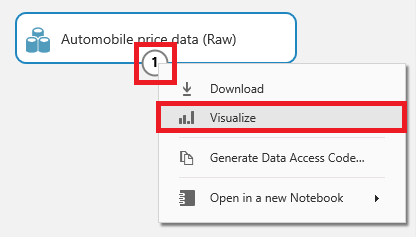
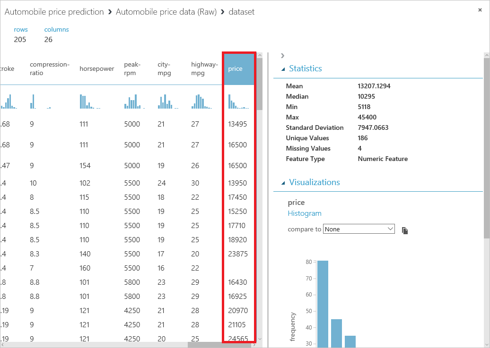
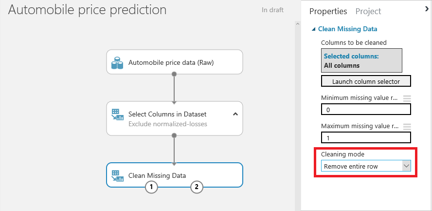

<a name="HOLTitle"></a>
# Machine Learning Hands On Lab #

---

<a name="Overview"></a>
## Overview ##

Machine Learning is one of the hottest areas of research and interest in the computer world today. **ADD MORE ADD MORE**

In this machine learning tutorial, you will build and evaluate a Machine Learning model to predict automobile prices. You will follow five basic steps to build this experiment in Machine Learning Studio in order to create, train, and score your model:

1. Create a model
    - Get the data
    - Preprocess the data
    - Define features
1. Train the model
    - Choose and apply a learning algorithm
1. Score and test the model
    - Predict new automobile prices

<a name="Objectives"></a>
### Objectives ###

In this hands-on lab, you will learn how to:

- Create an account on, or use an existing account on the Azure Machne Learning Studio
- How to work with the Azure Machine Learning Studio
- How to acquire and process data for machine learning experiements
- Apply and test learning algorithms
- How to convert your model to a web service so you can use it in your research programs or scripts

<a name="Prerequisites"></a>
### Prerequisites ###

There are no prerequisites for this lab.

---
<a name="Exercises"></a>
## Exercises ##

This hands-on lab includes the following exercises:

1. [Exercise 1: Logging in to the Azure Machine Learning Studio.](#Exercise1)
1. [Exercise 2: Getting the data.](#Exercise2)
1. [Exercise 3: Preprocessing the data.](#Exercise3)
1. [Exercise 4: Defining the features.](#Exercise4)
1. [Exercise 5: Choosing and applying a learning algorithm.](#Exercise4)
1. [Exercise 6: Predicting new automobile prices.](#Exercise6)


Estimated time to complete this lab: **60** minutes.

<a name="Exercise1"></a>
## Exercise1: Logging in to the Azure Machine Learning Studio.

The first step to any Azure Machine Learning process it getting logged in.

1. In your web browser, navigate to http://studio.azureml.net. In the middle of the page, click the Get started button

    

    _Getting Started_

1. You can either use a guest account or sign in with your Azure subscription. Click the appropriate button. **ADD MORE: Explain differences between guest access and using your Azure account. There are some limitations.**

    

    _Chooseing the Login Type_

<a name="Exercise2"></a>
## Exercise 2: Getting the data.

Now that you are logged in feel free to look around Azure ML Studio. In this exercise you are going to create a new experiment and add the data source to it.

When working with the Azure Machine Learning Studio, get in the habit of saving your experiements every time you perform a step in this lab. That way if there's a problem you will not have to replicate steps to get caught up. **Also, there is a known issue in Azure ML Studio that if you click the back button, and your experiment is not saved, you can lose your work.**

Azure Machine Learning Studio comes with a good number of sample datase you can experiment with on your own. For this lab you are going to utilize the incliuded sample data set **Automibile price data (Raw)**. This dataset includes entries for a number of individual automobiles, including information such as make, model, technical specifications, and price.

1. Start a new experiment by clicking **+NEW** at the bottom of the Azure Machine Learning Studio window, and select **EXPERIMENT**, and then select **"Blank Experiment"**.

    

    _Clicking the +NEW Button_

    

    _Clicking the Blank Experiment_

1. Select the default experiment name at the top of the canvas and rename it to something meaningful, for example, **Automobile price prediction**.

1. To the left of the experiment canvas is a palette of datasets and modules. Type **automobile** in the search box at the top of this palette to find the dataset labeled **Automobile price data (Raw)**.

    

    _Clicking the +NEW Button_

1. Drag the dataset to the experiment canvas.

    

    _The Dataset on the Experiment Canvas_

1. To see what this data looks like, click the output port at the bottom of the automobile dataset and select **Visualize**. A popup menu will appear and select the Visualize menu option.

    

    _Selecting Visualize Button on the Dataset_

    

    _Selecting Visualize Menu_

1. The variables in the dataset appear as columns, and each instance of an automobile appears as a row. The far-right column (column 26 and titled "price") is the target variable we're going to try to predict.

    

    _Viewing the Raw Data_

1. Close the data viaulization window by clicking the "**x**" in the upper right corner.

1. This is a good point to save your experiment by clicking on the **Save** button at the bottom of the screen.

<a name="Exercise3"></a>
## Exercise 3: Preprocessing the data.

No dataset is perfect so they usually requires some preprocessing before it can be analyzed. You may have noticed the missing values present in the columns of various rows when you viewed the data in the last exercise. These missing values need to be cleaned so the model can analyze the data properly. In your case, you will remove any rows that have missing values. Also, the **normalized-losses** column has a large proportion of missing values, so we'll exclude that column from the model altogether.

To clean up the data you are going to remove the **normalized-losses** column followed by removing any row that has missing data.

1. At the top of the modules pallet type **project columns** in the search box to find the [Project Columns](https://msdn.microsoft.com/library/azure/1ec722fa-b623-4e26-a44e-a50c6d726223/) module. Drag that box to the experiment canvas and connect it to the output port of the of the **Automobile price data (Raw)** dataset. The Project Columns module allows us to select which columns of data we want to include or exclude in the model.

    

    _Connecting the Dataset output to the Project Columns Input_

1. Select the **Project Columns** module on the experiment canvas and click the **Launch column selector** button in the properties pane.

    

    _The Launch Column Selector Button_

1. Make sure **All columns** is selected in the filter drop-down list, **Begin With**. This tells **Project Columns** to pass through all the columns (except those we're about to exclude).

1. In the next row, select **Exclude** and **column name**s, and then click inside the text box. A list of columns is displayed. Select **normalized-losses** and it will be added to the text box.

    

    _The Column Selector Dialog Properly Filled Out_

1. Click the check mark (OK) button to close the column selector

1. The properties pane for **Project Columns** indicates that it will pass through all columns from the dataset except **normalized-losses**

    

    _Final Project Column Properties_

1. While you are building a real mode in this lab, it is a relatively simple one. As you start doing bigger and bigger machine learning projects with many modules, it's easy to get lost. A nice feature of the Azure Machine Learning Studio is that if you double click on a module on the experiement canvas, you can enter a text comment about what that module is doing. Double click on the **Project Columns** module and type the comment "Exclude normalize-losses"

1. With the column removed, you can now turn to removing rows that have blank values. Drag the [Clean Missing Data](https://msdn.microsoft.com/library/azure/d2c5ca2f-7323-41a3-9b7e-da917c99f0c4/) module to the experiment canvas and connect it to the output of the Project Columns module. In the **Properties** pane, select **Remove entire row** under **Cleaning mode** to clean the data by removing rows that have missing values.

    

    _Clean Missing Data Properties_

1. Double-click the Clean Missing Data module and type the comment "Remove missing value rows."

1. Click the **Save** button on the bottom of the experiment canvas.

1. Click the **Run** button at the bottom of the experiement canvas to exeute the experiment you have built to this point.

1. When the experiment finishes running, all the modules will have a green check mark to indicate that they completed successfully. Notice also the **Finished running** status in the upper-right corner.

    

    _Finished Run_

1. All you have done in the experiment to this point is clean the data. To view the cleaned dataset, click the left output port of the Clean Missing Data module ("Cleaned dataset") and select **Visualize**. Notice that the normalized-losses column is no longer included, and there are no missing values.

1. Close the data viaulization window by clicking the "**x**" in the upper right corner.

<a name="Exercise4"></a>
## Exercise 4: Defining the features.

In machine learning, _features_ are individual measurable properties of something you are interested in. In your dataset, each row represents one automobile, and each column is a feature of that automobile. Finding a good set of features for creating a predictive model requires experimentation and knowledge about the problem you want to solve. Some features are better for predicting the target than others. Also, some features have a strong correlation with other features (for example, city-mpg versus highway-mpg), so they will not add much new information to the model and they can be removed.

It is time to build a model that uses a subset of the features in our dataset. You can come back and select different features, run the experiment again, and see if you get better results. As a first guess, uyou will select the following features (columns) with the Project Columns module. Note that for training the model, we need to include the _price_ value that we're going to predict.

    ```
    make, body-style, wheel-base, engine-size, horsepower, peak-rpm, highway-mpg, price

    ```

1. Drag another Project Columns module to the experiment canvas and connect it to the left output port of the Clean Missing Data module. Double-click the module and type "Select features for prediction" as the comment.

1. Click **Launch column selector** in the **Properties** pane

1. In the column selector, select **No columns** for **Begin With**, and then select **Include** and **column names** in the filter row. Enter our list of column names. This directs the module to pass through only columns that we specify.

Because we've run the experiment, the column definitions for our data have passed from the original dataset through the Clean Missing Data module. When you connect Project Columns to Clean Missing Data, the Project Columns module becomes aware of the column definitions in our data. When you click the **column names** box, a list of columns is displayed, and you can select the columns that you want to add to the list.

    

    _Selected Columns for the Experiment_

1. Click the check mark (OK) button to close the Select columns dialog.


----

Copyright 2015 Microsoft Corporation. All rights reserved. Except where otherwise noted, these materials are licensed under the terms of the Apache License, Version 2.0. You may use it according to the license as is most appropriate for your project on a case-by-case basis. The terms of this license can be found in http://www.apache.org/licenses/LICENSE-2.0.
