# Using Azure Blob Storage #

---

## Overview ##

Microsoft Azure Storage is a set of services that allows you to store large volumes of data in a cost-effective manner and in a way that makes the data readily and reliably available for consumption. Data committed to Azure Storage can be stored in blobs, tables, queues, or files. [Azure blobs](http://azure.microsoft.com/en-us/services/storage/blobs/) are ideal for storing images, videos, and other types of data, and are frequently used to provide input to and capture output from other Azure services such as [Azure Machine Learning](https://azure.microsoft.com/en-us/services/machine-learning/) and [Azure Stream Analytics](http://azure.microsoft.com/en-us/services/stream-analytics/). [Azure tables](http://azure.microsoft.com/en-us/services/storage/tables/) provide NoSQL storage for semi-structured data. [Azure queues](http://azure.microsoft.com/en-us/services/storage/queues/) support queued message transfers between applications (or parts of applications) and can be used to make applications more scalable and robust by loosely coupling them together. Finally, [Azure Files](http://azure.microsoft.com/en-us/services/storage/files) use the Server Message Block (SMB) protocol to share files through the cloud and access storage as network drives.

Data stored in Microsoft Azure Storage can be accessed over HTTP or HTTPS using straightforward REST APIs, or it can be accessed using rich client libraries available for many popular languages and platforms, including .NET, Java, Android, Node.js, PHP, Ruby, and Python. The [Azure Portal](https://portal.azure.com) includes basic features for working with Azure Storage, but richer functionality is available from third-party tools, many of which are free and some of which work cross-platform.

In this lab, you will learn how to work with storage accounts, storage containers, and storage blobs. You'll also get familiar with some of the tools used to manage them, including the [Microsoft Azure Storage Explorer](http://storageexplorer.com/), a free tool from Microsoft that runs on Windows, macOS, and Linux. The knowledge you gain will be used in later labs featuring Azure services that rely on blob storage for input and output, and will serve you well when you use Azure in your research.

### Objectives ###

In this hands-on lab, you will learn how to:

- Create storage accounts using the Azure Portal
- Create storage containers using the Microsoft Azure Storage Explorer
- Upload blobs to storage using the Microsoft Azure Storage Explorer
- Download blobs from storage using the Azure Portal
- Share blobs with other researchers
- Delete storage accounts using the Azure Resource Manager

### Prerequisites ###

The following is required to complete this hands-on lab:

- An active Microsoft Azure subscription. If you don't have one, [sign up for a free trial](http://aka.ms/WATK-FreeTrial).
- [Microsoft Azure Storage Explorer](http://storageexplorer.com/)

----

## Exercises ##

This hands-on lab includes the following exercises:

- [Exercise 1: Use the Azure Portal to create a storage account](#Exercise1)
- [Exercise 2: Use Storage Explorer to create a container and upload blobs](#Exercise2)
- [Exercise 3: Use the Azure Portal to download a blob](#Exercise3)
- [Exercise 4: Share blobs using public containers](#Exercise4)
- [Exercise 5: Share blobs using shared-access signatures](#Exercise5)
- [Exercise 6: Delete the resource group](#Exercise6)

Estimated time to complete this lab: **45** minutes.

## Exercise 1: Use the Azure Portal to create a storage account ##

The [Azure Portal](https://portal.azure.com) allows you to perform basic storage operations such as creating storage accounts, viewing what's stored under those accounts, and managing the access keys associated with the accounts. In this exercise, you'll use the portal to create a storage account.

1. Open the [Azure Portal](https://portal.azure.com/) in your browser. If you are asked to sign in, do so with your Microsoft account.
 
1. The first step in using Azure Storage is to create one or more storage accounts. To create a storage account, click **+ New** in the ribbon on the left. Then click **Storage**, followed by **Storage account**.

    

    _Adding a storage account_

1. In the ensuing blade, enter a name for the new storage account in **Name** field. The name is important, because it forms one part of the URL through which blobs created under this account can be accessed.

	> Storage account names can be 3 to 24 characters in length and can only contain numbers and lowercase letters. In addition, the name you enter must be unique within Azure; if someone else has chosen the same name, you'll be notified that the name isn't available with a red exclamation mark in the **Name** field.

	Once you have a unique name that Azure will accept (as indicated by the green check mark in the **Name** field), select **Create new** under **Resource group** and type "StorageLabResourceGroup" (without quotation marks) into the box below to name the resource group that will be created for the storage account. Select the location nearest you in the **Location** box. Then click the **Create** button at the bottom of the blade.
    
	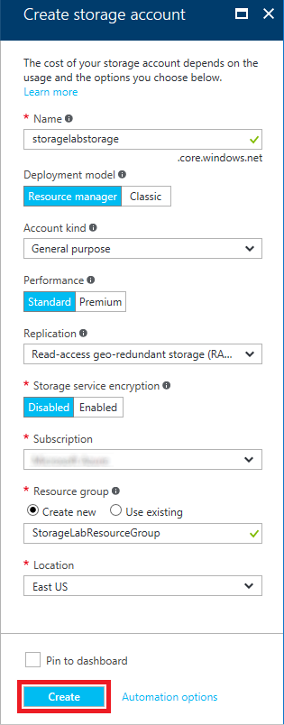

    _Creating a storage account_

1. Click **Resource groups** in the ribbon on the left side of the portal to list all of your resource groups. In the "Resource groups" blade, click the **StorageLabResourceGroup** resource group.

1. Wait until "Deploying" changes to "Succeeded," indicating that the storage account has been deployed. (You can click the **Refresh** button at the top of the blade to refresh the deployment status.) Then click the storage account.

	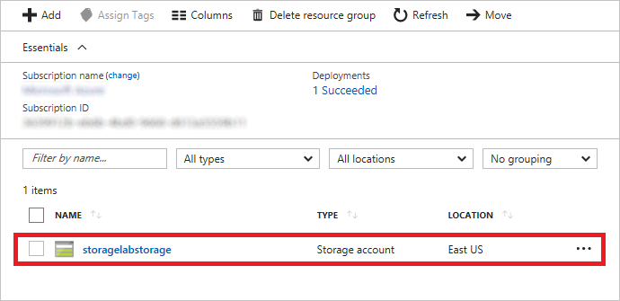

    _Opening the storage account_

1. In the blade for the storage account, click **Blobs** to view a list of blob containers.

    

    _Viewing blob containers_

The storage account currently has no containers. Before you create a blob, you must create a container to store it in. You can create containers and upload blobs in the Azure Portal, or you can use external tools that offer additional features that the portal does not. In Exercise 2, you will use the cross-platform [Microsoft Azure Storage Explorer](http://storageexplorer.com/) to create containers and upload blobs.

## Exercise 2: Use Storage Explorer to create a container and upload blobs ##

A container is similar to a folder in a file system. A storage account can have an unlimited number of containers, and a container can store an unlimited number of blobs. Container names must be from 3 to 63 characters in length and may contain numbers, dashes, and lowercase letters. Dashes cannot be consecutive, and a container name cannot start with a dash. The following diagram illustrates the blob storage schema:

_Blob storage schema_

In this exercise, you will create a container named "images" in the storage account you created  in [Exercise 1](#Exercise1). Then you will upload several blobs to it.

1. In your browser, go to http://storageexplorer.com/ and download and install the Microsoft Azure Storage Explorer.

1. Start Storage Explorer. If you are asked to log in, do so using your Microsoft account — the same one that you used to log in to the Azure Portal. If you are *not* asked to log in and don't see the storage account you created in the previous exercise in Storage Explorer's left pane, click the **Azure Accounts settings** button highlighted below, click **Add an account**, and log in with your Microsoft account.

    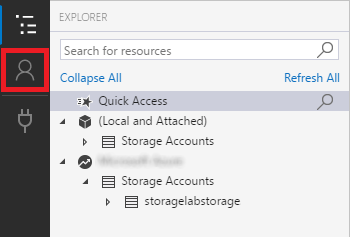

    _Adding an account to Storage Explorer_

1. In Storage Explorer, click the small arrow next to the storage account you created in Exercise 1 to reveal the items underneath it. Then right-click **Blob Containers** (on a Mac, Control-click instead) and select **Create Blob Container** from the context menu.

    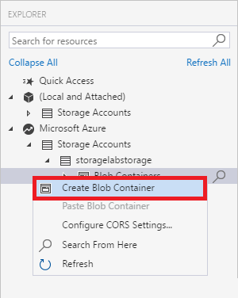

    _Creating a container_

1. Type "images" (without quotation marks) into the box that appears under **Blob Containers**. Then press Enter to create a new container named "images."

    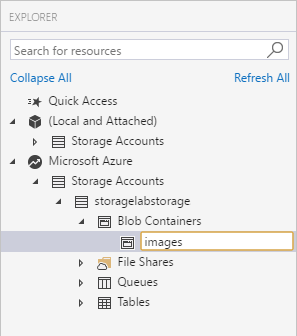

    _Creating an "images" container_

1. The next step is to create blobs by uploading files to the "images" container. The files you will upload are provided for you in the "resources" subdirectory of this lab. Click the **Upload** button in the Storage Explorer. Then select **Upload Files...** from the menu.

    

    _Uploading files to the "images" container_

1. Click the **...** button to the right of the field labeled "Files." In the ensuing dialog, navigate to this lab's "resources" subdirectory and select all the files in that subdirectory. (There are 10 of them, and each has the file-name extension .jpg.) Then close the dialog and click  the **Upload** button.

    

    _Uploading files to blob storage_

	> The default blob type — block blob — supports up to approximately 4.75 TB of data per blob. Append blobs are similar to block blobs but are optimized for append operations. Page blobs can hold up to 1 TB of data and are used to hold virtual hard disks (VHDs) for virtual machines.

1. Confirm that all ten .jpg files were uploaded to the "images" container.

    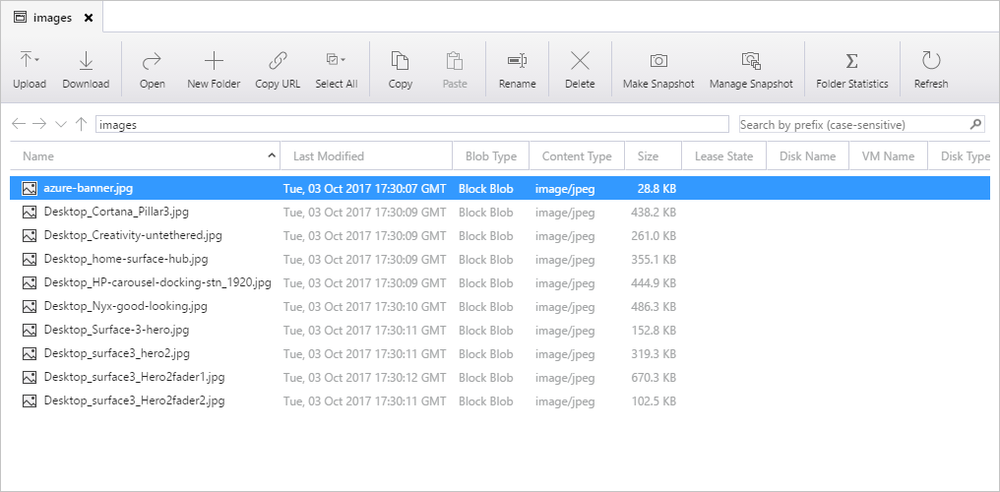

    _Blobs uploaded to the "images" container_

Uploading blobs is easy with the Microsoft Azure Storage Explorer. Now let's learn how to download blobs.

## Exercise 3: Use the Azure Portal to download a blob ##

You can download a blob using the Azure Storage Explorer by selecting the blob and clicking the **Download** button, or by right-clicking the blob and selecting **Download** from the ensuing menu. You can also download blobs using the Azure Portal. In this exercise, you'll use the portal to download one of the blobs you uploaded in the previous exercise.

1. Return to the [Azure Portal](https://portal.azure.com) in your browser. If you left the blade for the storage account open at the end of [Exercise 1](#Exercise1), click the **Refresh** button at the top of the blade to refresh the list of containers. If you didn't leave it open, navigate back to it. The click the "images" container to view its contents.

    

    _Viewing the blobs in the "images" container_

1. Verify that **azure-banner.jpg** appears in the list of blobs. Then click it to open the "Blob properties" blade.

    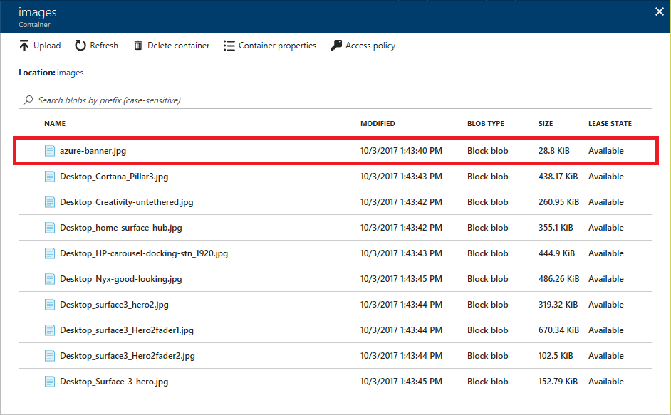

	_Image blobs uploaded to Azure Storage_

1. Click the **Download** button at the top of the blade to download **azure-banner.jpg**.

    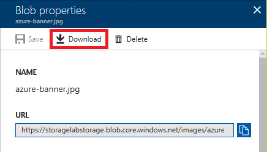

	_Downloading a blob_

1. Confirm that **azure-banner.jpg** appears in your browser:

    

	_Image blob downloaded from Azure Storage_

Now that you know how to upload and download blobs, it is time to think about the privacy of those blobs and how to share them with other researchers.

## Exercise 4: Share blobs using public containers ##

Each container that you create is assigned an access level that determines whether its contents are public or private. The default is private, which means that only you (or someone to whom you provide an access key for the storage account) can access the container's blobs. In this exercise, you will make the "images" container public and demonstrate that you can easily share blobs inside it using links that can be opened in a browser.

1. Return to the Microsoft Azure Storage Explorer and right-click (on a Mac, Control-click) the "images" container and select **Set Public Access Level**.

    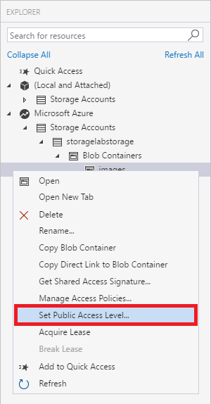

    _Changing the container's access level_

1. Select **Public read access for blobs only**. Then click the **Apply** button.

    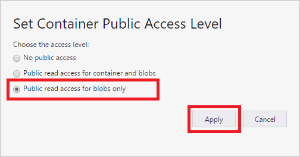

    _Setting the access level to public_

	> The difference between **Public read access for blobs only** and **Public read access for container and blobs** is that the latter allows the blobs in a container to be enumerated, while the former does not. **Public read access for blobs only** offers slightly more security because it prevents people from discovering other blobs in the container. To fetch the blob, they must know the blob's name.

1. Right-click **azure-banner.jpg** and select **Copy URL to Clipboard**.

    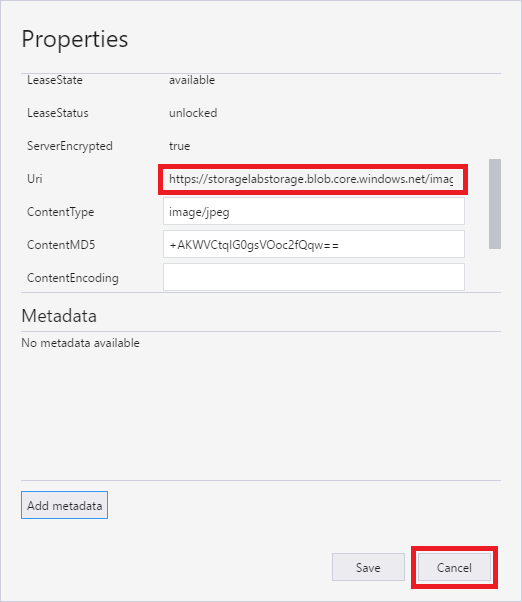

    _Getting a blob URL_

1. Now paste the URL into your browser's address bar. Confirm that the browser shows **azure-banner.jpg**:

    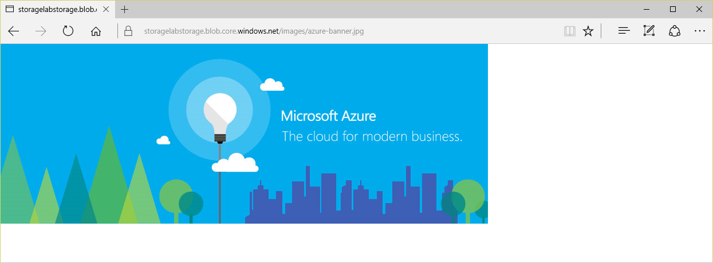

	_Image blob downloaded from Azure Storage_

1. Return to the Microsoft Azure Storage Explorer, right-click the "images" container, select **Set Public Access Level** again, and this time set the container's access level to **No public access**.

    

    _Setting the access level to private_

1. Copy the URL for azure-banner.jpg to the clipboard again and paste it into your browser's address bar. Confirm that the image can't be downloaded this time.

	> The exact output will vary from browser to browser. Some will display an error message in XML.

    

    _404 error_

Making a container public is one way to share the blobs with other people. But what if you only wanted to share *selected* blobs in that container while keeping the others private? And what if you wanted to limit the amount of time that the blob can be downloaded? That's where shared-access signatures come in.

## Exercise 5: Share blobs using shared-access signatures ##

Rather than create a separate (public) container to hold the blobs you wish to share, you can use shared-access signatures to share blobs from private containers. In this exercise, you will generate a URL containing a shared-access signature (SAS) for one of the blobs in the "images" container and demonstrate that the blob can be downloaded even though the container is private. You will also learn how to limit the amount of time a shared-access signature is valid.

1. Return to the Microsoft Azure Storage Explorer. Right-click **azure-banner.jpg** and select **Get Shared Access Signature**.

    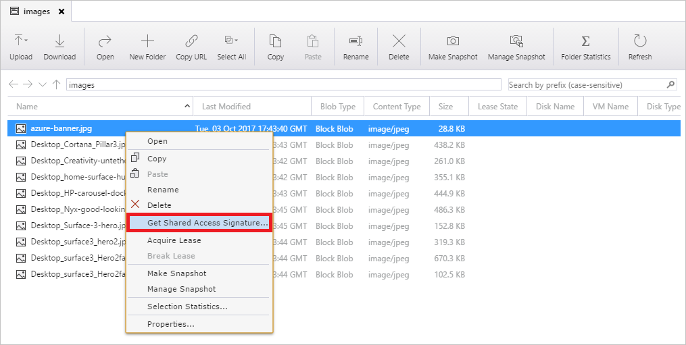

    _Getting a shared-access signature_

1. Set **Start time** to yesterday's date and **Expiry time** to a date a few days from now. Then click the **Create** button.

	> Notice the **Permissions** box. By leaving **Write** and **Delete** unchecked, you ensure that the blob can't be modified or deleted using the shared-access signature. In this example, you are creating a *read-only* signature.

    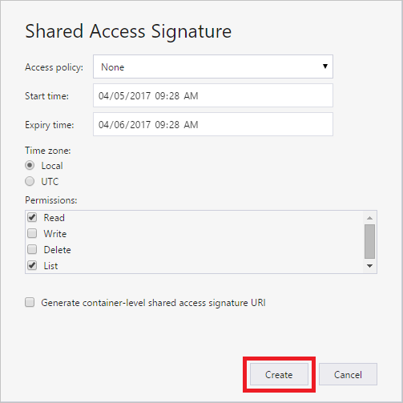

    _Creating a shared-access signature_

1. Click the **Copy** button to the right of the URL field to copy the blob URL containing a shared-access signature to the clipboard. Then click the **Close** button.

    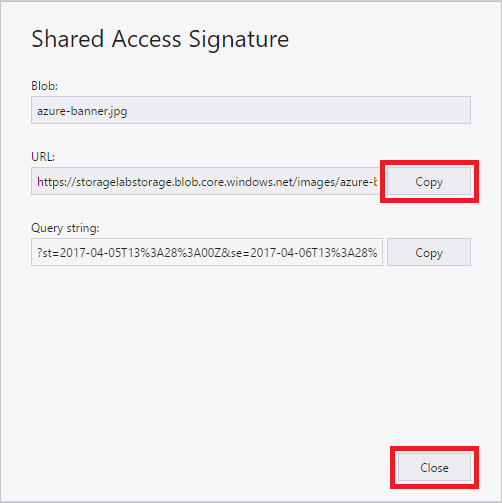

    _Copying a SAS URL to the clipboard_

1. Paste the URL into your browser's address bar and confirm that **azure-banner.jpg** appears, even though the container that holds it is private rather than public.

    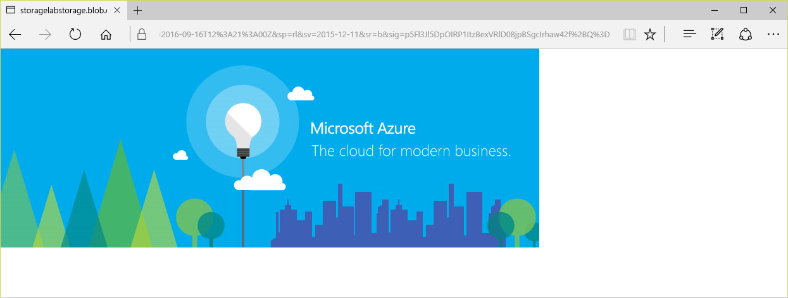

    _Using a SAS URL to download a blob_

Take a moment to examine the URL that you pasted into the browser. The long query string — everything after the question mark — is the shared-access signature. Embedded within it is information about when the signature expires. The signature is cryptographically signed so it can't be tampered with. For more information on shared-access signatures and their application to Azure Storage, see [Shared Access Signatures, Part 1: Understanding the SAS model](https://azure.microsoft.com/en-us/documentation/articles/storage-dotnet-shared-access-signature-part-1/).

## Exercise 6: Delete the resource group ##

When you created a storage account in Exercise 1, you made it part of a resource group named "StorageLabResourceGroup." One of the benefits of using resource groups is that deleting a resource group deletes all the resources inside it, including storage accounts and blobs. Deleting a resource group is a convenient way to delete complex Azure deployments without having to delete individual resources one by one. 

In this exercise, you will use the Azure Portal to delete the resource group you created in [Exercise 1](#Exercise1), and along with it the storage account and the blobs stored in it.

1. In the Azure Portal, open the blade for the resource group that holds the storage account. Then click the **Delete** button at the top of the blade.

	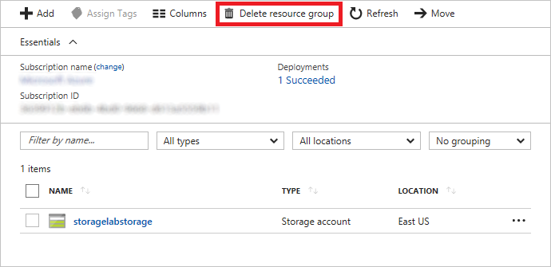

	_Deleting a resource group_

1. For safety, you are required to type in the resource group's name. (Once deleted, a resource group cannot be recovered.) Type the name of the resource group. Then click the **Delete** button to remove all traces of this lab from your account.

After a few minutes, you will be notified that the resource group was deleted. If the deleted resource group still appears in the "Resource groups" blade, click that blade's **Refresh** button to update the list of resource groups. The deleted resource group should go away.  

## Summary ##

Here's a quick summary of the important concepts that you learned in this lab:

- Azure Storage is a set of services for storing data durably and reliably
- Azure Storage blobs can contain any type of data, just like files in a file system, and are frequently used for input and output to other Azure services
- The Azure Portal enables you to perform basic storage operations, such as creating storage accounts, creating blob containers, and uploading and downloading blobs
- The Microsoft Azure Storage Explorer runs on Windows, macOS, and Linux and supports certain features the Azure Portal does not, such as the ability to generate shared-access signatures
- Shared-access signatures can be used to share blobs in private containers and limit the amount of time the blobs can be accessed, as well as limit access to read-only
- Storage accounts and other resources that are placed inside a resource group are easily deleted by deleting the resource group itself

Now that you're familiar with storage accounts, containers, and blobs, as well as some of the tools for managing them, you'll put your knowledge to work in subsequent labs. Knowing the basics of Azure Storage is an essential first step in working with Azure data services.

---

Copyright 2016 Microsoft Corporation. All rights reserved. Except where otherwise noted, these materials are licensed under the terms of the Apache License, Version 2.0. You may use it according to the license as is most appropriate for your project on a case-by-case basis. The terms of this license can be found in [http://www.apache.org/licenses/LICENSE-2.0](http://www.apache.org/licenses/LICENSE-2.0).
