<a name="HOLTitle"></a>
# Creating Web Sites with Django and Bing Maps #

---
<a name="Overview"></a>
## Overview ##

In this hands-on lab we will walk you through how to create a Windows Azure Web Site with Django. We will also show you how to create a simple page to monitor the last 20 major earthquakes with Django! We will using a FTP client to manage the web site.

<a name="Objectives"></a>
### Objectives ###

In this hands-on lab, you will learn how to:

- Create a new Web Site on Windows Azure by using Django.
- Create a Django website to show the latest earthquake data.

<a name="Prerequisites"></a>
### Prerequisites ###

The following is required to complete this hands-on lab:

- A Windows Azure subscription - [sign up for a free trial](http://aka.ms/WATK-FreeTrial)
- Install FileZilla from [SourceForge.](https://filezilla-project.org/)  You may also use your favorite FTP client. 

---
<a name="Exercises"></a>
## Exercises ##

This hands-on lab includes the following exercises:

1. [Exercise 1: Create a Web site on Azure of Django.](#Exercise1)
1. [Exercise 2: Display earthquake locations on your Django Web Site.](#Exercise2)

Estimated time to complete this lab: **45** minutes.

<a name="#Exercise1"></a>

### Exercise 1: Create a Web site on Azure of Django. ###

1. Go to the [Windows Azure Management Portal](https://manage.windowsazure.com/) and sign in using the Microsoft credentials associated with your subscription.

	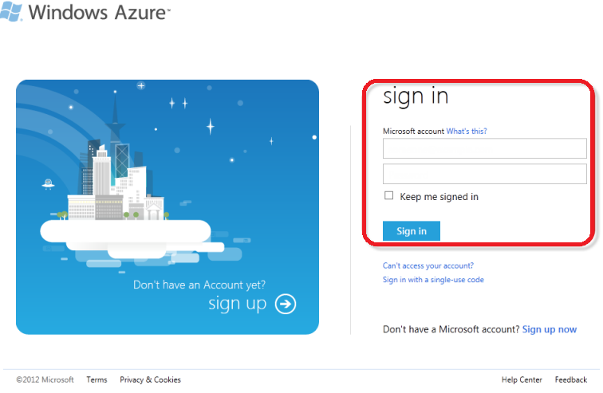

	_Log on to Windows Azure Management Portal_
    

1. Click *New* on the command bar.

	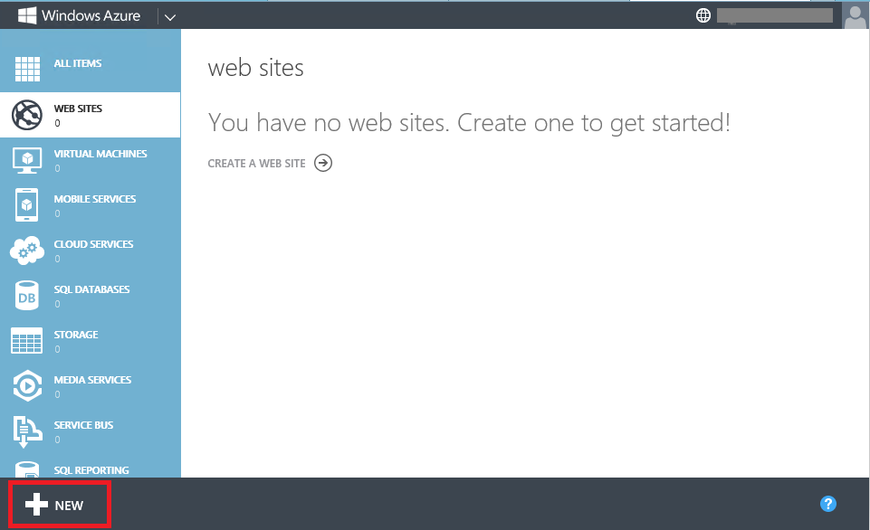

	_Creating a new Web Site From Gallery_

1. Click *Web Site* and then *FROM GALLERY*.

    

	_Creating a new web site From Gallery_

1. Choose *App Frameworks* category and then select Django. Click on the Next arrow.

	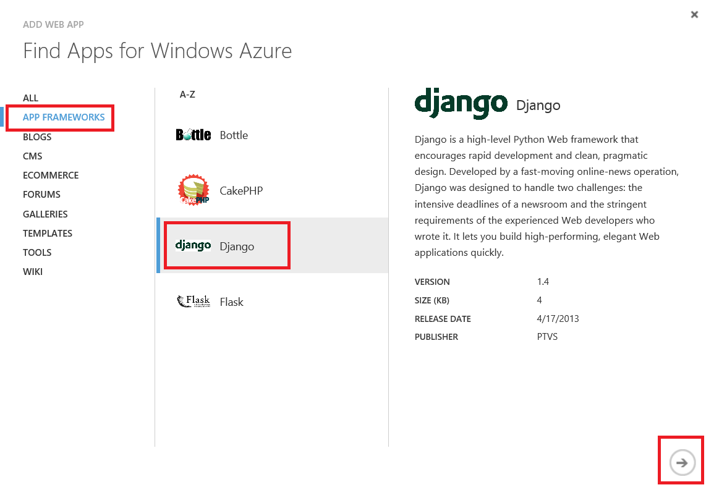

	_Creating Django Webs_

1. Enter a site name, such as *mydjangowebsite1*, and select the region. Click on the check mark to complete the wizard. Your Django web site is now being created and deployed.

	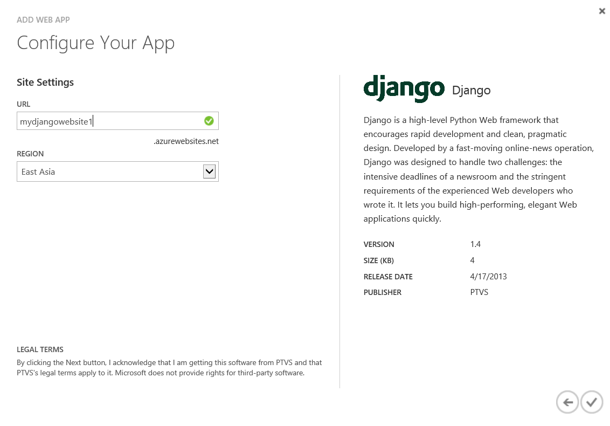

	_Set Django Website Informaiton_

1. You can get the status of the deployment on the portal. The status message is updated once completed:

	

	_View Website Deployment Status_

1. From the list of web sites displayed in the portal, select your site by clicking on its name. This will take you to its dashboard:

	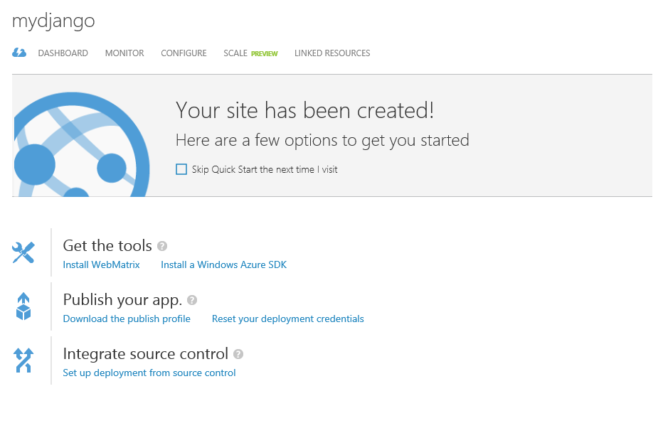

	_View Django Dashboard_

1. From the toolbar at the bottom of the dashboard, click on the Browse button to browse the newly created site: 

	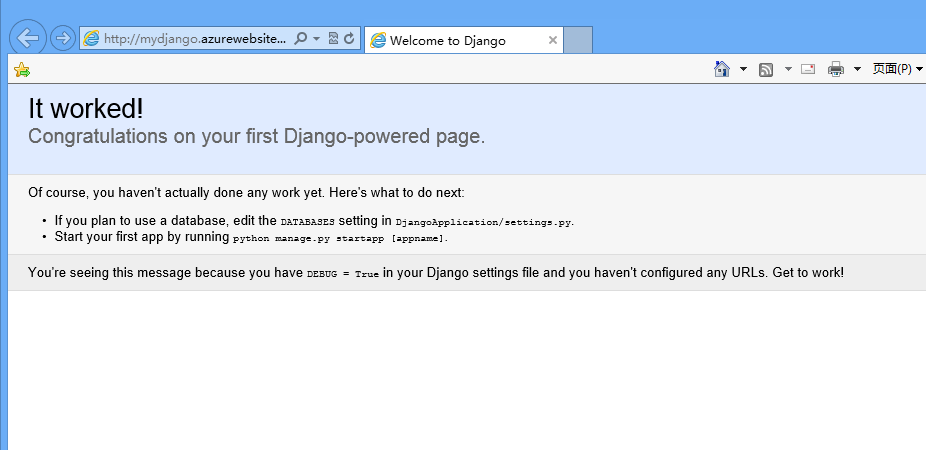

	_View Django Site_

1. **Next**, you need to reset your website's credential for use with FTP. Web Site credentials are separated from the Microsoft ID associated with your Windows Azure subscription. Web Site credentials are valid for use with all Windows Azure web sites associated with your subscription. It is the administrator password for the site that you are creating, this way you don't have to give co-admin of the website your portal password. If you do forget your deployment credentials you can easily reset them again using the management portal. Open the web site **Dashboard** page and click the **Reset deployment credentials** link. Provide a new password and click Ok.

	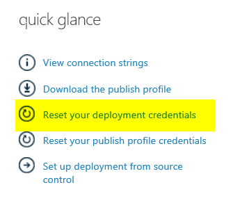
	
	_Click on Reset deployment credential on the right hand side of your web site dashboard_
	
	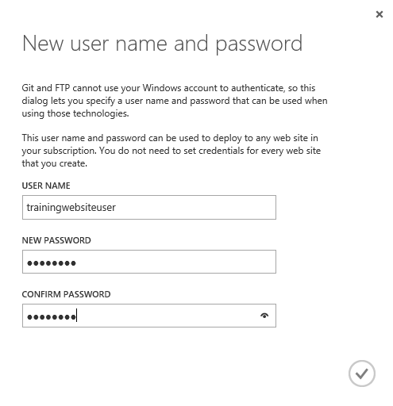
	
	_Entering the username and password_
	
	>**Note:** Don't forget to write your username and password on a paper. If you forget the password, you have to reset the credential again.


<a name="#Exercise2"></a>

#### Excerise 2 - Display eathquake locations on your Django Web Site. ####

**Next**, we are going to create a Django website and show data of the latest earthquakes around the world on a map using Bing Maps. First we need to install Python and Django on your local machine.  If you are not familiar with Django, it is a "High-level Python Web framework that encourages rapid development and clean, pragmatic design." You may learn more about using it for web development from its [website](https://www.djangoproject.com/).

1. Open the folder **Azure-training-course\Day 1\2. HOL WindowsAzure Web Sites\Source\Exercise02\Begin**, There is an existing Django project. Let's study the directory structure and the files in them.

1. There is a file *manage.py* and a folder *DjangoApplication* under the *Begin* folder. manage.py is a command-line utility that lets you interact with this Django project in various ways. We don't need to change anything of the file.
 
1. In the *DjangoApplication* folder, there are 5 files: *\__init__.py*, *settings.py*, *urls.py*, *wsgi.py* and *view.py*. There is a folder *templates* with an html file *earthquake.html* inside. The DjangoApplication/ directory contains all the files for your project. Its name is the Python package name you’ll need to use to import and use anything inside it (e.g. DjangoApplication.urls).
	
	- DjangoApplication/\__init__.py: An empty initialization file that tells Python that this directory should be considered a Python package. (Read more about [packages](http://docs.python.org/2/tutorial/modules.html#packages) in the official Python docs if you’re a Python beginner.)
	- DjangoApplication/settings.py: Settings/configuration for this Django project. [Django settings](https://docs.djangoproject.com/en/1.6/topics/settings/) will tell you all about how settings work.
	- DjangoApplication/urls.py: The URL declarations for this Django project; a “table of contents” of your Django-powered site. You can read more about URLs in [URL dispatcher](https://docs.djangoproject.com/en/1.6/topics/http/urls/).
	- DjangoApplication/wsgi.py: An entry-point for WSGI-compatible web servers to serve your project. See [How to deploy with WSGI](https://docs.djangoproject.com/en/1.6/howto/deployment/wsgi/) for more details.
	- DjangoApplication/view.py: The code to load the earthquake.html file from the template and show the earthquake page.
	- templates\earthquake.html: The html template file to show the earthquake locations. It contains JavaScript code that lets you embed a Bing Map.

1. Open the file **settings.py**. Uncomment the following code at the top of the file by removing the leading "#" sign. This operation allows Django to work correctly in the Windows environment. It will now use forward slash (/) even on Windows.
 
	
	````import os # uncomment this line````	
	

1.	Find the TEMPLATE_DIRS section in **settings.py**, uncomment the last line to load template.

	

	_settings.py modification_

	<pre>	
	TEMPLATE_DIRS = (
		# Put strings here, like "/home/html/django_templates" or "C:/www/django/templates".
		# Always use forward slashes, even on Windows.
		# Don't forget to use absolute paths, not relative paths.
		os.path.join(os.path.dirname(__file__), 'templates').replace('\\','/'),  # uncomment this line
	)
	</pre>

	Final TEMPLATE_DIRS section after edits.

1. **Next**, we will add the url redirect to **urls.py** file. First, uncomment *from DjangoApplication.view import earthquake* near the top of the file, as shown, to reference a new view called earthquake (that we will create soon). Second, uncomment the line *('^earthquake/$',earthquake),* to the patterns section so that web routing to our new view will be recognized. After this step, Django understands that [yourwebsite].azurewebsites.net/earthquake/* should execute a function called earthquake(second parameter) defined in the view.py file. We will create view.py next.

	<pre>
		from DjangoApplication.view import earthquake # uncomment the line to support earthquake view

		urlpatterns = patterns('',
		    # Examples:
		    # url(r'^$', 'DjangoApplication.views.home', name='home'),
		    # url(r'^DjangoApplication/', include('DjangoApplication.DjangoApplication.urls')),

		    url('^earthquake/$',earthquake), # uncomment the line to support earthquake view

		    # Uncomment the admin/doc line below to enable admin documentation:
		    # url(r'^admin/doc/', include('django.contrib.admindocs.urls')),
		
		    # Uncomment the next line to enable the admin:
		    # url(r'^admin/', include(admin.site.urls)),
		)	
	</pre>
	_Change two lines to urls.py_

1. **Next**, we will open the file **view.py** and read python code there. The code will download an earthquake csv file from [Earthquake Hazards Program](http://earthquake.usgs.gov) and show 20 most recent earthquakes on your Django website using a Bing Map.

	The first part of the code is to load required libraries including django, urllib and csv.

	<pre>
		from django.http import HttpResponse
		from django.template.loader import get_template
		from django.template import Template, Context
		from django.http import HttpResponse
		import urllib
		import csv
		import string
	</pre>

	Next we define a function **earthquake** that will be invoked when our web page is accessed. In this function, we will load the earthquake information and download the data locally. Finally, it will render the predefined template and show earthquake locations.  Please note that Python uses "TAB" for indentation. 
	
	<pre> # These lines fetches the most recent data from usgs website and saves it as a csv file locally.
		def earthquake(request):
			    #load the earthquake data from internet
			    csvgps = urllib.urlopen("http://earthquake.usgs.gov/earthquakes/feed/v1.0/summary/2.5_month.csv")
			    f = csvgps.read();
			    with open('csvgps.csv','w') as temp:
			        temp.write(f)
	</pre>
	
	Continuing the same *earthquake* function, we now use csv library to parse the earthquake latitude, longitude and magnitude from the data file.
	
	<pre> # Uses the CSV reader to read 20 lines from the file.  The data is stored in a 3(date, long, lat) x 20 (earthquakes) matrix.
	    data = [[0 for col in range(3)] for row in range(20)]
	    reader = csv.reader(open("csvgps.csv"), delimiter=",")
	    index = 0
	    for line in reader:
	        if index > 0 and index <= 20:
	            data[index - 1][0] = float(line[1])
	            data[index - 1][1] = float(line[2])
	            data[index - 1][2] = float(line[4])
	        index = index + 1
	</pre>
	
	Finally, to finish up the implementation of the *earthquake* function, the code loads *earthquake.html* as a template and replaces the earthquake information in the page. The data matrix is put into the "content" context.  Then the "content" input is rendered by the HTML.  Please see further explanation in the Bing maps section.

	<pre>
	    #load the template
	    t = get_template('earthquake.html')
	    html = t.render(Context({'content': data})) # Puts the data into the HTML template via "content" input.
	
	    return HttpResponse(html)
	</pre>

1. In order to use Bing Map SDK, we will also need to apply for a key. Just visit the [Bing Maps Portal](http://www.bingmapsportal.com).

	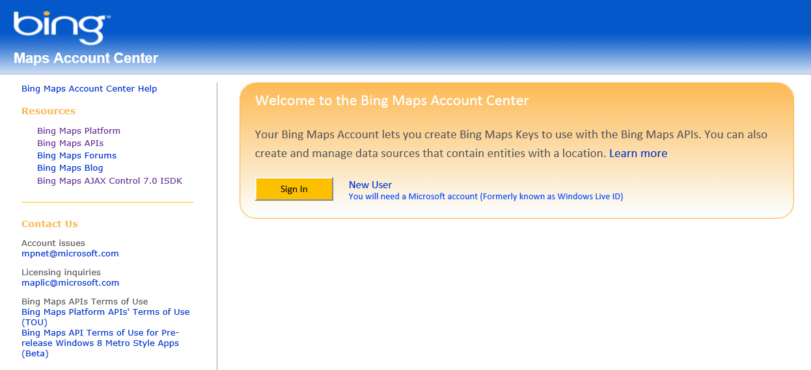

	_Bing Map Portal_

You can use the same Microsoft account you used to login to the Windows Azure portal, or you can click **New User** to register a new one.

1. Click **Create or view keys** to create your own key. Input your application name, Url, key type and application type. Set the Key type to **Basic** and Application type to **Education**. Please ensure the **Application URL** is the same as the web site you just created in the last step.

	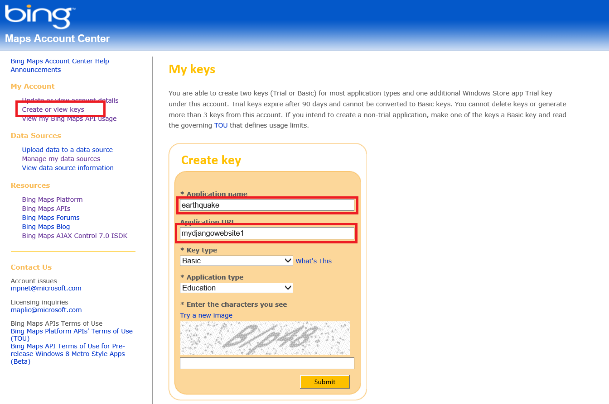
	_Create Bing Map Keys_

1. You will get your key after you submit your information. You will use the key in your html page.

	

	_Bing Map Key_

1. Open the file in **templates\earthquake.html** in text editor, replace the **Your Bing Maps Key** with your own application key and save the file.

	

	_Change Application Key_

1. Inspect the addPushpins() function, and study how the Map uses data from "mapdata", and "mapdata" came from "content" passed from the view.py file using the data matrix. Recall we called "html = t.render(Context({'content': data}))" in view.py. 
<pre>

        function addPushpins() {
            //Get data, the map uses mapdata values that comes from {{content}} below.
            var ll = eval(document.getElementById("mapdata").value); 
            for (var i = 0; i < ll.length; i++) {
                var pushpin = new Microsoft.Maps.Pushpin(new Microsoft.Maps.Location(ll[i][0], ll[i][1]), null);
                map.entities.push(pushpin);
</pre>

<pre>
  input type="hidden" id="mapdata" value="{{ content }}" 
</pre>

1. Connect to the FTP publishing service by FileZilla. You can download and install FileZilla to manage all your folders. FileZilla is a free ftp solution. The client version can be downloaded from [here](https://filezilla-project.org/). It has Windows and Mac version. The UI is almost exactly the same. 

	Provide the **Host Name**, **User Name** and **Password** of your deployment credentials. The **Host Name** is available from the Dashboard in the portal under FTP HOST NAME (or FTPS HOST NAME) and will look something like _ftp://waws-prod-blu-001.ftp.azurewebsites.windows.net_. Make sure that the **User Name** is prefixed by the **Web Site** name (e.g. **mydiangowebsite1\trainingwebsiteuser**). The password is you wrote down in the Exercies 1.

	
	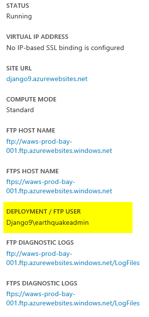 

	_Above is an example of the **Dash board**, on the right hand side you will find the ftp host and the user name you should use for Filezilla._


	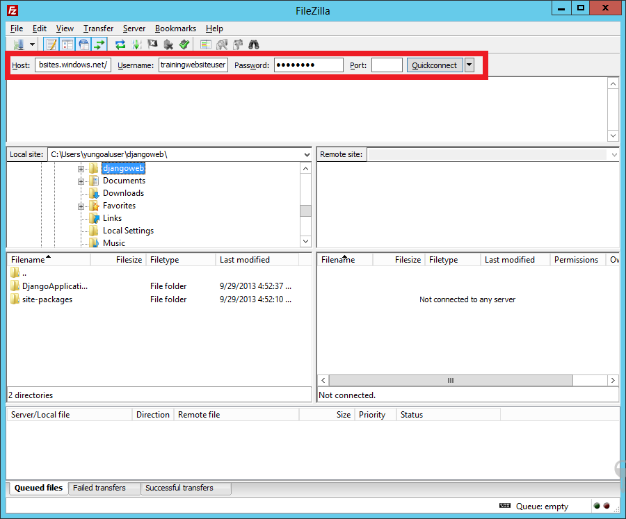 

	_Use FileZilla_
	

1. Click **Quick Connect** and Upload all files using the FileZilla.Use FileZilla to upload the subfolder **DjangoApplication** to **site/wwwroot** folder. You can overwrite the server files.

	

	_Upload Django Website_

1. Browse the new web site [http://**[yourwebsite]**.azurewebsites.net/earthquake](http://[yourwebsite].azurewebsites.net/earthquake), for example, [http://django.azurewebsites.net/earthquake](http://django.azurewebsites.net/earthquake).

1. You can see the earthquake locations on your website.

	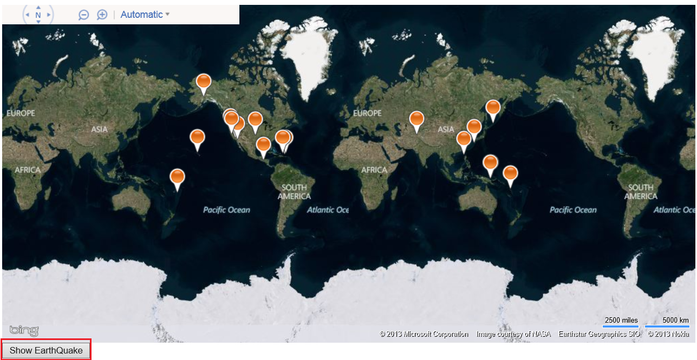

	_Earthquake Locations_ 

1. The final result is under **Azure-training-course\Day 1\2. HOL WindowsAzure Web Sites\Source\Exercise02\End**. If you meet some issues when viewing the page, just compoare files you uploaded with the files under **End** folder.  If you are having issues with the ftp server, close Filezilla and try again, make sure you have used the correct user name and password.  Also note that username is in the format of: [YOURWEBSITE/USERNAME] not user user name you created via reset deployment credential.

---

<a name="summary"></a>
## Summary ##

By completing this hands-on lab you learned the following:

- Create a new Web Site on Windows Azure by using Django.
- Create a Django website to show earthquake information.


© 2013 Microsoft Corporation. All rights reserved.
Except where otherwise [noted](http://creativecommons.org/policies#license), content on this site is licensed under a [Creative Commons Attribution-NonCommercial 3.0 License.](http://creativecommons.org/licenses/by-nc/3.0/)
