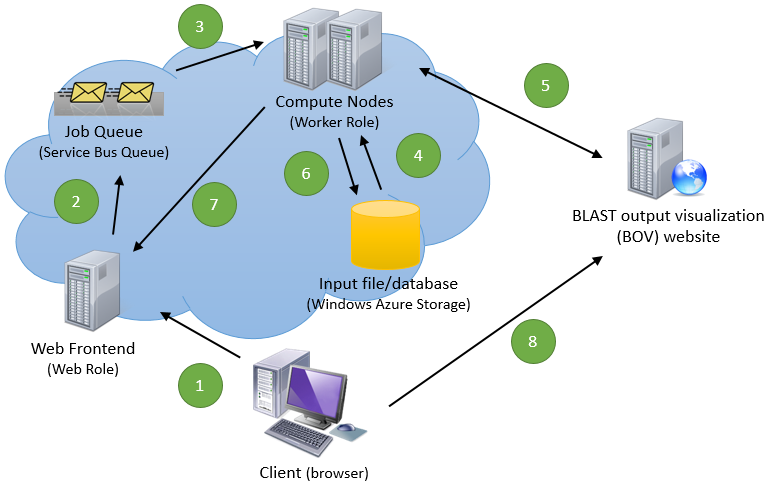
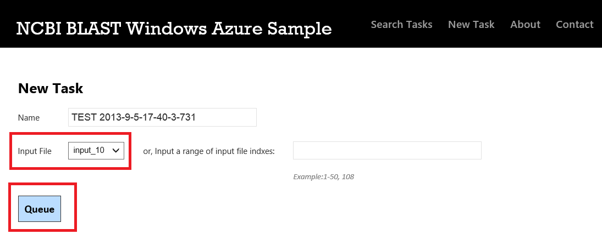
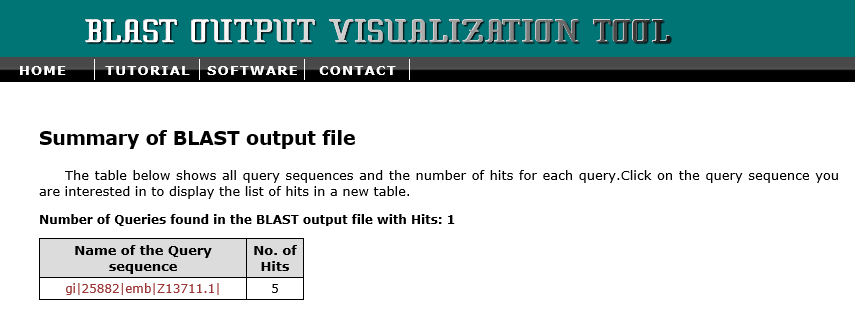
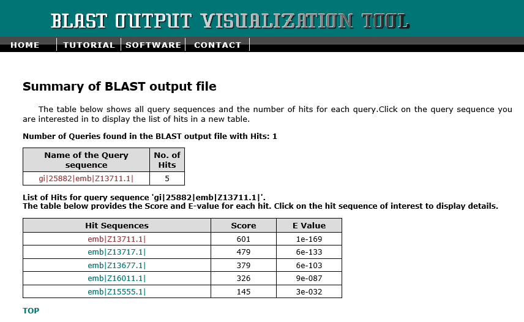
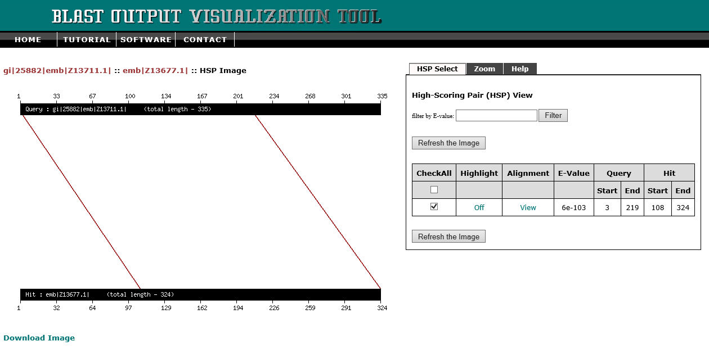
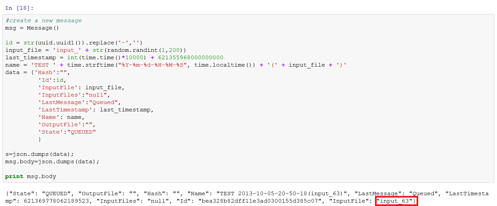
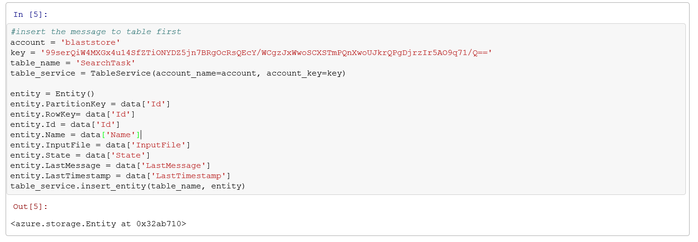
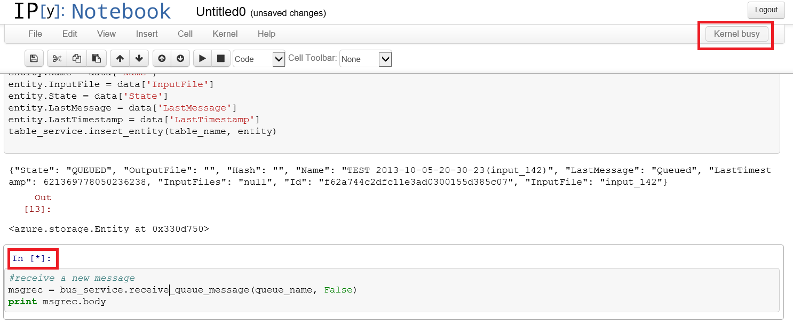
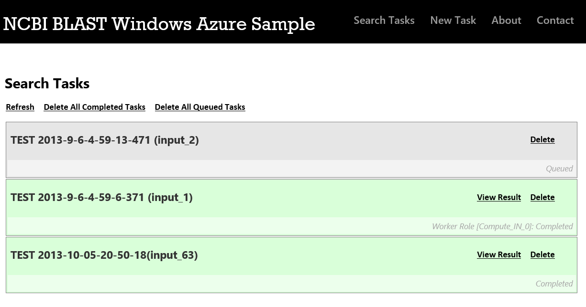
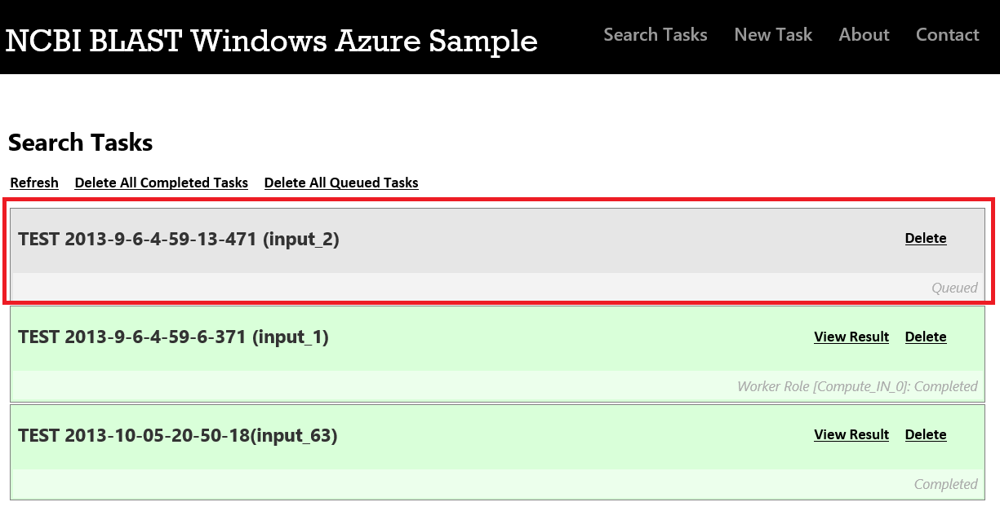

# Using Windows Azure Service Bus Queue with Python #

---

## Overview ##

In this hands-on lab you will use Python to manage Windows Azure Service Bus Queue. There is a NCBI BLAST (National Center for Biotechnology Information Basic Local Alignment Search Tool) cloud service deployed for you. You can use IPython Notebook to send a task to the Service Bus Queue and the blast cloud service worker role will do the task for you. You will also read a message from the Service Bus Queue using Python on IPython Notebook and process the task locally.

### Objectives ###

In this hands-on lab, you will learn how to:

- Understand Windows Azure Service Bus Queue.
- Send a task to a Service Bus Queue by IPython Notebook and check the processing result.
- Receive a message from a Service Bus Queue.

### Prerequisites ###

The following is required to complete this hands-on lab:

- A Windows Azure subscription - [sign up for a free trial](http://aka.ms/WATK-FreeTrial)
- You have an IPython Notebook VM - [IPython Notebook on Windows Azure](http://www.windowsazure.com/en-us/develop/python/tutorials/ipython-notebook/) Or use the Linux VM you deployed in the previous Hands on Lab.
- NCBI BLAST Windows Azure Sample Cloud Service - [NCBI BLAST Windows Azure Sample](http://azure4research-blast.cloudapp.net/)  http://azure4research-blast.cloudapp.net/ 

---

## Exercises ##

This hands-on lab includes the following exercises:

1. [Exercise 1: Understand Windows Azure Service Bus Queue and NCBI BLAST.](#Exercise1)
1. [Exercise 2: Send a task to a Service Bus Queue using IPython Notebook for processing.](#Exercise2)
1. [Exercise 3: Receive a message from a Service Bus Queue.](#Exercise2)

Estimated time to complete this lab: **60** minutes.

### Exercise 1: Understand Windows Azure Service Bus Queue and NCBI BLAST.  ###

#### What is Service Bus Queues? ####

Service Bus Queues support a **brokered messaging communication** model. When using queues, components of a distributed application do not communicate directly with each other, they instead exchange messages via a persistent message queue, which acts as an intermediary. A message producer (sender) hands off a message to the queue and then continues its processing. Asynchronously, a message consumer (receiver) pulls the message from the queue and processes it. The producer does not have to wait for a reply from the consumer in order to continue to process and send further messages. Queues offer **First In, First Out (FIFO)** message delivery to one or more competing consumers. That is, messages are typically received and processed by the receivers in the order in which they were added to the queue, and each message is received and processed by only one message consumer. 

_Service Bus Queue Introduction_
 
Service Bus queues are a general-purpose technology that can be used for a wide variety of scenarios:

- Communication between web and worker roles in a multi-tier Windows Azure application.
- Communication between on-premises apps and Windows Azure hosted apps in a hybrid solution.
- Communication between components of a distributed application running on-premises in different organizations or departments of an organization.

In order to help you understand process Service Bus Queues and distributed computing in the cloud, we also deploy the NCBI BLAST cloud service.

#### What is NCBI BLAST?####

The National Center for Biotechnology Information’s Basic Local Alignment Search Tool (NCBI BLAST) Sample demonstrates how to run a [nucleotide match algorithm](http://blast.ncbi.nlm.nih.gov/Blast.cgi) on the human genome using an HPC parametric sweep application.

The parametric sweep application uses a set of input files that contain sequences of nucleotides, comparing them to the human genome database. The application creates output files containing sequence similarities and uploads these files to a BLAST output visualizer (BOV) web site.

To run the nucleotide match, the sample uses the blastn utility, which is a part of the [BLAST+](http://blast.ncbi.nlm.nih.gov/Blast.cgi?CMD=Web&PAGE_TYPE=BlastDocs&DOC_TYPE=Download) application. 

The architecture of the sample and the steps of its execution are described:

_NCBI BLAST Architecture_

Architecture of the BLAST sample

1. The client application (browser) submits a parametric sweep job to the Web front-end via an AJAX call to the REST API.
1. The Web front-end pushes the job to a Service Bus queue.
1. A compute node gets the sweep job from the job queue and executes on it. The compute nodes are competing consumers of the job queue. This pattern allows us to scale out compute nodes as needed and ensures a submitted job is executed at least once.
1. The parametric sweep application running on a compute node downloads an input file from a Windows Azure blob storage. The input file includes a nucleotide that is to be compared to the human genome database previously downloaded to each Windows Azure compute node (a Worker Role instance).
1. After completing a sweep index, the BLAST application uploads the resulting matches file to the BLAST output visualization (BOV) web site and receives a matching URL for the file’s visualization page.
1. The output file and the URL are written to Windows Azure storage: the file is uploaded to a blob, and the URL is written in a table.
1. While the parametric sweep job is running, the compute node notifies the web front-end its progress via a SignalR channel. The web front-end then accesses the Windows Azure table storage to get updated URL list and shows it to the user.
1. The user can select any of the URLs to see the rendered image for the nucleotide match.

We have already deployed an [NCBI BLAST web site](http://azure4research-blast.cloudapp.net/) deployed and you can just click to have a look. We've also created a sample service bus namespace **sb://sb-azure4research-blast.servicebus.windows.net/** and created a *JobQueue* under the namespace to manage our tasks.

1. Open the NCBI BLAST web site.

	
	
	_NCBI BLAST Web site_

1. Click the "New Task" link to create a new task

	
	
	_BLAST Create New Task_

1. Then you will navigate to a new page to set some parameters. Select an input file, then click *Queue*

	
	
	_BLAST Set Task Information_

1. Then you will see the task is executing.	

	
	
	_BLAST Running Task_

1. Because the system needs to download the database files, the very first task after the system has been deployed will take a long time. However, as the system caches database files, jobs after the first will be executed much faster. After several minutes, the task is finished.

	
	
	_BLAST Task Complete_

1. After a task completes, you can click on its View Result link to view the search result. The link takes you to bov.bioinfo.cas.unt.edu to view the result.

	
	
	_BLAST Output File_

1. Click on the link to expand hit sequences.

	
	
	_BLAST Output File Hit Sequences_

1. Click on any of hit sequences to view its corresponding HSP image.

	
	
	_BLAST Output File Hit Sequence Image_

### Exercise 2: Send a task to a Service Bus Queue by IPython Notebook for processing.  ###

Next we are going to use IPython Notebook to send a new task to BLAST Cloud Service and request it to process. You can find the sample code inside **Source\python_service_bus.py**

1. First we need to import required libraries:

    <pre>
        #import libraries
        from azure.servicebus import *
        from azure.storage import *
        import uuid
        import random
        import time
        import json
    </pre>

    
	
    _IPython Notebook Import Libraries_

1. Run the following code to define private variables we can use to interact with the Service Bus.

    <pre>

        #define service namespace, account key and issuer
        #we have already defined it for you
        servicenamespace = 'sb-azure4research-blast'
        accountkey = 'aC7HfbvW8t7+851wyCEI8DinXg2KTS1voDb2yqyUZZ8='
        issuer = 'owner'
        queue_name='JobQueue'
        #create bus_service
        bus_service = ServiceBusService(service_namespace=servicenamespace, account_key=accountkey, issuer=issuer)
    </pre>

    
	
    _IPython Notebook Create Service Bus Service_	

1. Now we create a dict in Python and save all properties into the dictionary. Then we will use json library's dumps method to convert the dictionary into a json string. Then we set the message body to be the json string. The code randomly pick a file from 1 to 200 as the input file. In the example, we use *input_63* as the input file.

    <pre>
        #create a new message
        msg = Message()
        id = str(uuid.uuid1()).replace('-','')
        input_file = 'input_' + str(random.randint(1,200))
        last_timestamp = int(time.time()*10000) + 621355968000000000
        name = 'TEST ' + time.strftime("%Y-%m-%d-%H-%M-%S", time.localtime()) + '(' + input_file + ')'
        data = {'Hash':"",
                'Id':id,
                'InputFile': input_file,
                'InputFiles':"null",
                'LastMessage':"Queued",
                'LastTimestamp': last_timestamp,
                'Name': name,
                'OutputFile':"",
                'State':"QUEUED"
               }
        s=json.dumps(data);
        msg.body=json.dumps(data);
        print msg.body
    </pre>

    
	
    _IPython Notebook Create Message_

1. Before we submit the message to a Service Bus queue, we have to insert a new entity into a table first for the BLAST web site to track the status correctly. 

     <pre>
          #insert the message to table first
          account = 'blaststore'
          key = '99serQiW4MXGx4u14SfZTiONYDZ5jn7BRgOcRsQEcY/WCgzJxWwoSCXSTmPQnXwoUJkrQPgDjrzIr5AO9q71/Q=='
          table_name = 'SearchTask'
          table_service = TableService(account_name=account, account_key=key)
          entity = Entity()
          entity.PartitionKey = data['Id']
          entity.RowKey= data['Id']
          entity.Id = data['Id']
          entity.Name = data['Name']
          entity.InputFile = data['InputFile']
          entity.State = data['State']
          entity.LastMessage = data['LastMessage']
          entity.LastTimestamp = data['LastTimestamp']
          table_service.insert_entity(table_name, entity)
    </pre>

    
	
    _IPython Notebook Insert Table_

1. Finally we execute the following command to submit a message.
    <pre>
         #submit the message to service bus queue
		 bus_service.send_queue_message(queue_name, msg)
    </pre>

    
	
    _IPython Notebook Submit to Queue_

1. Then let's navigate to the BLAST web site again, click **Refresh** button and check the new task. We can see a task with input file 63 is completed.

    
	
    _New Task Complete_

	You can do the same thing to check the hit sequences and HSP image as you did in [Exercise1](#Exercise1).

	Service Bus queues support a maximum message size of 256 KB (the header, which includes the standard and custom application properties, can have a maximum size of 64 KB). There is no limit on the number of messages held in a queue but there is a cap on the total size of the messages held by a queue. This queue size is defined at creation time, with an upper limit of 5 GB.
	

### Exercise 3: Receive a message from a Service Bus Queue.  ###

You can use Python to receive a message as well! Messages are received from a queue using the **receive_queue_message method** on the **ServiceBusService** object. 

1. Execute following command to receive a message in IPython Notebook. If there is no message in the queue, IPython Notebook will block until either a message arrives or the thread times out. You can see **Kernel busy** on the top right.
 
    <pre>
        #receive a new message
		msgrec = bus_service.receive_queue_message(queue_name, False)
		print msgrec.body 
    </pre>
    
    
	
    _IPython Notebook Receive Message_

1. On the BLAST web site, click **New Task** twice to create 2 new tasks. Since we set the worker role to process only 1 task at one time, your ipython notebook can receive another message.

	>If there are multiple people using the BLAST service, just do the previous step as many times as needed until you receive a message.

    
	
    _IPython Notebook Create Many New Tasks_

1. If your IPython notebook receives a new message, then the message's body will be printed. 

    
	
    _IPython Notebook Received New Message_

1. Checking the web site again, we can see the task is stuck in **Queued** status because the message was read by IPython Notebook and BLAST will never see it.

    
	
    _IPython Notebook Task Will NOT be Processed_

	Messages are deleted from the queue as they are read; however, you can read (peek) and lock the message without deleting it from the queue by setting the optional parameter peek_lock to True.

	The default behavior of reading and deleting the message as part of the receive operation is the simplest model, and works best for scenarios in which an application can tolerate not processing a message in the event of a failure. To understand this, consider a scenario in which the consumer issues the receive request and then crashes before processing it. Because Service Bus will have marked the message as being consumed, then when the application restarts and begins consuming messages again, it will have missed the message that was consumed prior to the crash.

	If the peek_lock parameter is set to True, the receive becomes a two stage operation, which makes it possible to support applications that cannot tolerate missing messages. When Service Bus receives a request, it finds the next message to be consumed, locks it to prevent other consumers receiving it, and then returns it to the application. After the application finishes processing the message (or stores it reliably for future processing), it completes the second stage of the receive process by calling the delete method on the Message object. The delete method will mark the message as being consumed and remove it from the queue.

1. Execute the following code.

	
    <pre>
        #receive a new message when peek lock = True
        msgrec = bus_service.receive_queue_message(queue_name, True)
        print msgrec.body 
    </pre>
    
    
	
    _IPython Notebook Receive Message With Peek Lock_

1. By default the peek lock time is 30 seconds. After that, check the BLAST web site again, you will see the task is picked up by the default worker role and it is in *Completed* status:	

 	
	
    _IPython Notebook Message Processed Again_

    If you use peek lock, you must remember to call **delete()** after you successfully processed the task.

---

## Summary ##

By completing this hands-on lab you learned the following:

- Understand Windows Azure Service Bus Queue.
- Send a task to a Service Bus Queue by IPython Notebook and check the processing result.
- Receive a message from a Service Bus Queue.

Copyright 2013 Microsoft Corporation. All rights reserved. 
Except where otherwise noted, these materials are licensed under the terms of the Apache License, Version 2.0. You may use it according to the license as is most appropriate for your project on a case-by-case basis. The terms of this license can be found in [http://www.apache.org/licenses/LICENSE-2.0](http://www.apache.org/licenses/LICENSE-2.0).
