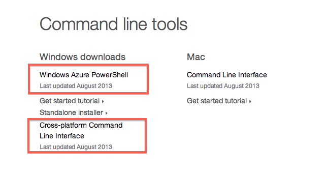
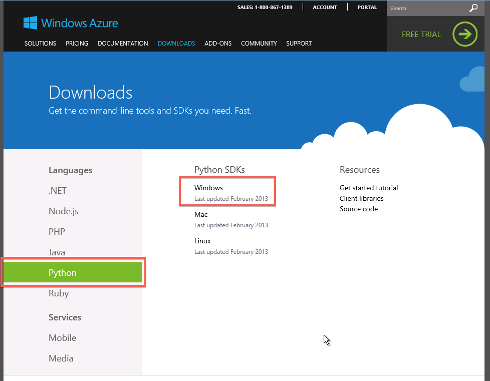
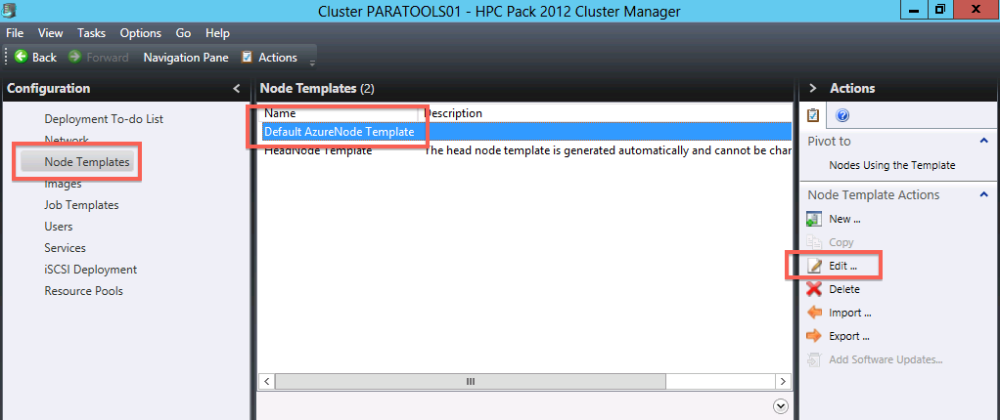
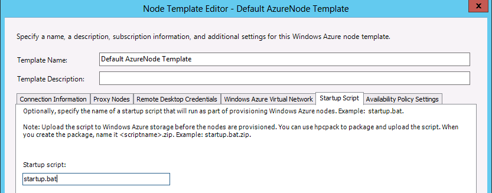
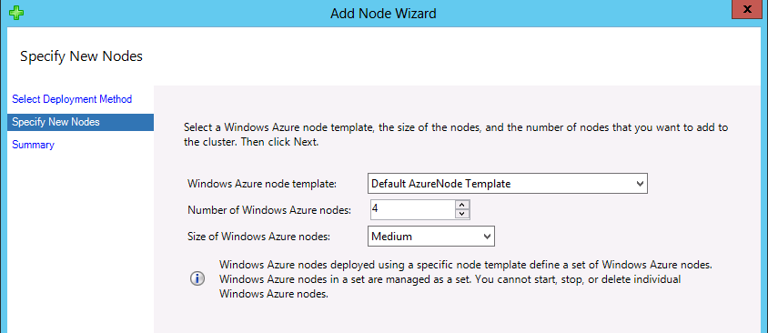
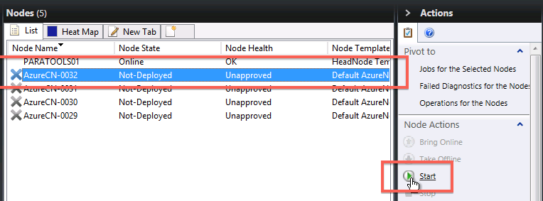
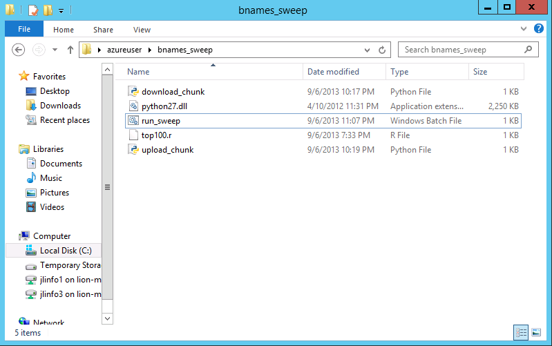
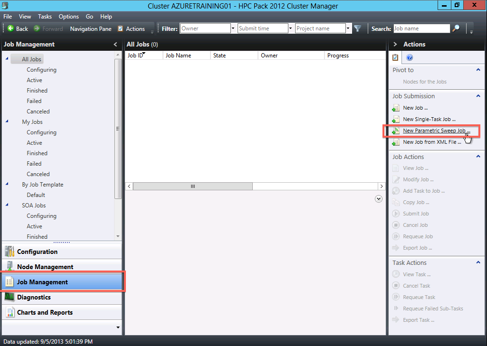
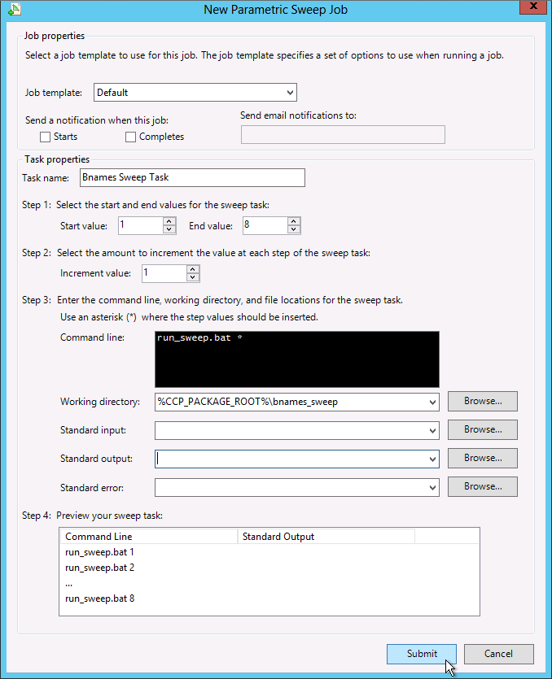
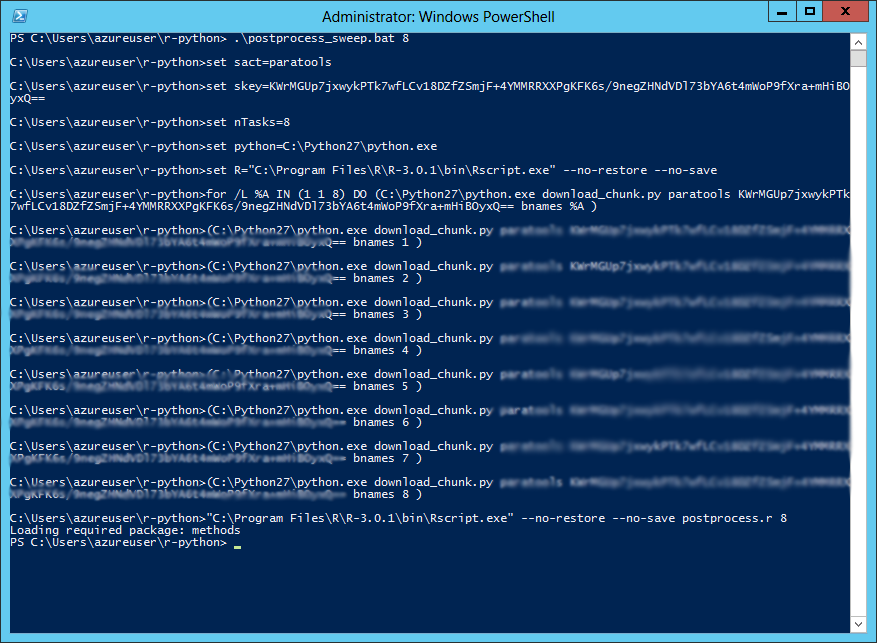

# Parametric Sweep with R and Python #

This example uses a combination of R and Python to download data about baby names in the USA and calculate the percentage of babies per year with a name in the top 100 names of that year.  The calculation is done in parallel with a parametric sweep job.  The output looks something like this:

## Download Example Code ##

1. Open a Remote Desktop Connection to the head node.  Log in with the username and password you set when you created the VM, **not** the domain user you created before installing HPC Pack.  This will simplify the process later on.

1. Download the training materials from https://github.com/jlinford/azuretraining/archive/master.zip to the head node.  

1. Extract master.zip to create the azuretraining-master folder.  The example files are in azuretraining-master\hpc-r-sweep

## Install the Azure Command Line Interface ##

1. On the head node, go to http://www.windowsazure.com/en-us/downloads/ and download installer packages for both the **Windows Azure PowerShell** and the **Cross-platform Command Line Interface**.

   

1. Run the Windows Azure PowerShell installer and install to the default location.

1. Run the Cross-platform Command Line Interface installer and install to the default location.

1. Open a PowerShell window and execute the commands below to configure the Windows Azure Command Line Interface:

        cd Downloads
        azure account download
    
   A browser window will open.  Sign in when prompted and save the publishsettings file when the download begins.  When the download completes, go back to the command line and import the publishsettings file:
   
        azure account import <publishsettings file>
        
   Now you can see your subscriptions:
   
        azure account list

## Install and Package the Windows Azure Python SDK ##

1. Go to http://www.windowsazure.com/en-us/downloads/ and select **Python** from the list on the left, then click **Windows** to download the Windows Azure Python SDK installer package.

   

1. Run the Python SDK installer package and install to the default location.  Python is now installed at **C:\Python27\python.exe** with pip at **C:\Python27\Scripts\pip.exe**.

1. We want to install Python on the compute nodes as well as the head node.  Since we already have a fully-featured Python installation on the head node, we'll simply copy it to the compute nodes.  Use [hpcpack create](http://technet.microsoft.com/en-us/library/jj899594.aspx) to package the Python installation:

        hpcpack create Python27.zip .\Python27

1. Use [hpcpack upload](http://technet.microsoft.com/en-us/library/jj899593.aspx) to upload the package to the storage account associated with the AzureNode template you created earlier:

        hpcpack upload Python27.zip /nodetemplate:"Default AzureNode Template" /relativePath:Python27

   Be sure to use the **/relativePath** parameter.  Otherwise Python will be placed on a path that involves a timestamp so it will be difficult to determine where the installation files are.

   * * * * 
   > **NOTE:** Make sure you logged in as the right user.
   > 
   > If you get an "access denied" error when executing the above command, make sure you are logged in to the VM with the username and password you set when you created the VM and **not** any domain user.  As a work-around, you can replace the /nodetemplate parameter with the /account and /key parameters.  See the [hpcpack documentation](http://technet.microsoft.com/en-us/library/jj899593.aspx) for more information.
   * * * *

## Install R on the Head Node and Package the R Installer ##

1. Log in to the VM with the username and password you set when you created the VM, **not** the domain user you created before installing HPC Pack.  If you log in with a domain user, the following hpcpack commands will not work.

1. On the head node, download the [R base installer for Windows](http://cran.wustl.edu/bin/windows/base/R-3.0.1-win.exe).

1. Run the installer on the head node and accept all default values.

1. We need to collect several files in order to automate the R installation on the compute nodes.  On the cluster head node, make a folder named **RInstaller** in your home directory.

1. Copy the R installer (R-3.0.1-win.exe) to the RInstaller folder.

1. Copy **prep.r** from azuretraining-master\hpc-R-sweep to the RInstaller folder.

1. In the RInstaller folder, create an installation script named **install.bat** with these contents:

        set root=%CCP_PACKAGE_ROOT%\RInstaller
        %root%\R-3.0.1-win.exe /VERYSILENT
        "D:\Program Files\R\R-3.0.1\bin\Rscript.exe" --no-restore --no-save %root%\prep.r

   Note that the script calls R on the **D:** drive, not the C: drive.
   
1. Open a Command Prompt window and navigate to the folder containing RInstaller.  For example, if you created the RInstaller folder in your home folder, navigate to your home folder.  We'll be using the [hpcpack](http://technet.microsoft.com/en-us/library/gg481764.aspx) command to distribute R to the cluster nodes.

1. Use [hpcpack create](http://technet.microsoft.com/en-us/library/jj899594.aspx) to package the RInstaller folder for distribution to the cluster nodes: 

        hpcpack create RInstaller.zip RInstaller

1. Use [hpcpack upload](http://technet.microsoft.com/en-us/library/jj899593.aspx) to upload the package to the storage account associated with the AzureNode template you created earlier:

        hpcpack upload RInstaller.zip /nodetemplate:"Default AzureNode Template" /relativePath:RInstaller
        
   Be sure to use the **/relativePath** parameter.  Otherwise the R installer and install.bat will be placed on a path that involves a timestamp so it will be difficult to determine where the installation files are.
   
   * * * * 
   > **NOTE:** Make sure you logged in as the right user.
   > 
   > If you get an "access denied" error when executing the above command, make sure you are logged in to the VM with the username and password you set when you created the VM and **not** any domain user.  As a work-around, you can replace the /nodetemplate parameter with the /account and /key parameters.  See the [hpcpack documentation](http://technet.microsoft.com/en-us/library/jj899593.aspx) for more information.
   * * * *

1. Use [hpcpack list](http://technet.microsoft.com/en-us/library/jj899577.aspx) to verify that the package is in your storage account:

        hpcpack list /nodetemplate:"Default AzureNode Template"

## Create a Node Startup Script ##

1. We'll use a startup script to automatically install R when the Azure nodes boot.  Create **startup.bat** with the following contents.  If you already have a startup script, append these lines to your existing script:

        xcopy /h/i/c/k/e/r/y %CCP_PACKAGE_ROOT%\Python27 C:\Python27
        cd /D %CCP_PACKAGE_ROOT%\RInstaller
        .\install.bat

   When the nodes boot they will use the [hpcsync](http://technet.microsoft.com/en-us/library/gg481752.aspx) command to automatically download and unpack the RInstaller.zip package.  By default, hpcsync deploys files to a location on the Windows Azure nodes that is determined in part by the **%CCP_PACKAGE_ROOT%** environment variable. This variable is set on Windows Azure nodes during the provisioning process. The extracted files are placed in a folder that is determined as follows: %CCP_PACKAGE_ROOT%\<packageName>\<uploadTimeStamp>. This is the expected location for SOA services, XLLs, Excel workbooks, and startup scripts that are called from the node template.  However, because we passed "/relativePath:RInstaller" to our hpcpack upload command, RInstaller.zip will be unpacked to %CCP_PACKAGE_ROOT%\RInstaller.  We used relativePath because we cannot easily determine the <uploadTimeStamp> part of the default path.
   
1. Open a command prompt, navigate to the folder containing startup.bat, and package the startup script:

        hpcpack create startup.bat.zip startup.bat

1. Upload the startup script to your storage account:

        hpcpack upload startup.bat.zip /nodetemplate:"Default AzureNode Template"
        
1. Open the HPC Pack Cluster Manager.  On the **Configuration** page, select **Node Templates** from the list on the left, select **Default AzureNode Template** from the display in the center, and click **Edit...** under Node Template Actions on the right.

   

1. On the **Startup Script** Tab, enter **startup.bat** in the Startup script box and click **Save**.

   

## Update or Add and Start Cluster Nodes ##

If you already have a group of Windows Azure Nodes online you can update them via **clusrun** and **hpcsync**:

        clusrun /nodegroup:AzureNodes hpcsync
        clusrun /nodegroup:AzureNodes xcopy /h/i/c/k/e/r/y %CCP_PACKAGE_ROOT%\Python27 C:\Python27
        clusrun /nodegroup:AzureNodes %CCP_PACKAGE_ROOT%\RInstaller\install.bat

If you don't already have any nodes online you'll need to provision and start new compute nodes.  The node startup script will automatically install R.

1. Open the Cluster Manager on the cluster head node.

1. On the Node Management page, select **Add Node** under Node Actions on the right.

1. Select **Add Windows Azure nodes** and click **Next**.

1. Verify that **Default AzureNode Template** is the selected template, enter **4** for the number of Windows Azure nodes, and select the **Medium** node size.  Click **Next** and click **Finish**.

   

1. Select the first **AzureCN** node from the node list and click **Start** under Node Actions on the right.

   
   
   You will be notified that a set of nodes is being started.  Verify that four nodes will be started and click **Start**.
1. The nodes are now provisioning (this will take a while).  Once the provisioning is complete, they will be in the "Unapproved" state.  To approve the nodes, select **all** the nodes and click **Bring Online** under Node Actions on the right.

   


## Package Application Files ##

1. On the head node, make a folder named **bnames_sweep** to contain the R script and supporting files.

1. Copy **download_chunk.py**, **upload_chunk.py**, **top100.r**, and **run_sweep.bat** from the training materials to the **bnames_sweep** folder on the cluster head node.

1. We'll need your storage account key for the run_sweep.bat script.  Use the azure command line interface to get it.  Replace YOUR_ACCOUNT with your storage account name:

        azure storage account keys list YOUR_ACCOUNT

   You should see output similar to this:
   
   
   
   Highlight your storage key in the console and right-click to copy it to the clipboard.

1. Edit **run_sweep.bat** and set the **sact** and **skey** variables to your storage account name and storage account key.  Save the file.

   
   
1. Copy **C:\Windows\SysWOW64\python27.dll** to the application folder.  bnames_sweep should look like this:

   

1. Open a command line window and navigate to the parent of the **bnames_sweep** folder.  Use **hpcpack** to package and upload the application:

        hpcpack create bnames_sweep.zip bnames_sweep
        hpcpack upload bnames_sweep.zip /nodetemplate:"Default AzureNode Template" /relativePath:bnames_sweep

1. Execute **hpcsync** on all cluster nodes via the [clusrun](http://technet.microsoft.com/en-us/library/cc947685.aspx) command.  This will download the new package from your storage account to all cluster nodes:

        clusrun /nodegroup:AzureNodes hpcsync
        
1. We need to upload our data to the storage account so the worker nodes can access it.  Open a command prompt window and navigate to the training materials folder.  Execute the **upload_bnames.py** script as shown:

        C:\Python27\python.exe upload_bnames.py YOUR_ACCOUNT YOUR_KEY bnames 8 bnames.csv
        
   
   
1. Open the Cluster Manager on the head node.  On the **Job Management** page, select **New Parametric Sweep Job** from the list on the right.

   

1. Enter **Bnames Sweep Task** as the task name.  

   

1. Under Step 1, set the Start Value to **1** and the End Value to **8**.  We will use eight parallel jobs since we have eight CPU cores in our cluster (four medium-sized nodes, two CPU cores per node).

   

1. Leave the Increment Value as **1**.

   

1. In the command line box, enter **run_sweep.bat \***

   The job scheduler replaces the asterisk with sequential integer values in the range specified in the Step 1 section, in this case, the numbers 1, 2, and so on up to 8.  You can use this parameterization any way you like.  In this example, we're simply using it to specify the taskID.  The command line box should look like this:
   
   
      
1. Set the working directory to **%CCP_PACKAGE_ROOT%\bnames_sweep**.  This folder was created automatically by hpcsync because we specified the /relativePath parameter when we executed our hpcpack upload command.

   
   
   * * * *
   > **IMPORTANT:** There is a 10GB limit on %CCP_PACKAGE_ROOT%.  
   >
   >If your job is going to write a lot of data to files in the working directory then you'll need to use a different working directory and write a batch script to copy files from %CCP_PACKAGE_ROOT% before running the job.
   * * * *

1. Leave the Standard input, Standard output, and Standard error fields empty.
   
1. Your "New Parametric Sweep Job" window should look like this with all fields completed.  Click **Submit**.

   

1. Once the job is finished, we'll need to postprocess the results to get our final answer.  Edit **postprocess_sweep.bat** and set the **sact** and **skey** variables to your storage account name and storage account key.  Save the file.

1. Open a command prompt window and navigate to the training materials folder.  Execute the **postprocess_sweep.bat** script:

   
   
   The final result is written to **bname-top100.png**:
   
   

© 2013 Microsoft Corporation. All rights reserved.
Except where otherwise [noted](http://creativecommons.org/policies#license), content on this site is licensed under a [Creative Commons Attribution-NonCommercial 3.0 License.](http://creativecommons.org/licenses/by-nc/3.0/)
